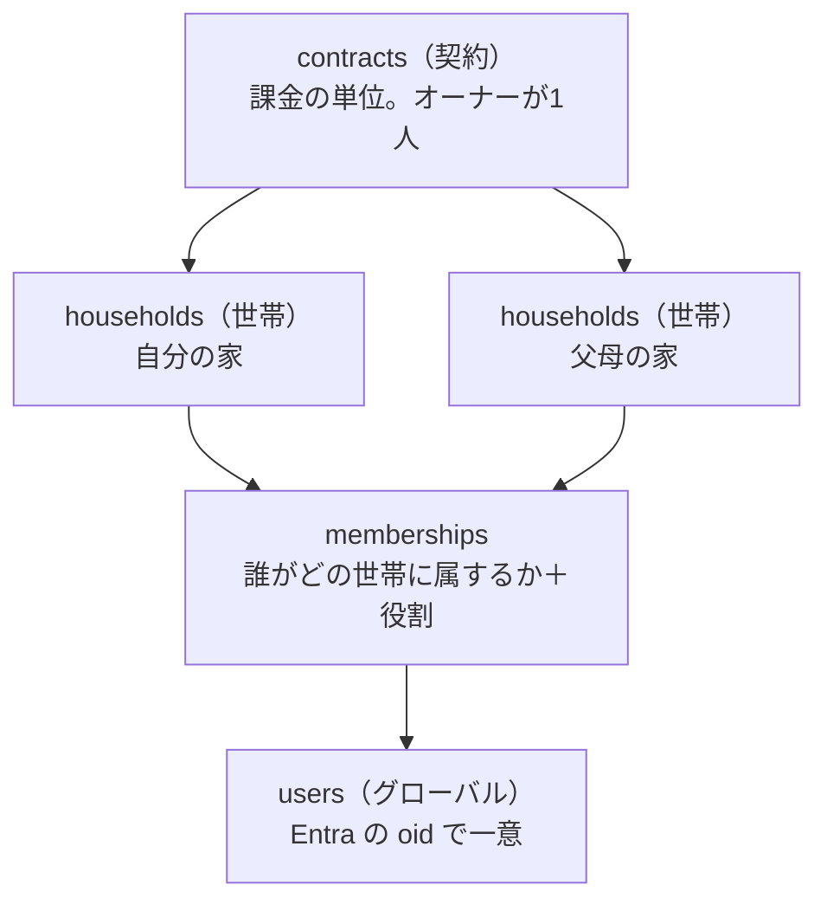

# SaaS 化調査（構想メモ）

身内での磨きこみが済んだあと、KakeiFlow をサブスクの Web サービスとして展開できるかの調査結果。
**まだ計画書ではない。** 実装に入るときは `.claude/rules/development_procedure.md` に従い、
`91_UPDATE/01/` へ改めて計画書を起こす。

作成: 2026-08-13

---

## 結論

**プロダクトの中身とデータモデルは十分。障壁は技術ではなく「入口（登録）」「固定費」「法務・サポート」の3つ。**

いま無いのは機能ではなく、**赤の他人が自分で登録して自分で払う経路**である。
身内向けの前提（オーナーが Azure ポータルで手動招待する、世帯は `seed_master.sql` で手で作る）が
そのまま塞いでいる。

---

## 1. すでにある資産

| 資産 | なぜ効くか |
|---|---|
| 全テーブルの `household_id` と `assertReferencesInHousehold` | **マルチテナントの分離が後付けでなく最初から入っている。** SaaS 化で作り直す部分が少ない |
| 追記専用台帳＋残高導出 | テナントが増えても「他人のデータで計算が壊れる」事故が起きにくい |
| 接続文字列と API キーを持たない構成（MI） | 利用者が増えたときに漏れて困る秘密が、そもそも存在しない |
| 入口で座標を捨てる作り（`dropIfImprecise` → `stripIfAtHome`） | **プラン外なら捨てる**を同じ場所に足すだけで、下流が全部正しく動く |

### 競合と勝ち筋

マネーフォワード ME・Zaim（有料はおおむね月500円前後）は**銀行・カード自動連携による見える化**が主戦場で、
**予算を組み換えて運用する**部分は弱い。KakeiFlow の4台帳分離・カテゴリ別繰越ポリシー・プール・
支出マップは、海外で YNAB が取っているポジション（封筒家計簿を世帯で回す）に近い。

**自動連携で真っ向勝負しない。** そこは資金移動業・スクレイピング契約・維持コストの世界で、個人では戦えない。
「予算を配り、組み換え、繰り越して、世帯で回す」ことに一点集中する。

---

## 2. 契約 / 世帯 / ユーザーの3層モデル

**採る。** 「PC が使える1人が父母世帯の管理も行う」は実在するニーズで、日本の家計簿アプリでほぼ空いている。
介護・実家の家計管理という文脈は、値段を正当化しやすい数少ない領域でもある。

### D1. `users` は世帯に属さない。グローバルにする

いまは `users.household_id NOT NULL`（`001_init.sql`）。これを外し、
**`memberships(user_id, household_id, role)` へ移す。**

1人が複数世帯に属せないと構想そのものが成立しない。管理者は自分の世帯と父母世帯の両方に入る。
`users` は Entra の `oid` で一意なグローバルな存在になり、テナントに属さなくなる。
**これが今回いちばん大きなスキーマ変更**で、後回しにするほど高くつく。

### D2. 無料でも世帯を必ず1つ作る。「ユーザー単位」を構造にしない

「無料の間はユーザー単位」を**世帯を持たない**と実装すると、有料化のたびにデータ移行が要る。
無料も有料も構造は同じにして、**上限だけを変える。**

| | 無料 | 有料 |
|---|---|---|
| 世帯 | 1つ（登録時に自動作成） | 契約の枠まで |
| 招待 | 不可 | 可 |
| 位置・通知・写真 | 不可 | 可 |

無料ユーザーの世帯は `contract_id` が NULL の世帯として存在する。有料化は**契約を作って紐付けるだけ**で、
データは1行も動かない。

### D3. 課金の判定は世帯から引く。ユーザーからは引かない

父が無料ユーザーでも、子の契約下にある父母世帯の中では**有料機能が使える**。
判定は `households.contract_id` → `contracts.plan` の1本だけを見る。

ユーザーから引くと、同じ画面が**誰が開いたかで挙動を変える**ことになり、世帯共有の意味が壊れる。
「妻が開くと地図が出るが夫が開くと出ない」は説明できない。

### D4. 契約オーナーは請求の権限であって、閲覧の権限ではない

**支払っている人がその世帯の家計をいつでも覗ける作りにしない。** 事故になる。

| 契約オーナーができること | できないこと |
|---|---|
| 世帯の作成・削除、枠の増減 | **家計データの閲覧** |
| 支払い方法の変更、請求書の取得 | 記帳・予算の変更 |
| 世帯オーナーの指名 | |

データを見るには**自分もその世帯のメンバーになる**（＝`memberships` に行を作る）。
入れば世帯のメンバー一覧に出るので、**見ていることが隠れない。**

今回の想定（父母世帯を子が管理する）では子がメンバーとして入るので、実運用は何も変わらない。
変わるのは「黙って見られない」ことだけ。

### D5. 契約が切れても世帯は消さない。読み取り専用へ落とす

家計の記録は消えると取り返しがつかない。解約後は記帳を止め、閲覧とエクスポートだけ残す。
**猶予期間と最終削除の期日は規約に明記する。**

あわせて**世帯の契約移管**（父が自分で契約を引き継ぐ）ができるよう、`households.contract_id` は
可変にしておく。画面を作るのは後でよいが、モデルは今決めておく。

### D6. 移行は二段階で行う

既に身内で運用中のデータがあるため、`018` 以降のマイグレーションで足す。

1. `users.household_id` を残したまま `memberships` を作り、**両方へ書く**
2. BE を `memberships` 参照へ切り替える
3. `users.household_id` を落とす

一度に落とすと、切り替えの瞬間にログインできなくなる窓ができる。

### 残る論点

- **世帯の招待は誰ができるか。** 契約オーナーか、世帯オーナーか、両方か
- **1ユーザーが属せる世帯数の上限。** 無制限だと招待の踏み台にされうる
- **同じ人が2つの契約に世帯を持つ場合**（自分でも契約し、親の契約にも入っている）の請求表示

---

## 3. 課金設計

### 元の案の問題

> 基本無料＋広告 / 月330円で広告撤去 / 月550円で位置解禁 / +110円でメモ通知解禁

- **刻みすぎ。** 選択肢が4つ以上あると転換率が落ちる
- **「広告撤去に330円」は訴求が弱い。** マイナスを消すだけの対価
- **+110円の単品アドオンは割に合わない。** 決済手数料と課金状態管理の実装コストに対してリターンが小さい
- **広告そのものを勧めない。** 家計簿という極めてセンシティブな画面に第三者スクリプトを載せると、
  外部送信規律（改正電気通信事業法）の同意取得が必要になり、信頼を損なう。
  収益は概算で**1ユーザー月数円**にしかならない。無料枠は広告ではなく**機能制限**で切る

### 推奨する形 — 機能で刻まず、量で刻む

3層モデルはここに効く。**世帯数という軸ができるので、機能を細切れにしなくても単価が伸びる。**

| プラン | 目安 | 内容 |
|---|---|---|
| 無料 | 0円 | 1世帯・1人。記帳・予算・プール・分析。**広告は出さない** |
| プレミアム | 月480〜580円 | 1世帯。位置・通知・写真・招待をすべて含む |
| 追加世帯 | 月 +280円 / 世帯 | 父母世帯などを自分の契約で持つ |
| （年額） | 2ヶ月分引き | |

**位置機能を有料に置く判断自体は正しい。** Azure Maps と逆ジオが実際の変動費で、原価と課金が一致している。
通知（ACS）・写真（Blob）も同じ。**原価がかかるものを有料にする**という筋は元の案から変えない。

**Web サブスクにするのは正解。** App Store / Google Play 経由だと 15〜30% 取られる。

---

## 4. 写真保存・共有（Blob）

レシート写真は家計簿と自然に噛み合い、**原価が明確（容量＋帯域）で課金と一致する。**
位置・通知と同じ論法で有料機能に置ける。

### U1. ブラウザから直接読み書きする。BE を通さない

BE を経由させると Functions の帯域と実行時間を払うことになる。画像は大きいので効く。

### U2. ユーザー委任 SAS（User Delegation SAS）を BE が MI で発行する

ストレージは**共有キーアクセス自体を禁止**しているため、アカウントキーの SAS は使えない。
User Delegation SAS なら Entra ID（＝MI）で署名するので、**「接続文字列と API キーをどこにも保持しない」
方針を崩さずに済む。** 有効期限は短く（数分）、書き込みは1オブジェクトに限定する。

### U3. アップロード前に縮小する

長辺 1600px 程度の JPEG にしてから送る。原寸はコストと転送時間の無駄で、レシートは**読めれば足りる**。
クライアントで縮小すれば、遅い回線での記帳が止まらない。

### U4. 写真は再入力できない

金額は覚えていれば打ち直せるが、**レシートの現物は捨てられている。**
バックアップと削除の責任が金額データより一段重くなる。削除は論理削除にし、N日後に物理削除する。
Blob のソフト削除とバージョニングを有効にする。

### 未確定 — 「共有サービス」の範囲

**レシートを記録に添付する**のか、**汎用の写真アルバム**なのかで話が全く変わる。
後者は家計簿と別プロダクトになり、スコープが爆発する。ここは決めてから着手する。

### 将来 — レシート OCR

Azure AI Document Intelligence の領収書モデルを使えば、写真から金額・店名・日付を起こせる。
差別化としては大きいが原価が跳ねるので、**さらに上位のプラン**として切り分ける。

---

## 5. コストと損益分岐

| 項目 | 身内（現在） | SaaS |
|---|---|---|
| Azure SQL | Basic 5DTU / 2GB | **Serverless か Elastic Pool 必須。** 数百世帯で Basic は破綻する |
| Functions | Flex（コールドスタート数秒） | **無料ユーザーに数秒待たせるのは離脱要因。** always-ready ＝ 固定費 |
| Azure Maps | 月5,000tx の無料枠に収まる | **枠はアカウント単位。** 世帯が増えれば即超過 |
| ACS メール | ほぼ無料 | 通数課金 |
| Blob | — | 容量＋下り帯域。写真次第で伸びる |

固定費はざっくり**月 8,000〜15,000円**。決済手数料（Stripe 3.6% ＋固定）を引くと
実収は 330円→約300円、550円→約510円。**有料100人で月3〜5万円**。

黒字にはなるが、有料100人には無料1,000〜3,000人が要る（転換率 3〜10%）。
**技術より集客が壁。**

### 国土地理院の逆ジオは商用利用の可否を確認する

`system_flow.md` に自分で書いてある通り、**地理院地図向けの提供で SLA が無い。**
無料の身内利用と、課金しているサービスから15分ごとに叩き続けるのは意味が違う。
**有料展開の前に利用規約の確認が必須。** 使えないなら有料の逆ジオへ切替＝原価が増える。

---

## 6. 法務・運用

| 項目 | 内容 |
|---|---|
| 特定商取引法に基づく表記 | サブスクなので必須。**個人事業だと氏名・住所の開示義務**（バーチャルオフィスの検討） |
| 利用規約・プライバシーポリシー | 取得する情報、位置情報の扱い、写真の扱い、解約後の保持期間 |
| 個人情報保護法 | 開示・訂正・削除請求への対応窓口 |
| 消費税・インボイス | 表示価格を内税に統一する |
| 障害対応 | 問い合わせ窓口。**身内なら「ごめん」で済む障害が、有料だと済まない** |
| バックアップ | Azure SQL Basic の PITR は7日。有料展開では期間の見直しが要る |

---

## 7. 着手順

**①だけは身内での磨きこみ中に混ぜるのが得策。** 記録が増えるほど移行が重くなる。

| 順 | 内容 | いつ |
|---|---|---|
| 1 | **契約 / 世帯 / ユーザーの3層化**（D1・D2・D6） | 磨きこみ中に実施 |
| 2 | セルフサインアップ（Entra External ID / CIAM への移行、世帯の自動作成＋シード投入） | 展開の直前 |
| 3 | 課金とエンタイトルメント（Stripe、`contracts.plan` による機能ゲート） | 2 のあと |
| 4 | 写真・共有（Blob、User Delegation SAS） | 3 のあと。範囲を決めてから |
| 5 | 法務書類・問い合わせ窓口 | 公開前 |

---

## 関連ドキュメント

- [システム構成](../system_architecture.md) — 現在の全体像
- [処理フロー](../system_flow.md) — 現在の主要な処理
- [ユーザー手動作業](19_ユーザー作業.md) — Azure / Entra 側で人が行う作業
