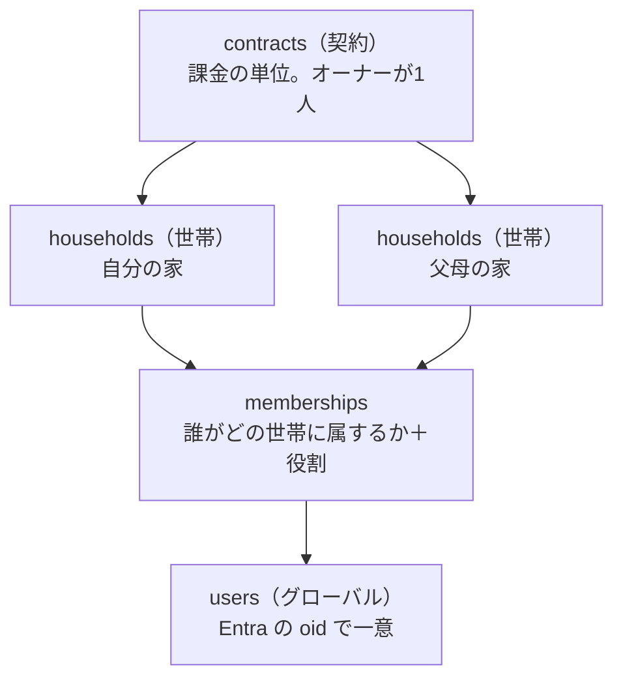
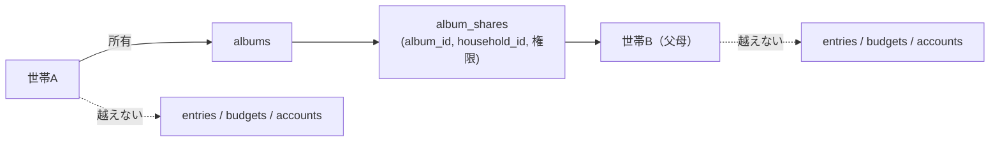

# SaaS 化調査（構想メモ）

身内での磨きこみが済んだあと、KakeiFlow をサブスクの Web サービスとして展開できるかの調査結果。
**まだ計画書ではない。** 実装に入るときは `.claude/rules/development_procedure.md` に従い、
`91_UPDATE/01/` へ改めて計画書を起こす。

作成: 2026-08-13

---

## 結論

**プロダクトの中身とデータモデルは十分。障壁は技術ではなく「入口（登録）」「固定費」「法務・サポート」の3つ。**

いま無いのは機能ではなく、**赤の他人が自分で登録して自分で払う経路**である。
身内向けの前提（オーナーが Azure ポータルで手動招待する、世帯は `seed_master.sql` で手で作る）が
そのまま塞いでいる。

構成は **契約 / 世帯 / ユーザーの3層**、料金は **無料 / プレミアム / 上位（アルバム）の3段**で確定。
層は固定し、**プランで変わるのは上限だけ**にする（[D6](#d6-層は3つのままプランで変わるのは上限だけ)、
[§3](#3-課金設計)）。

**グローバル展開も成立する**（[§7](#7-グローバル展開)）。英語圏は envelope budgeting の文化があり、
単価が日本の1.5〜2倍。銀行連携を持たないことが、**逆に国を増やすときの障壁のなさ**になっている。

到達可能性は **お小遣い（月3万円）＝有料60契約＝登録600〜1,200人**（[§8](#8-到達可能性どこまで行けるか)）。
**達成可能だが1〜3年かかり、勝負するのはプロダクトではなく集客。**

2026-08-13 のレビューで見つかった不足は [§10](#10-レビューで見つかった不足と懸念2026-08-13-追記) にまとめた。
結論の向きは変わらないが、**解約の織り込み漏れ**により「登録1,200人」は積み上げ目標ではなく
**毎月40〜70人の流入を続ける問題**に読み替える必要がある。

---

## 1. すでにある資産

| 資産 | なぜ効くか |
|---|---|
| 全テーブルの `household_id` と `assertReferencesInHousehold` | **マルチテナントの分離が後付けでなく最初から入っている。** SaaS 化で作り直す部分が少ない |
| 追記専用台帳＋残高導出 | テナントが増えても「他人のデータで計算が壊れる」事故が起きにくい |
| 接続文字列と API キーを持たない構成（MI） | 利用者が増えたときに漏れて困る秘密が、そもそも存在しない |
| 入口で座標を捨てる作り（`dropIfImprecise` → `stripIfAtHome`） | **プラン外なら捨てる**を同じ場所に足すだけで、下流が全部正しく動く |

### 競合と勝ち筋

マネーフォワード ME・Zaim（有料はおおむね月500円前後）は**銀行・カード自動連携による見える化**が主戦場で、
**予算を組み換えて運用する**部分は弱い。KakeiFlow の4台帳分離・カテゴリ別繰越ポリシー・プール・
支出マップは、海外で YNAB が取っているポジション（封筒家計簿を世帯で回す）に近い。

**自動連携で真っ向勝負しない。** そこは資金移動業・スクレイピング契約・維持コストの世界で、個人では戦えない。
「予算を配り、組み換え、繰り越して、世帯で回す」ことに一点集中する。

---

## 2. 契約 / 世帯 / ユーザーの3層モデル

**採る。** 「PC が使える1人が父母世帯の管理も行う」は実在するニーズで、日本の家計簿アプリでほぼ空いている。
介護・実家の家計管理という文脈は、値段を正当化しやすい数少ない領域でもある。

### D1. `users` は世帯に属さない。グローバルにする

いまは `users.household_id NOT NULL`（`001_init.sql`）。これを外し、
**`memberships(user_id, household_id, role)` へ移す。**

1人が複数世帯に属せないと構想そのものが成立しない。管理者は自分の世帯と父母世帯の両方に入る。
`users` は Entra の `oid` で一意なグローバルな存在になり、テナントに属さなくなる。
**これが今回いちばん大きなスキーマ変更**で、後回しにするほど高くつく。

### D2. 無料でも世帯を必ず1つ作る。「ユーザー単位」を構造にしない

「無料の間はユーザー単位」を**世帯を持たない**と実装すると、有料化のたびにデータ移行が要る。
無料も有料も構造は同じにして、**上限だけを変える。**

| | 無料 | 有料 |
|---|---|---|
| 世帯 | 1つ（登録時に自動作成） | 契約の枠まで |
| 招待 | 不可 | 可 |
| 位置・通知・写真 | 不可 | 可 |

無料ユーザーの世帯は `contract_id` が NULL の世帯として存在する。有料化は**契約を作って紐付けるだけ**で、
データは1行も動かない。

### D3. 課金の判定は世帯から引く。ユーザーからは引かない

父が無料ユーザーでも、子の契約下にある父母世帯の中では**有料機能が使える**。
判定は `households.contract_id` → `contracts.plan` の1本だけを見る。

ユーザーから引くと、同じ画面が**誰が開いたかで挙動を変える**ことになり、世帯共有の意味が壊れる。
「妻が開くと地図が出るが夫が開くと出ない」は説明できない。

### D4. 契約オーナーは請求の権限であって、閲覧の権限ではない

**支払っている人がその世帯の家計をいつでも覗ける作りにしない。** 事故になる。

| 契約オーナーができること | できないこと |
|---|---|
| 世帯の作成・削除、枠の増減 | **家計データの閲覧** |
| 支払い方法の変更、請求書の取得 | 記帳・予算の変更 |
| 世帯オーナーの指名 | |

データを見るには**自分もその世帯のメンバーになる**（＝`memberships` に行を作る）。
入れば世帯のメンバー一覧に出るので、**見ていることが隠れない。**

今回の想定（父母世帯を子が管理する）では子がメンバーとして入るので、実運用は何も変わらない。
変わるのは「黙って見られない」ことだけ。

### D5. 契約が切れても世帯は消さない。読み取り専用へ落とす

家計の記録は消えると取り返しがつかない。解約後は記帳を止め、閲覧とエクスポートだけ残す。
**猶予期間と最終削除の期日は規約に明記する。**

あわせて**世帯の契約移管**（父が自分で契約を引き継ぐ）ができるよう、`households.contract_id` は
可変にしておく。画面を作るのは後でよいが、モデルは今決めておく。

### D6. 層は3つのまま。プランで変わるのは**上限だけ**

プランごとに「契約が持てる世帯数」「世帯が持てる人数」が変わるだけで、**構造は3層で固定する。**

| | 無料 | プレミアム | 上位（アルバム） |
|---|---|---|---|
| 契約 | 無し（`contract_id` が NULL） | 1つ | 1つ |
| 世帯 | **1つ**（登録時に自動作成） | **1つ** | **複数** |
| 世帯あたりの人数 | **1人**（招待不可） | **10人** | 10人 |
| 本人の役割 | オーナー | オーナー | 契約オーナー |

プレミアムは `契約:世帯 = 1:1` になるが、**契約層は畳まない。**
上位プランで 1:多 になるうえ、支払い方法・請求先・解約状態は世帯の属性ではないため。
世帯オーナーが交代しても契約は動かない。

**「PC が使える1人が父母世帯も管理する」は上位プランの役割になる。**
複数世帯を1つの契約で持てるのは上位だけなので、当初構想はここへ集約する。

### D7. 無料でも招待される側にはなれる

無料の上限「1世帯・1人」は**自分が作れる世帯**の話であって、他人の世帯に入ることは妨げない。
無料ユーザーが自分の1人世帯を持ったまま、プレミアム世帯のメンバーにもなれる。

これは D1（`users` をグローバルにする）が前提で、D3（判定は世帯から引く）でそのまま処理できる。
**その人は自分の世帯では無料機能、招かれた世帯では有料機能を使う。**

### D8. 人数の枠は招待した時点で埋まる

10人の枠は `memberships` の有効な行で数え、**招待済みで未サインインの行（`provider_user_id` が NULL）も
1人として数える。** 数えないと11人目を招待できてしまい、後から来た本人が入れない。
断るなら招待の時点で断る。

### D9. 移行は二段階で行う

既に身内で運用中のデータがあるため、`018` 以降のマイグレーションで足す。

1. `users.household_id` を残したまま `memberships` を作り、**両方へ書く**
2. BE を `memberships` 参照へ切り替える
3. `users.household_id` を落とす

一度に落とすと、切り替えの瞬間にログインできなくなる窓ができる。

### 残る論点

- **世帯の招待は誰ができるか。** 契約オーナーか、世帯オーナーか、両方か
- **1ユーザーが属せる世帯数の上限。** 無制限だと招待の踏み台にされうる
- **同じ人が2つの契約に世帯を持つ場合**（自分でも契約し、親の契約にも入っている）の請求表示
- **プレミアム → 上位へ上げたとき、2つ目の世帯をどう作るか。** 新規作成だけか、
  既にある他人の無料世帯を自分の契約へ引き取れるようにするか（引き取りは同意の設計が要る）
- **上位 → プレミアムへ下げたとき、2つ目以降の世帯をどうするか。**
  D5 のとおり消さず読み取り専用に落とすのが既定。どれを残すかを選ばせるか、自動で決めるか

---

## 3. 課金設計

**機能を細切れに売らない。3段に畳む。** 元案（広告撤去330円 / 位置550円 / +110円で通知）は
刻みが4つ以上あり、選択肢が増えるほど転換率が落ちる。位置と通知は同じ「原価がかかる機能」なので束ねる。

| プラン | 目安 | 世帯 | 人数 | 内容 |
|---|---|---|---|---|
| 無料 | 0円 | 1 | 1 | 記帳・予算・プール・分析。**広告あり**。位置・通知なし |
| プレミアム | 月480〜580円 | 1 | 10 | **広告なし**＋位置＋通知＋レシート添付＋招待 |
| 上位（アルバム） | 月880〜1,280円 | 複数 | 10/世帯 | 上記＋写真アルバム＋**世帯間共有**＋容量◯GB |
| （年額） | 2ヶ月分引き | | | |

**原価がかかるものを有料にする**という元案の筋はそのまま活きている。
Azure Maps と逆ジオ（位置）、ACS（通知）、Blob（写真）はいずれも実費が動くので、
課金の段と原価の段が一致する。**値上げの説明がしやすい構造**でもある。

**Web サブスクにするのは正解。** App Store / Google Play 経由だと 15〜30% 取られる。

### 広告を出す場合に確認が要ること

無料枠に広告を置く方針は決定事項として扱う。実装前に以下を確認する。

- **外部送信規律**（改正電気通信事業法、2023年6月施行）— 第三者へ利用者情報を送信するため、
  通知または同意取得の画面が要る
- **配信事業者のポリシー** — 個人の金融情報を表示する画面での配信可否
- **家計データを広告に渡さない。** 金額・店名・カテゴリをターゲティングの材料にしない。
  ページ内容に依存しない配信に限定する。ここが漏れると信頼が一度で消える
- **置き場所** — 記帳中の画面には出さない。入力の妨げになると解約ではなく離脱を招く

なお収益の見込みは概算で**1ユーザー月数円**なので、広告は収入源ではなく
**「プレミアムの理由」として機能させる**位置づけになる。

### 広告を入れるのは無料500〜1,000人を超えてから

[§5 の試算](#試算--無料100人--プレミアム9人--上位1人)のとおり、無料100人での広告収益は**月200〜400円**で、
AdSense の最低支払額（$100）に達するのに3〜4年かかる。一方で入れるために要るものは、

- 同意画面（外部送信規律）とプライバシーポリシーの改訂
- 配信事業者の審査
- **第三者スクリプトを通すための CSP の緩和**

**3つ目が特に重い。** 「接続文字列と API キーをどこにも保持しない」で通してきた構成に、
外部から読み込む JavaScript を1本通すことになる。月300円と引き換えにする話ではない。

**プランの区切りとしては「広告なし」を外しても成立する。**
プレミアムの訴求は位置・通知・招待・10人枠だけで足りる。
広告は**無料が500〜1,000人を超えた時点で改めて判断する**項目として置いておく。

---

## 4. 写真（Blob）— レシート添付とアルバム

**2つの機能に分けて、別々の段に置く。** 土台（Blob ＋ User Delegation SAS ＋ サムネイル）は共通なので、
片方を作ればもう片方はほぼ追加費用なしで載る。

| | 何か | 世帯を越えるか | 段 |
|---|---|---|---|
| **レシート添付** | 記録（`entries`）に写真を1〜数枚ぶら下げる | 越えない | プレミアム |
| **アルバム** | 家計とは独立した写真の入れ物 | **越える（共有）** | 上位 |

### P1. 家計データは世帯を越えない。越えるのはアルバムだけ

**これが今回いちばん重要な線引き。**

台帳・予算・口座・場所は世帯の中で閉じたままにする。`assertReferencesInHousehold` は
このシステムでいちばん強い安全装置で、**世帯を越える経路を1つでも開けると保証そのものが消える。**
「父母世帯のアルバムを見られる人が、父母の家計も見られてしまった」は起こしてはいけない事故。

アルバムは**最初から世帯を越える前提**で、台帳とは別の権限体系で作る。

### P2. 権限判定の関数を混ぜない

アルバムの閲覧可否は `album_shares` を見る専用の判定（`assertAlbumAccess` など）で行い、
**`assertReferencesInHousehold` は一切通さない/緩めない。** 既存の関数に「アルバムなら世帯越えを許す」
分岐を足すと、いずれ台帳側の呼び出しがその分岐を踏む。**別の関数にしておけば踏みようがない。**

これは既存の設計（座標を入口で捨てる、番号を数える場所を1つにする）と同じ考え方で、
**壊れられない作りにすることそのものを対策にする。**

### P3. ブラウザから直接読み書きする。BE を通さない

BE を経由させると Functions の帯域と実行時間を払うことになる。画像は大きいので効く。

**ユーザー委任 SAS（User Delegation SAS）を BE が MI で発行する。**
ストレージは共有キーアクセス自体を禁止しているため、アカウントキーの SAS は使えない。
User Delegation SAS なら Entra ID（＝MI）で署名するので、
**「接続文字列と API キーをどこにも保持しない」方針を崩さずに済む。**
有効期限は短く（数分）、書き込みは1オブジェクトに限定する。

### P4. サムネイルを必ず作る。帯域が主コストになる

**容量より下り帯域のほうが高い。** 目安として保存は GB あたり月数円だが、下りは GB あたり十数円で、
しかも**見るたびに**かかる。一覧に原寸を並べると1画面で数十 MB 出ていく。

| 用途 | 作るもの |
|---|---|
| 一覧・サムネイル | 長辺 400px 程度 |
| 通常表示 | 長辺 1600px 程度 |
| 原寸 | ダウンロード時のみ |

**縮小はクライアントで行い、2枚アップロードする。** BE で変換すると Functions の実行時間を
画像の枚数だけ払うことになる。遅い回線での記帳が止まらない利点もある。

### P5. 容量の上限を必ず置く

無制限にすると**1人の重い利用者で採算が崩れる。** 世帯あたり（または契約あたり）の上限を決め、
超えたらアップロードを断る。追加容量は別売りにできる。

上限に近づいたことを事前に知らせる。**上げようとした瞬間に断られるのがいちばん困る。**

### P6. 共有しても容量は持ち主の契約に計上する

共有された側が課金されると、**共有されただけで請求が増える**ことになり説明できない。
容量も帯域も持ち主持ちにする。代わりに**1アルバムを共有できる世帯数に上限**を置き、
配布サービスとして使われるのを防ぐ。

### P7. 動画は当面入れない

容量・帯域・変換コストが写真と桁で違う。入れるなら独立した検討が要る。

### P8. 写真は再入力できない

金額は覚えていれば打ち直せるが、**レシートの現物も、その日の写真も、二度と手に入らない。**
バックアップと削除の責任が金額データより一段重くなる。

- 削除は論理削除にし、猶予期間の後に物理削除する
- Blob のソフト削除とバージョニングを有効にする
- 解約・退会時の保持期間とエクスポート手段を規約に明記する

### P9. アルバムを SNS にしない

上げる・見る・落とす・消す・世帯に共有する、**この5つだけ**に絞る。
コメント・いいね・タイムライン・通報を足し始めると、家計簿とは別のプロダクトになり、
モデレーションの義務まで背負うことになる。**入れ物として作る。**

### 将来 — レシート OCR

Azure AI Document Intelligence の領収書モデルを使えば、写真から金額・店名・日付を起こせる。
差別化としては大きいが原価が跳ねるので、さらに別の段として切り分ける。

---

## 5. コストと損益分岐

| 項目 | 身内（現在） | SaaS |
|---|---|---|
| Azure SQL | Basic 5DTU / 2GB | **Serverless か Elastic Pool 必須。** 数百世帯で Basic は破綻する |
| Functions | Flex（コールドスタート数秒） | **無料ユーザーに数秒待たせるのは離脱要因。** always-ready ＝ 固定費 |
| Azure Maps | 月5,000tx の無料枠に収まる | **枠はアカウント単位。** 世帯が増えれば即超過 |
| ACS メール | ほぼ無料 | 通数課金 |
| Blob | — | **主コストは容量ではなく下り帯域**（P4）。見られるほど増える |

固定費はざっくり**月 8,000〜15,000円**。決済手数料（Stripe 3.6% ＋固定）を引くと
実収はプレミアム 580円→約520円、上位 1,280円→約1,190円。
**プレミアム100人で月5万円前後**、うち固定費を引いて月3〜4万円が残る。

黒字にはなるが、有料100人には無料1,000〜3,000人が要る（転換率 3〜10%）。
**技術より集客が壁。**

**上位プランだけは変動費が読めない。** 位置と通知は1世帯あたりの上限が見えるが、
写真は利用者次第で桁が動く。**容量上限（P5）を決めずに上位プランを売り出さない。**

### 試算 — 無料100人 / プレミアム9人 / 上位1人

**前提:** SQL は S1（20 DTU）、Function App は常時起動にしない（従量のまま）。
東日本リージョン、為替 ¥155/$ で概算。**Azure の価格は変動するので目安。**

#### 支出（月）

| 項目 | 円 | 備考 |
|---|---|---|
| **Azure SQL S1（20 DTU）** | **約 4,700** | **全体の約85%。ここだけが実質的な費目** |
| Function App（Flex・従量） | 0〜300 | 実行 約3万回/月。無料枠にほぼ収まる |
| Azure Maps | 0 | 使えるのは10世帯だけ。無料枠（月5,000tx）に遠く届かない |
| ACS メール | 約 10 | 月200通程度 |
| Blob（上位1世帯・20GB 想定） | 約 100 | **下り帯域は月100GB まで無料**なので実質は保存分のみ |
| Static Web Apps | 0 | Free プラン |
| Entra External ID | 0 | **50,000 MAU まで無料** |
| Key Vault / Storage / App Insights | 約 100 | |
| ドメイン | 約 250 | 年 3,000円を按分 |
| **計** | **約 5,500** | |

#### 収入（月）

| 項目 | 円 |
|---|---|
| プレミアム 580円 × 9 | 5,220 |
| 上位 1,280円 × 1 | 1,280 |
| Stripe 手数料（3.6%） | −234 |
| **サブスク実収** | **約 6,270** |
| 広告（下記） | +300 |
| **計** | **約 6,570** |

**差引 月 +1,000円前後。年に直して約1.3万円。**

#### 広告収益の内訳

無料100人のうち、1ヶ月後も使っているのは実勢で3〜4割。**課金対象になるのは実際に開いた回数だけ。**

| | 前提 | 月間 imp | eCPM | 月額 |
|---|---|---|---|---|
| 控えめ | 有効30人 × 月8回 × 1枚 | 240 | 200円 | **約 50円** |
| 中位 | 有効40人 × 月10回 × 2枚 | 800 | 300円 | **約 240円** |
| 楽観 | 有効60人 × 月15回 × 3枚 | 2,700 | 500円 | **約 1,350円** |

**中心は月200〜400円。** SPA なので画面遷移で広告が貼り替わらず、1セッションあたりの表示回数が伸びない
（記帳は「開いて1件入れて閉じる」が主で、滞在も短い）。

### 開発費（Claude Max）は運用費と分けて数える

上の表は **Azure の運用費だけ**で、開発に使っている Claude Max は入っていない。
Max は $100（5x）または $200（20x）＝**月 15,500〜31,000円**（¥155/$）で、
**Azure の3〜6倍**になる。他プロジェクトと併用しているので全額を乗せるのは正しくないが、
半分としても Azure より大きい。

**性質が違うので、同じ表に混ぜない。**

| | Azure | Claude Max |
|---|---|---|
| 何の費用か | **運用費** | **開発費** |
| いつ発生するか | 利用者がいる限り毎月 | **作っている間だけ** |
| 利用者数との関係 | 増えると増える | **無関係** |
| 止められるか | 止めるとサービスが死ぬ | **保守フェーズに入れば Pro へ落とせる** |

**恒久的な固定費として数えるのは実態に合わない。** 磨きこみが終われば機能追加は減り、
トークンの消費も落ちる。**収益化フェーズに入った時点で Max → Pro を判断する**のが自然。

ただし**集客フェーズでもツールを作る**（SNS 自動投稿など）ので、
「磨きこみ完了＝即 Pro」ではない。**開発の山が終わるまでは投資として見る。**

#### 投資として見た場合の回収

磨きこみに12ヶ月、Max 5x を50%だけ本件に按分すると **約9.3万円の初期投資**。
有料30契約（月の粗利 約1.9万円）まで行けば、**5〜8ヶ月で回収**できる。

### この試算から読めること

**① 広告はプレミアム0.5人分にしかならない。**
無料100人に広告を出して月300円。**プレミアムを1人増やすほうが大きい**（実収559円）。
加えて AdSense の最低支払額は $100（約15,000円）なので、**この規模だと振り込まれるまで3〜4年**かかる。

**② 費目は事実上 SQL 1つ。** 他を全部足しても SQL の6分の1にしかならない。
削るならここしかなく、逆に**ここ以外の最適化は効かない。**

- **Serverless は選べない。** 5分ごとの `reminderSweep` が auto-pause を妨げるため、
  実質は常時起動になり S1 より高くつく。**DTU モデルを選ぶ判断は正しい。**
- **S0（10 DTU、約2,300円）から始める余地はある。** 100人規模なら足りる可能性が高く、
  詰まってから S1 へ上げれば、損益分岐点が**プレミアム5人**まで下がる

**③ Functions を常時起動にしない判断も正しい。**
実行回数は無料枠に収まるので実質0円。しかも**5分ごとのタイマーが副作用でインスタンスを温める**ため、
体感のコールドスタートは想定より出にくい。

**④ 無料ユーザーの限界費用は1人あたり月数円。**
DB 容量と実行回数しか増えないので、**無料枠を広く配ること自体は安全。**
次の壁は DTU で、数百人規模になったら S2 以上を検討する。

**⑤ この規模は収益事業ではない。**
月1,000円は「サーバー代がぎりぎり出る」水準。**実データでバグを出し切る段階**と位置づけるのが健全で、
利益を期待する規模ではない。

### 国土地理院の逆ジオは商用利用の可否を確認する

`system_flow.md` に自分で書いてある通り、**地理院地図向けの提供で SLA が無い。**
無料の身内利用と、課金しているサービスから15分ごとに叩き続けるのは意味が違う。
**有料展開の前に利用規約の確認が必須。** 使えないなら有料の逆ジオへ切替＝原価が増える。

---

## 6. 法務・運用

| 項目 | 内容 |
|---|---|
| 特定商取引法に基づく表記 | サブスクなので必須。**個人事業だと氏名・住所の開示義務**（バーチャルオフィスの検討） |
| 利用規約・プライバシーポリシー | 取得する情報、位置情報の扱い、写真の扱い、解約後の保持期間 |
| 個人情報保護法 | 開示・訂正・削除請求への対応窓口 |
| 消費税・インボイス | 表示価格を内税に統一する |
| 利用者が上げた写真 | 共有先は招いた世帯だけの**閉じた範囲**なので公開プラットフォームには当たらない。権利侵害の申し立てを受けたときの削除手順だけ規約に置く（P9 を守る限り軽い） |
| 障害対応 | 問い合わせ窓口。**身内なら「ごめん」で済む障害が、有料だと済まない** |
| バックアップ | Azure SQL Basic の PITR は7日。有料展開では期間の見直しが要る |

---

## 7. グローバル展開

**いける。むしろ日本より単価が高く、KakeiFlow の思想と噛み合う。**

### 「家計簿」は日本特有の習慣ではない

日本の家計簿は1904年に羽仁もと子が考案した様式が起源だが、同種の習慣は各地にある。

| 地域 | 呼び方・形 |
|---|---|
| 韓国 | 가계부（家計簿）。ほぼ同じ習慣。記帳アプリ市場が大きい |
| 中国・台湾 | 记账 / 記帳。巨大な記帳アプリ市場がある |
| ドイツ語圏 | Haushaltsbuch（文字通り「家計の本」）。伝統としてそのまま存在する |
| 英語圏 | **envelope budgeting / zero-based budgeting**。単語はないが**予算を封筒に配る**文化が強い |

**英語圏は「弱い」のではなく「形が違い、かつ有料で払う文化が強い」。**
YNAB は月およそ $14.99・年 $109 で成立していて、**日本の家計簿アプリの3〜5倍の価格帯**にある。

### KakeiFlow は形として envelope budgeting そのもの

- 予算をカテゴリに**配る**（`budget_allocations`）
- 足りなくなったら**組み換える**（追記専用なので総額が狂わない）
- 余ったら**繰り越すか、プールへ退避する**

YNAB が "Give every dollar a job" / "Roll with the punches" と呼んで売りにしている性質を、
別々に実装した状態になっている。日本では「変わった家計簿」だが、
**英語圏では説明の要らない既存カテゴリ**になる。加えて**世帯共有は YNAB も弱い。**

### 最大の武器は「銀行連携が無いこと」

日本市場では弱点だが、グローバルでは逆に効く。
連携型は国ごとに Plaid / TrueLayer / Tink との契約と金融規制対応が要り、**1カ国増やすたびに費用がかかる。**
手入力型は**その障壁がゼロ**で、翻訳と通貨だけで理論上どこへでも出せる。
**個人開発でグローバルに出せる数少ない形。**

### G1. 金額の型を「その通貨の最小単位」に読み替える ← 今のうち

現在 `BIGINT` の**円単位整数**。整数で持つ判断は正しいが、**最小単位が通貨ごとに違う**
（JPY は0桁、USD / EUR は2桁のセント、KWD などは3桁）。

`households.currency` を持ち、定義を「**その通貨の最小単位の整数**」に読み替える。
**DB の値は変えなくてよい**（JPY は最小単位が円そのもの）ので、今なら定義の読み替えとカラム追加で済む。
後からだと `format.ts`・入力欄・集計のすべてを触ることになる。

**世帯ごとに通貨は1つに固定する。** 多通貨口座は為替レート・換算日・評価損益で泥沼になる。
最初は絶対にやらない。

### G2. タイムゾーンを世帯の属性にする ← 今のうち

現在は JST 固定（`recurringSweep` が JST 00:10、終日予定が 9:00 基準）。
**タイマーの設計そのものが変わる。**

| いま | グローバル対応後 |
|---|---|
| 全世帯を JST 00:10 に処理 | **各世帯のローカル日付が変わった時点で**処理 |

`households.timezone` を持ち、タイマーを1時間ごとに回して
「その時刻に日付が変わった世帯だけ」を拾う形にする。
**後から直すのが一番つらい種類の変更**なので、3層化と同じタイミングで入れる。

### G3. 逆ジオはプロバイダを差し替え可能にする — ここは楽になる

国土地理院は**日本国内専用**。ただし Azure Maps の逆ジオを不採用にした理由は
「**日本の**施設データが薄くローマ字で返る」ことだったので、**海外ではそのまま使える。**

「地名は表示のための飾り」という既存設計のおかげで、**差し替え口を1つ作るだけ**で済む
（日本＝国土地理院、それ以外＝Azure Maps）。

### G4. EU は最初に入れない

**GDPR が最大の障壁。** 位置情報と写真を扱うので該当が重い
（同意・削除権・データポータビリティ・越境移転）。

US / カナダ / オーストラリア / シンガポールなど**英語圏の非 EU から始める。**
EU は売れ始めてから対応する。

### G5. 決済は Merchant of Record を使う

Stripe は多通貨に対応するが、**各国の VAT / GST の納税義務は自分に残る。**
Paddle のような Merchant of Record（販売者が代わりに納税する形態）なら税務を任せられる。
手数料は5%前後と高いが、**40カ国ぶんの税務を個人でやるよりはるかに安い。**

### 価格

| | 日本 | 英語圏 |
|---|---|---|
| プレミアム | 580円（≈ $3.7） | **$5.99〜7.99** |
| 競合の相場 | 500円前後 | YNAB $14.99 |

**同じプロダクトを、ほぼ同じ変動費で、1.5〜2倍の単価で売れる。**

---

## 8. 到達可能性（どこまで行けるか）

### お小遣い（月3万円）に必要な数

平均実収は **約622円**（プレミアム:上位 = 9:1、決済手数料引後）。
**Claude Max をどう扱うかで必要数が変わる。**

| 前提 | 月の固定費 | 必要な粗利 | **必要な有料契約** | 転換率5%なら登録 |
|---|---|---|---|---|
| Azure のみ（Max は開発費として別勘定） | 5,500円 | 35,500円 | **約 60契約** | 約1,200人 |
| ＋ Max 5x を50%按分 | 13,250円 | 43,250円 | **約 70契約** | 約1,400人 |
| ＋ Max 20x を50%按分 | 21,000円 | 51,000円 | **約 82契約** | 約1,650人 |

**Claude を恒久コストに含めても、必要数は 60 → 70〜82 にしか増えない。**
桁が変わるほどではないので、**方針そのものは動かない。**

**本当の目標は「登録1,200〜1,700人」。** ここから先はプロダクトの問題ではなく**集客の問題**になる。

なお **SQL を S0（10 DTU）にすると固定費が月2,400円下がる**が、
Max を勘定に入れると相対的な効き目は小さい。**削るべき順は Max の按分 → SQL**。

### 現実的な見立て

| 水準 | 有料契約 | 到達性 |
|---|---|---|
| **Azure 代が出る**（月5千円） | 10 | **ほぼ確実。** 身内＋知人で届く |
| **Claude Max 込みで赤字にならない** | **25〜35** | **現実的な最初の目標。ここを最初のマイルストーンに置く** |
| **お小遣い（月3万円）** | **70前後** | **達成可能。ただし1〜3年かかる** |
| 副業として意味がある（月10万円） | 200 | 難しいが不可能ではない |
| 生活費（月25万円） | 480 | 片手間では届かない。事業として専念する領域 |

**最初に狙うのは「お小遣い」ではなく「Claude 代が浮く」ライン（有料25〜35契約）。**
ここに乗ると開発を続けること自体のコストが消えるので、**時間を買える。**

**個人開発の大半は登録10人未満で終わる。** 一方で家計簿は検索需要が大きく、ニッチではない。
YNAB 自身も2004年に Excel テンプレートの個人販売から始まっている。
**「無理な水準ではないが、product ではなく distribution が全てになる」**というのが正直な評価。

### 効く手が4つある

**① ストア配信を捨てない。**
Web のみだと **App Store / Google Play というアプリ流入の最大チャネルを丸ごと捨てる**ことになる。
PWA から TWA / Capacitor で包めばストアに載る。
**課金だけ Web で完結**させれば、ストアの15〜30%も避けられる。

**② 無料の「1世帯・1人」制限は、実は転換装置として優秀。**
家計簿は世帯で使うものなので、「**夫婦で使いたい**」が課金理由になる。
機能を我慢させて課金させるより自然で、抵抗が少ない。この設計は変えない。

**③ 年額を必ず用意する。**
月額のみだと解約率が効いてくる。個人向けサブスクの月次解約率は5〜10%が普通で、
5%なら平均継続は20ヶ月ほど。**年額にすると解約の機会が年1回になり、LTV が大きく変わる。**

**④ 英語圏は「日本の半分の人数で同じ金額」。**
単価が1.5〜2倍なので、日本で1,200人集めるのと英語圏で600〜800人集めるのが同じ売上になる。
しかも YNAB の値上げのたびに「もっと安い代替」を探す層が実際に出る。**受け皿として明確な需要がある。**

### 集客ツール（別プロジェクト）

磨きこみ完了後、SNS への投稿を支援するツールを**別プロジェクト**として作る予定。
ここでは前提だけ残す。

#### 主軸は縦動画にする

**このアプリは「言葉だと伝わらないもの」ばかりを差別化にしている。**
「4台帳を分離しているので組み換えても総額が狂わない」は文章では誰も読まないが、
**予算を組み換えて数字が動く画面**なら3秒で伝わる。
支出マップにピンが立つ、カレンダーに記録が並ぶ、も同じ。
**見せられる素材が実際にある**のは家計簿アプリとして珍しく、動画向き。

#### 1本作れば3チャネルに出せる

| チャネル | 役割 | 特性 |
|---|---|---|
| TikTok | **認知** | 伸びやすいが若年層寄りで、月580円を払う層と重なりにくい |
| Instagram Reels | **本命** | 手書き家計簿の投稿文化があり、**家計簿クラスタの本体がここにいる** |
| YouTube Shorts | 認知＋検索の入口 | 後から検索で掘られる |
| X | 開発者・節約クラスタ | 届く層が違う。テキストは埋もれやすい |

**同じ縦動画をそのまま3つに出せる**ので、1本の制作コストが3分割される。
「X か Instagram か」を先に決める必要も無くなる。

**ただし TikTok は流入の質が低い。** 再生数は伸びるがプロフィールのリンクしか踏ませられず、
視聴者層と課金層がずれる。**TikTok で認知、Instagram で刈り取る**という役割分担で見る。
**リンク先は1つ（LP）に絞る。**

#### ツールの形 — Remotion が候補

**React で動画をプログラム生成する**ライブラリ。

- **FE と同じ React + TS** で書けるので学習コストがほぼゼロ
- 実データを流し込んで**同じテンプレートで大量生産**できる（「今月の支出トップ5」を毎月自動生成など）
- 画面録画と違い、**やり直しが差分だけ**で済む

**ライセンスに注意。** 個人・小規模は無料だが、規模が大きくなると有償になる。
収益化を前提にしているので、着手前に条件を確認する。

#### 着手前に確認しないと詰むもの

**① X の API は投稿が有料化の方向にある。** 無料枠の月間投稿上限が実装の可否を決めるので、
**ツールの設計より先に現在の枠と価格を確認する。** 上限次第では、
API 投稿ではなく手動投稿を支援する形（下書き生成・予約リスト作成）に倒すほうが安上がりになる。

**② 自動化ポリシーに触れるとアカウントごと失う。**
定期的な情報発信は問題ないが、リプライ営業・フォロー爆撃・同一文面の反復は凍結対象。
**凍結されると集客チャネルそのものを失う**ので、
自動化するのは「決めた時刻に、違う内容を、1日数回」までに留める。

**③ 時間配分。動画1本を作る時間で機能が1つ作れる。**
個人開発で最も多い失敗が、**集客に手を出した瞬間に開発が止まること。**
毎日1本作ろうとすると確実に破綻するので、
**バッチ制作（1日でまとめて作り、小出しに投稿する）を最初から前提にする。**
そこを自動化することがツールの目的そのものになる。

**順番は「磨きこみ → 動画テンプレートを作る → 量産して投稿」。**

### 見落とすと痛いリスク

- **継続率がすべての前提。** 家計簿アプリ最大の敵は「3日で辞める」。
  クイック登録・一括登録・定期取引はどれも正しい対策だが、**ここが崩れると転換率の話が成立しない**
- **サポートは有料60人でも発生する。** 月に数時間。時給換算では合わない
- **日本の価格は500円が天井。** 580円は既に上限に近く、値上げの余地がない
- **1人運用のリスク。** 病気や多忙で数週間止まると解約が始まる

### 位置づけ

**月1〜3万円 ＋ 自分と家族が最高の家計簿を使える ＋ 技術資産**、という組み合わせが
最も現実的で、かつ十分に価値がある着地点。**利益だけを目的にすると割に合わない規模**である一方、
すでに毎日使うものを作っているので、そこは元が取れている。

---

## 9. 着手順

**①だけは身内での磨きこみ中に混ぜるのが得策。** 記録が増えるほど移行が重くなる。

| 順 | 内容 | いつ |
|---|---|---|
| 1 | **契約 / 世帯 / ユーザーの3層化**（D1・D2・D9） | **磨きこみ中に実施** |
| 2 | **通貨とタイムゾーンを世帯の属性にする**（G1・G2） | **1 と同時** |
| 3 | i18n の器（文言をコードに直書きしない） | 1・2 のあと。翻訳自体は後でよい |
| 4 | セルフサインアップ（Entra External ID / CIAM、世帯の自動作成＋シード投入） | 展開の直前 |
| 5 | 課金とエンタイトルメント（`contracts.plan` による上限と機能ゲート） | 4 のあと |
| 6 | レシート添付（Blob、User Delegation SAS、サムネイル） | 5 のあと |
| 7 | アルバムと世帯間共有（`albums` / `album_shares`、容量管理） | 6 のあと。**上位プランと同時** |
| 8 | 法務書類・問い合わせ窓口 | 公開前 |
| 9 | ストア配信（PWA → TWA / Capacitor。課金は Web のまま） | 公開後、流入を増やす段で |
| 10 | 英語圏展開（Merchant of Record、逆ジオの差し替え G3・G5） | 日本で継続率が確認できてから |
| 別PJ | 集客ツール（縦動画の量産・投稿支援） | 磨きこみ完了後（[§8](#集客ツール別プロジェクト)） |
| — | 広告（外部送信規律の同意画面を含む） | **保留。無料500〜1,000人を超えてから** |

**1 と 2 は同じ計画にまとめる。** どちらも「やらなくても日本では困らないが、後からだと高い」もので、
`households` と `users` に同時に手を入れる。**分けて2回マイグレーションする理由がない。**

**6 と 7 は土台を共有する。** 6 で Blob・SAS 発行・サムネイル・容量計上を作っておけば、
7 は権限体系（P1・P2）を足すだけで載る。**逆順にはしない。**
先にアルバムを作ると、世帯を越える権限を前提にした土台の上へレシート添付を載せることになり、
P1 の線引きが最初から曖昧になる。

---

## 10. レビューで見つかった不足と懸念（2026-08-13 追記）

現段階のコード・ドキュメント・外部情報と突き合わせたレビューの結果。
**§8 までの結論（達成可能・ただし集客が全て）は覆らないが、試算と着手順に穴が5つある。**

### R1. 解約で減る分を数えていない — 試算の最大の穴

§8 の「登録1,200〜1,700人」は**累計**の話で、解約による流出が入っていない。
個人向けサブスクの月次解約率を §8 自身が5〜10%と置いているので、それを70契約に当てると:

| 月次解約率 | 70契約を維持するのに毎月要る新規契約 | 転換率5%なら毎月要る登録 |
|---|---|---|
| 3%（年額中心） | 約2.1 | **約40人/月** |
| 5% | 約3.5 | **約70人/月** |
| 8% | 約5.6 | 約110人/月 |

**「1〜3年かけて1,200人集めたら終わり」ではなく、達成後も毎月40〜70人を入れ続ける**のが月3万円の実態。
集客が「立ち上げ期の仕事」ではなく**恒常業務**になることを意味し、§8③（年額必須）の重みが一段増す。
年額比率を上げて実効解約率を3%側へ寄せることが、集客量を半分にするのと同じ効きをする。

### R2. 転換率3〜10%を支える実測がまだ1つも無い

現在の利用者は**実質1人**（`seed_master.sql` はオーナー1行のみ。配偶者も未登録）。
Azure 版は再構築着手から数日で、継続率・転換率・「夫婦で使いたい」需要の強さはすべて借り物の数字。
**この状態で課金・法務・ストア対応へ投資判断はできない。** 判断を段階に割る:

| ゲート | 通過条件（例） | 通過したら着手してよいもの |
|---|---|---|
| G0: 身内 | 配偶者を含む2人以上で3ヶ月回る | 着手順①②③（どのみち身内でも効く） |
| G1: 無料公開 | 登録100人 / 4週継続率20%以上 | 課金（⑤）・法務（⑧） |
| G2: 課金開始 | 有料10契約 / 月次解約率10%未満 | ストア（⑨）・英語圏（⑩）・上位プラン |

**やめる基準も先に決めておく**: 無料公開から6ヶ月で G1 に届かなければ、収益化は畳んで身内運用へ戻す。
撤退コストは低い（身内運用の Azure 代は月1,000円前後。作った機能は自家用としてそのまま残る）ので、
**白紙に戻す判断は G1 の実測を見てからで遅くない。**

### R3. External ID への移行で既存ユーザーの紐付けが切れる — 着手順④の技術的欠落

現在のテナントは **workforce（B2B ゲスト招待）**。セルフサインアップに使う Entra External ID（CIAM）は
**別テナント**になるため、issuer が変わり、**同じ人でも `oid` が別の値になる。**

- `auth.ts` は `TENANT_ID` 1つから JWKS / issuer を組み立てており、**複数テナントの並行受け入れができない**
- そのまま切り替えると oid 検索が全員外れ、**既存ユーザー全員が 403 でロックアウト**される

救いは、初回サインインの**メール照合による自動紐付け**（`provider_user_id IS NULL` の行へ oid を書く）が
既にあること。移行は次の3段で無停止にできる:

1. `auth.ts` を issuer / JWKS を**配列で**受け付ける形に一般化し、新旧テナントを並行受理する
2. 既存ユーザーの `provider_user_id` を NULL に戻す（1本の UPDATE）
3. 各自の初回サインインでメール照合により新 oid が自動で入る

D9（memberships の二段階移行）と同種の問題なので、**3層化のマイグレーション（`018` 以降）と同じ計画に含める。**
なお CIAM の Google サインインで `email` クレームに素のアドレスが入るかは事前検証が要る
（現行の `#EXT#` 復元ロジックとはクレームの形が変わる）。

### R4. 自動テストが無いまま課金しない

再構築計画では「ゼロサム性・繰越の冪等性・`ck_entries_shape` 違反を Vitest でテストケース化」と
宣言済みだが、**現状テストは1本も無い**（`test` スクリプト・テストファイルともに不存在）。
DB 制約による防御は強いが、**回帰は誰も守っていない。** 身内なら「ごめん」で済むが、
他人のお金の記録を月580円で預かるなら済まない。

あわせて運用面も身内前提のまま:

- BE デプロイ・DB マイグレーションが**手動**（FE のみ CI）
- 検証環境が無い（本番へ直接デプロイ）
- バックアップは PITR 7日のみで、計画にあった**月次エクスポートは未実装**（P8「写真は再入力できない」の前提を先に自分の台帳データで満たせていない）

**これらを着手順⑤（課金）の前提条件に加える**: `domain/` 6ファイルの単体テスト、締め・組み換え・
定期記帳の回帰テスト、BE デプロイの CI 化、検証用スロットまたは第2環境、エクスポート実装。

### R5. 英語圏は「安い YNAB 代替」の枠が既に埋まっている — §7 の補正

YNAB 年 $109 は事実だが、その下の価格帯は空き地ではない:

| 競合 | 価格 | 備考 |
|---|---|---|
| Actual Budget | **無料**（OSS・セルフホスト） | ゼロベース予算。YNAB 難民の定番受け皿 |
| Goodbudget | 無料枠あり / 年 $80 | **封筒式＋世帯共有**が主機能。ポジションが最も近い |
| EveryDollar | 無料枠あり | ゼロベース予算・手入力 |
| Quicken Simplifi | 年 $36 | 低価格帯の大手 |

**「YNAB より安い」だけでは選ばれない。** 勝ち筋は価格ではなく、
カレンダー起点の記帳・支出マップ・4台帳の組み換え・プールという**機能の形の違い**に置く。
§7 の「受け皿として明確な需要がある」は「**受け皿は既に複数あり、その中で形で差別化する**」に読み替える。

また G5（Merchant of Record）の手数料は率だけでなく**固定額**が効く。Paddle は 5% + $0.50 で、
月額 $5.99 だと**実質13%**、年額 $59.99 なら6%弱。**英語圏は年額主体で設計する**前提を §7 に足す。

### R6. 法務・課金まわりの不足項目

§6 の表に無いもの:

| 項目 | 内容 |
|---|---|
| **特商法 2022年改正（最終確認画面）** | 申込みの最終確認画面に分量・価格・支払時期・解約方法など**6項目の表示義務**。解約手段は**申込みと同程度に簡便**であること（電話のみ等は不可）。課金画面の設計要件として最初から入れる |
| **個人情報保護法の漏えい時報告義務**（2022年施行） | 位置情報＋家計データの漏えいは個人情報保護委員会への報告・本人通知の対象になりうる。インシデント対応手順を規約・運用に置く |
| **サービス終了（sunset）の手順** | 終了時の告知期間・エクスポート提供・データ削除を規約に明記。家計データを預かる以上、D5（解約時）と同様に終了時も必要 |
| **商標調査** | 「KakeiFlow」を J-PlatPat で先行調査（英語圏展開なら英語圏の商標も）。公開後の改名は集客資産を失う |
| **決済失敗の督促（dunning）** | カード期限切れ等の非自発的解約は月1〜2%出る。Stripe の自動リトライ・更新メールの設定を課金実装に含める |
| **Stripe の料率確認** | §5 は決済手数料3.6%のみで計算しているが、サブスク管理（Stripe Billing）は別料率。実収の計算前に現行料金体系を確認する |

### R7. 総合判断

**白紙に戻す必要はない。ただし「収益化を目的」に据えるのはやめ、ゲート（R2）で刻む。**

- §5⑤・§8 の自己評価（収益事業ではない。月1〜3万円＋自家用＋技術資産が着地点）は、
  R1 の補正を入れると**さらに保守的に**読むのが正しい。時給換算では確実に合わない
- 一方、撤退コストが低く（身内運用は月1,000円前後）、着手順①②③は**身内利用にも効く**
  （父母世帯の管理は身内でも使う。通貨・TZ は後からだと高い）ため、G0 段階の投資は無駄にならない
- **最も高くつく失敗は「課金・法務・集客へ一気に投資してから継続率が無いと分かる」こと。**
  G1（無料公開で継続率を実測する）までは、失うものが Azure 代と自分の時間だけの構成を崩さない

---

## 関連ドキュメント

- [SaaS 化 引き継ぎ](02_SaaS化引き継ぎ.md) — 本調査レビュー後の**決定事項・ゲート・作業指示**（次に動くときはここから）
- [機能候補](03_機能候補.md) — 継続率・転換・単価の軸で選んだ機能案（未計画）
- [システム構成](../system_architecture.md) — 現在の全体像
- [処理フロー](../system_flow.md) — 現在の主要な処理
- [ユーザー手動作業](19_ユーザー作業.md) — Azure / Entra 側で人が行う作業
