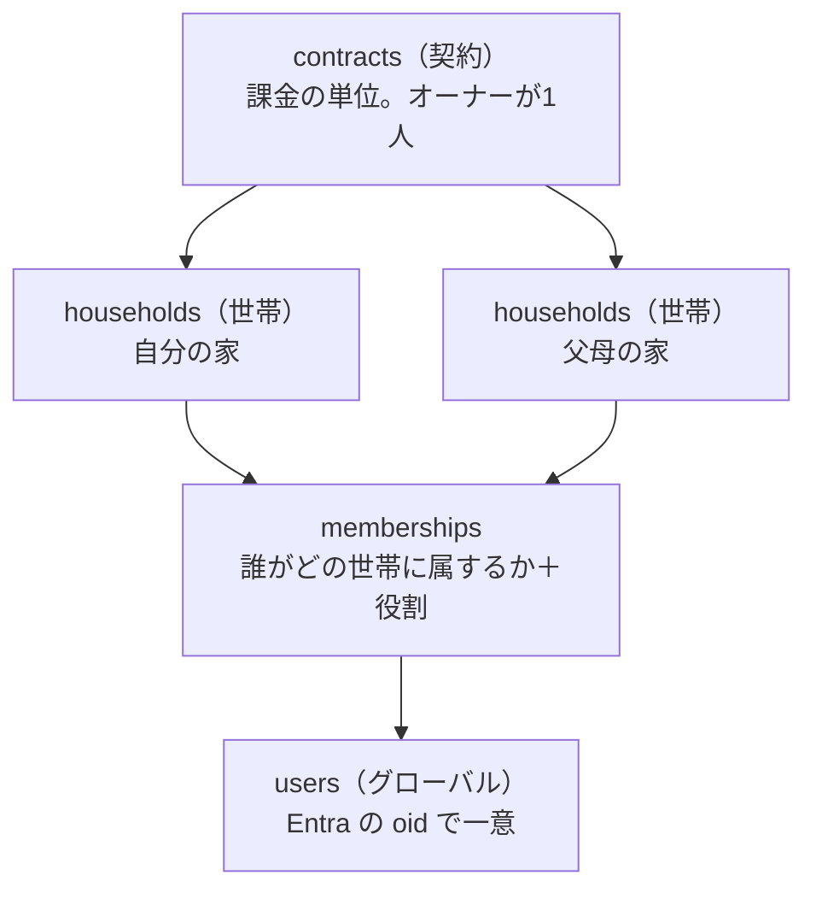
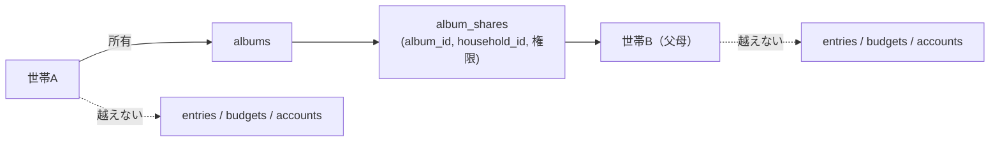

# SaaS 化調査（構想メモ）

身内での磨きこみが済んだあと、KakeiFlow をサブスクの Web サービスとして展開できるかの調査結果。
**まだ計画書ではない。** 実装に入るときは `.claude/rules/development_procedure.md` に従い、
`91_UPDATE/01/` へ改めて計画書を起こす。

作成: 2026-08-13

---

## 結論

**プロダクトの中身とデータモデルは十分。障壁は技術ではなく「入口（登録）」「固定費」「法務・サポート」の3つ。**

いま無いのは機能ではなく、**赤の他人が自分で登録して自分で払う経路**である。
身内向けの前提（オーナーが Azure ポータルで手動招待する、世帯は `seed_master.sql` で手で作る）が
そのまま塞いでいる。

構成は **契約 / 世帯 / ユーザーの3層**、料金は **無料 / プレミアム / 上位（アルバム）の3段**で確定。
層は固定し、**プランで変わるのは上限だけ**にする（[D6](#d6-層は3つのままプランで変わるのは上限だけ)、
[§3](#3-課金設計)）。

---

## 1. すでにある資産

| 資産 | なぜ効くか |
|---|---|
| 全テーブルの `household_id` と `assertReferencesInHousehold` | **マルチテナントの分離が後付けでなく最初から入っている。** SaaS 化で作り直す部分が少ない |
| 追記専用台帳＋残高導出 | テナントが増えても「他人のデータで計算が壊れる」事故が起きにくい |
| 接続文字列と API キーを持たない構成（MI） | 利用者が増えたときに漏れて困る秘密が、そもそも存在しない |
| 入口で座標を捨てる作り（`dropIfImprecise` → `stripIfAtHome`） | **プラン外なら捨てる**を同じ場所に足すだけで、下流が全部正しく動く |

### 競合と勝ち筋

マネーフォワード ME・Zaim（有料はおおむね月500円前後）は**銀行・カード自動連携による見える化**が主戦場で、
**予算を組み換えて運用する**部分は弱い。KakeiFlow の4台帳分離・カテゴリ別繰越ポリシー・プール・
支出マップは、海外で YNAB が取っているポジション（封筒家計簿を世帯で回す）に近い。

**自動連携で真っ向勝負しない。** そこは資金移動業・スクレイピング契約・維持コストの世界で、個人では戦えない。
「予算を配り、組み換え、繰り越して、世帯で回す」ことに一点集中する。

---

## 2. 契約 / 世帯 / ユーザーの3層モデル

**採る。** 「PC が使える1人が父母世帯の管理も行う」は実在するニーズで、日本の家計簿アプリでほぼ空いている。
介護・実家の家計管理という文脈は、値段を正当化しやすい数少ない領域でもある。

### D1. `users` は世帯に属さない。グローバルにする

いまは `users.household_id NOT NULL`（`001_init.sql`）。これを外し、
**`memberships(user_id, household_id, role)` へ移す。**

1人が複数世帯に属せないと構想そのものが成立しない。管理者は自分の世帯と父母世帯の両方に入る。
`users` は Entra の `oid` で一意なグローバルな存在になり、テナントに属さなくなる。
**これが今回いちばん大きなスキーマ変更**で、後回しにするほど高くつく。

### D2. 無料でも世帯を必ず1つ作る。「ユーザー単位」を構造にしない

「無料の間はユーザー単位」を**世帯を持たない**と実装すると、有料化のたびにデータ移行が要る。
無料も有料も構造は同じにして、**上限だけを変える。**

| | 無料 | 有料 |
|---|---|---|
| 世帯 | 1つ（登録時に自動作成） | 契約の枠まで |
| 招待 | 不可 | 可 |
| 位置・通知・写真 | 不可 | 可 |

無料ユーザーの世帯は `contract_id` が NULL の世帯として存在する。有料化は**契約を作って紐付けるだけ**で、
データは1行も動かない。

### D3. 課金の判定は世帯から引く。ユーザーからは引かない

父が無料ユーザーでも、子の契約下にある父母世帯の中では**有料機能が使える**。
判定は `households.contract_id` → `contracts.plan` の1本だけを見る。

ユーザーから引くと、同じ画面が**誰が開いたかで挙動を変える**ことになり、世帯共有の意味が壊れる。
「妻が開くと地図が出るが夫が開くと出ない」は説明できない。

### D4. 契約オーナーは請求の権限であって、閲覧の権限ではない

**支払っている人がその世帯の家計をいつでも覗ける作りにしない。** 事故になる。

| 契約オーナーができること | できないこと |
|---|---|
| 世帯の作成・削除、枠の増減 | **家計データの閲覧** |
| 支払い方法の変更、請求書の取得 | 記帳・予算の変更 |
| 世帯オーナーの指名 | |

データを見るには**自分もその世帯のメンバーになる**（＝`memberships` に行を作る）。
入れば世帯のメンバー一覧に出るので、**見ていることが隠れない。**

今回の想定（父母世帯を子が管理する）では子がメンバーとして入るので、実運用は何も変わらない。
変わるのは「黙って見られない」ことだけ。

### D5. 契約が切れても世帯は消さない。読み取り専用へ落とす

家計の記録は消えると取り返しがつかない。解約後は記帳を止め、閲覧とエクスポートだけ残す。
**猶予期間と最終削除の期日は規約に明記する。**

あわせて**世帯の契約移管**（父が自分で契約を引き継ぐ）ができるよう、`households.contract_id` は
可変にしておく。画面を作るのは後でよいが、モデルは今決めておく。

### D6. 層は3つのまま。プランで変わるのは**上限だけ**

プランごとに「契約が持てる世帯数」「世帯が持てる人数」が変わるだけで、**構造は3層で固定する。**

| | 無料 | プレミアム | 上位（アルバム） |
|---|---|---|---|
| 契約 | 無し（`contract_id` が NULL） | 1つ | 1つ |
| 世帯 | **1つ**（登録時に自動作成） | **1つ** | **複数** |
| 世帯あたりの人数 | **1人**（招待不可） | **10人** | 10人 |
| 本人の役割 | オーナー | オーナー | 契約オーナー |

プレミアムは `契約:世帯 = 1:1` になるが、**契約層は畳まない。**
上位プランで 1:多 になるうえ、支払い方法・請求先・解約状態は世帯の属性ではないため。
世帯オーナーが交代しても契約は動かない。

**「PC が使える1人が父母世帯も管理する」は上位プランの役割になる。**
複数世帯を1つの契約で持てるのは上位だけなので、当初構想はここへ集約する。

### D7. 無料でも招待される側にはなれる

無料の上限「1世帯・1人」は**自分が作れる世帯**の話であって、他人の世帯に入ることは妨げない。
無料ユーザーが自分の1人世帯を持ったまま、プレミアム世帯のメンバーにもなれる。

これは D1（`users` をグローバルにする）が前提で、D3（判定は世帯から引く）でそのまま処理できる。
**その人は自分の世帯では無料機能、招かれた世帯では有料機能を使う。**

### D8. 人数の枠は招待した時点で埋まる

10人の枠は `memberships` の有効な行で数え、**招待済みで未サインインの行（`provider_user_id` が NULL）も
1人として数える。** 数えないと11人目を招待できてしまい、後から来た本人が入れない。
断るなら招待の時点で断る。

### D9. 移行は二段階で行う

既に身内で運用中のデータがあるため、`018` 以降のマイグレーションで足す。

1. `users.household_id` を残したまま `memberships` を作り、**両方へ書く**
2. BE を `memberships` 参照へ切り替える
3. `users.household_id` を落とす

一度に落とすと、切り替えの瞬間にログインできなくなる窓ができる。

### 残る論点

- **世帯の招待は誰ができるか。** 契約オーナーか、世帯オーナーか、両方か
- **1ユーザーが属せる世帯数の上限。** 無制限だと招待の踏み台にされうる
- **同じ人が2つの契約に世帯を持つ場合**（自分でも契約し、親の契約にも入っている）の請求表示
- **プレミアム → 上位へ上げたとき、2つ目の世帯をどう作るか。** 新規作成だけか、
  既にある他人の無料世帯を自分の契約へ引き取れるようにするか（引き取りは同意の設計が要る）
- **上位 → プレミアムへ下げたとき、2つ目以降の世帯をどうするか。**
  D5 のとおり消さず読み取り専用に落とすのが既定。どれを残すかを選ばせるか、自動で決めるか

---

## 3. 課金設計

**機能を細切れに売らない。3段に畳む。** 元案（広告撤去330円 / 位置550円 / +110円で通知）は
刻みが4つ以上あり、選択肢が増えるほど転換率が落ちる。位置と通知は同じ「原価がかかる機能」なので束ねる。

| プラン | 目安 | 世帯 | 人数 | 内容 |
|---|---|---|---|---|
| 無料 | 0円 | 1 | 1 | 記帳・予算・プール・分析。**広告あり**。位置・通知なし |
| プレミアム | 月480〜580円 | 1 | 10 | **広告なし**＋位置＋通知＋レシート添付＋招待 |
| 上位（アルバム） | 月880〜1,280円 | 複数 | 10/世帯 | 上記＋写真アルバム＋**世帯間共有**＋容量◯GB |
| （年額） | 2ヶ月分引き | | | |

**原価がかかるものを有料にする**という元案の筋はそのまま活きている。
Azure Maps と逆ジオ（位置）、ACS（通知）、Blob（写真）はいずれも実費が動くので、
課金の段と原価の段が一致する。**値上げの説明がしやすい構造**でもある。

**Web サブスクにするのは正解。** App Store / Google Play 経由だと 15〜30% 取られる。

### 広告を出す場合に確認が要ること

無料枠に広告を置く方針は決定事項として扱う。実装前に以下を確認する。

- **外部送信規律**（改正電気通信事業法、2023年6月施行）— 第三者へ利用者情報を送信するため、
  通知または同意取得の画面が要る
- **配信事業者のポリシー** — 個人の金融情報を表示する画面での配信可否
- **家計データを広告に渡さない。** 金額・店名・カテゴリをターゲティングの材料にしない。
  ページ内容に依存しない配信に限定する。ここが漏れると信頼が一度で消える
- **置き場所** — 記帳中の画面には出さない。入力の妨げになると解約ではなく離脱を招く

なお収益の見込みは概算で**1ユーザー月数円**なので、広告は収入源ではなく
**「プレミアムの理由」として機能させる**位置づけになる。

---

## 4. 写真（Blob）— レシート添付とアルバム

**2つの機能に分けて、別々の段に置く。** 土台（Blob ＋ User Delegation SAS ＋ サムネイル）は共通なので、
片方を作ればもう片方はほぼ追加費用なしで載る。

| | 何か | 世帯を越えるか | 段 |
|---|---|---|---|
| **レシート添付** | 記録（`entries`）に写真を1〜数枚ぶら下げる | 越えない | プレミアム |
| **アルバム** | 家計とは独立した写真の入れ物 | **越える（共有）** | 上位 |

### P1. 家計データは世帯を越えない。越えるのはアルバムだけ

**これが今回いちばん重要な線引き。**

台帳・予算・口座・場所は世帯の中で閉じたままにする。`assertReferencesInHousehold` は
このシステムでいちばん強い安全装置で、**世帯を越える経路を1つでも開けると保証そのものが消える。**
「父母世帯のアルバムを見られる人が、父母の家計も見られてしまった」は起こしてはいけない事故。

アルバムは**最初から世帯を越える前提**で、台帳とは別の権限体系で作る。

### P2. 権限判定の関数を混ぜない

アルバムの閲覧可否は `album_shares` を見る専用の判定（`assertAlbumAccess` など）で行い、
**`assertReferencesInHousehold` は一切通さない/緩めない。** 既存の関数に「アルバムなら世帯越えを許す」
分岐を足すと、いずれ台帳側の呼び出しがその分岐を踏む。**別の関数にしておけば踏みようがない。**

これは既存の設計（座標を入口で捨てる、番号を数える場所を1つにする）と同じ考え方で、
**壊れられない作りにすることそのものを対策にする。**

### P3. ブラウザから直接読み書きする。BE を通さない

BE を経由させると Functions の帯域と実行時間を払うことになる。画像は大きいので効く。

**ユーザー委任 SAS（User Delegation SAS）を BE が MI で発行する。**
ストレージは共有キーアクセス自体を禁止しているため、アカウントキーの SAS は使えない。
User Delegation SAS なら Entra ID（＝MI）で署名するので、
**「接続文字列と API キーをどこにも保持しない」方針を崩さずに済む。**
有効期限は短く（数分）、書き込みは1オブジェクトに限定する。

### P4. サムネイルを必ず作る。帯域が主コストになる

**容量より下り帯域のほうが高い。** 目安として保存は GB あたり月数円だが、下りは GB あたり十数円で、
しかも**見るたびに**かかる。一覧に原寸を並べると1画面で数十 MB 出ていく。

| 用途 | 作るもの |
|---|---|
| 一覧・サムネイル | 長辺 400px 程度 |
| 通常表示 | 長辺 1600px 程度 |
| 原寸 | ダウンロード時のみ |

**縮小はクライアントで行い、2枚アップロードする。** BE で変換すると Functions の実行時間を
画像の枚数だけ払うことになる。遅い回線での記帳が止まらない利点もある。

### P5. 容量の上限を必ず置く

無制限にすると**1人の重い利用者で採算が崩れる。** 世帯あたり（または契約あたり）の上限を決め、
超えたらアップロードを断る。追加容量は別売りにできる。

上限に近づいたことを事前に知らせる。**上げようとした瞬間に断られるのがいちばん困る。**

### P6. 共有しても容量は持ち主の契約に計上する

共有された側が課金されると、**共有されただけで請求が増える**ことになり説明できない。
容量も帯域も持ち主持ちにする。代わりに**1アルバムを共有できる世帯数に上限**を置き、
配布サービスとして使われるのを防ぐ。

### P7. 動画は当面入れない

容量・帯域・変換コストが写真と桁で違う。入れるなら独立した検討が要る。

### P8. 写真は再入力できない

金額は覚えていれば打ち直せるが、**レシートの現物も、その日の写真も、二度と手に入らない。**
バックアップと削除の責任が金額データより一段重くなる。

- 削除は論理削除にし、猶予期間の後に物理削除する
- Blob のソフト削除とバージョニングを有効にする
- 解約・退会時の保持期間とエクスポート手段を規約に明記する

### P9. アルバムを SNS にしない

上げる・見る・落とす・消す・世帯に共有する、**この5つだけ**に絞る。
コメント・いいね・タイムライン・通報を足し始めると、家計簿とは別のプロダクトになり、
モデレーションの義務まで背負うことになる。**入れ物として作る。**

### 将来 — レシート OCR

Azure AI Document Intelligence の領収書モデルを使えば、写真から金額・店名・日付を起こせる。
差別化としては大きいが原価が跳ねるので、さらに別の段として切り分ける。

---

## 5. コストと損益分岐

| 項目 | 身内（現在） | SaaS |
|---|---|---|
| Azure SQL | Basic 5DTU / 2GB | **Serverless か Elastic Pool 必須。** 数百世帯で Basic は破綻する |
| Functions | Flex（コールドスタート数秒） | **無料ユーザーに数秒待たせるのは離脱要因。** always-ready ＝ 固定費 |
| Azure Maps | 月5,000tx の無料枠に収まる | **枠はアカウント単位。** 世帯が増えれば即超過 |
| ACS メール | ほぼ無料 | 通数課金 |
| Blob | — | **主コストは容量ではなく下り帯域**（P4）。見られるほど増える |

固定費はざっくり**月 8,000〜15,000円**。決済手数料（Stripe 3.6% ＋固定）を引くと
実収はプレミアム 580円→約520円、上位 1,280円→約1,190円。
**プレミアム100人で月5万円前後**、うち固定費を引いて月3〜4万円が残る。

黒字にはなるが、有料100人には無料1,000〜3,000人が要る（転換率 3〜10%）。
**技術より集客が壁。**

**上位プランだけは変動費が読めない。** 位置と通知は1世帯あたりの上限が見えるが、
写真は利用者次第で桁が動く。**容量上限（P5）を決めずに上位プランを売り出さない。**

### 国土地理院の逆ジオは商用利用の可否を確認する

`system_flow.md` に自分で書いてある通り、**地理院地図向けの提供で SLA が無い。**
無料の身内利用と、課金しているサービスから15分ごとに叩き続けるのは意味が違う。
**有料展開の前に利用規約の確認が必須。** 使えないなら有料の逆ジオへ切替＝原価が増える。

---

## 6. 法務・運用

| 項目 | 内容 |
|---|---|
| 特定商取引法に基づく表記 | サブスクなので必須。**個人事業だと氏名・住所の開示義務**（バーチャルオフィスの検討） |
| 利用規約・プライバシーポリシー | 取得する情報、位置情報の扱い、写真の扱い、解約後の保持期間 |
| 個人情報保護法 | 開示・訂正・削除請求への対応窓口 |
| 消費税・インボイス | 表示価格を内税に統一する |
| 利用者が上げた写真 | 共有先は招いた世帯だけの**閉じた範囲**なので公開プラットフォームには当たらない。権利侵害の申し立てを受けたときの削除手順だけ規約に置く（P9 を守る限り軽い） |
| 障害対応 | 問い合わせ窓口。**身内なら「ごめん」で済む障害が、有料だと済まない** |
| バックアップ | Azure SQL Basic の PITR は7日。有料展開では期間の見直しが要る |

---

## 7. 着手順

**①だけは身内での磨きこみ中に混ぜるのが得策。** 記録が増えるほど移行が重くなる。

| 順 | 内容 | いつ |
|---|---|---|
| 1 | **契約 / 世帯 / ユーザーの3層化**（D1・D2・D9） | 磨きこみ中に実施 |
| 2 | セルフサインアップ（Entra External ID / CIAM への移行、世帯の自動作成＋シード投入） | 展開の直前 |
| 3 | 課金とエンタイトルメント（Stripe、`contracts.plan` による上限と機能ゲート） | 2 のあと |
| 4 | 広告（無料枠。外部送信規律の同意画面を含む） | 3 と同時 |
| 5 | レシート添付（Blob、User Delegation SAS、サムネイル） | 3 のあと |
| 6 | アルバムと世帯間共有（`albums` / `album_shares`、容量管理） | 5 のあと。**上位プランと同時** |
| 7 | 法務書類・問い合わせ窓口 | 公開前 |

**5 と 6 は土台を共有する。** 5 で Blob・SAS 発行・サムネイル・容量計上を作っておけば、
6 は権限体系（P1・P2）を足すだけで載る。**逆順にはしない。**
先にアルバムを作ると、世帯を越える権限を前提にした土台の上へレシート添付を載せることになり、
P1 の線引きが最初から曖昧になる。

---

## 関連ドキュメント

- [システム構成](../system_architecture.md) — 現在の全体像
- [処理フロー](../system_flow.md) — 現在の主要な処理
- [ユーザー手動作業](19_ユーザー作業.md) — Azure / Entra 側で人が行う作業
