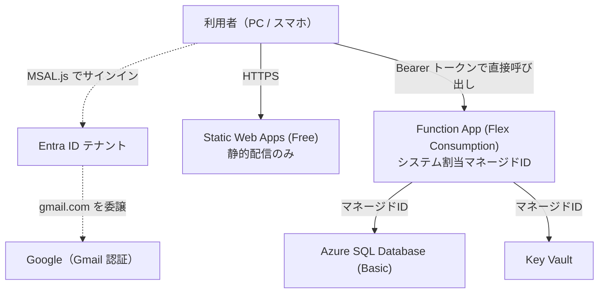

# システム構成（L1: 鳥瞰）

KakeiFlow — 世帯向け家計簿。カレンダーを基点に、予算・財布・プールを管理する。

> このドキュメントは**全体像とコンポーネント間の関係のみ**を扱う。
> ファイル単位の責務は L2（`01_開発ドキュメント/`）、テーブル定義は L3（`02_DB情報/`）を正とする。

---

## コンポーネント

| コンポーネント | 役割 | 実体 |
|---|---|---|
| **FE** | 画面。カレンダー・入力・予算・分析 | `10_SITE_DEPLOYMENT/`（React + TS + Vite） |
| **BE** | API。認証・業務ロジック・DB アクセス | `11_BE_DEPLOYMENT/`（Azure Functions / Node 22 / TS v4） |
| **DB** | 全データ | Azure SQL Database `KakeiFlow_SQL` |
| **定義** | スキーマ・初期データ | `20_DATABASE/`（マイグレーション + シード） |

BE には HTTP のほかに**タイマー**が3本ある。
`reminderSweep` が5分ごとに予定の通知を送り、`recurringSweep` が1日1回（JST 00:10）
定期取引を記帳し、`placeGeocodeSweep` が15分ごとに場所マスタへ地名を埋める。

FE と BE は**別リポジトリ・別デプロイ**。FE は `KakeiFlow_GH` にあり SWA が自動デプロイする。
BE は本リポジトリ配下から `func azure functionapp publish` で単独デプロイする。

---

## Azure 上の構成

**接続文字列とAPIキーをどこにも保持しない。** リソース間の接続はすべて
Entra ID + マネージドID で行う。ストレージは共有キーアクセス自体を禁止している。

SWA の Linked Backend は使わない（Managed Functions がマネージドIDに対応しないため）。
FE は Function App の URL を直接呼び、CORS で許可する。この判断の経緯は
[再構築計画書 §2.2](../91_UPDATE/01/20260810_rebuild_plan.md) を参照。

---

## 認証

| 対象 | 方式 |
|---|---|
| 利用者 → サイト | Entra ID（Gmail は Google フェデレーション経由）。MSAL.js がトークンを取得 |
| FE → BE | `Authorization: Bearer`。BE は JWKS で JWT を検証する（EasyAuth に依存しない） |
| BE → DB / Key Vault | マネージドID |

世帯メンバーは `users` テーブルへの登録が必須。Entra 認証を通っても未登録なら `403` を返す。
招待は「オーナーが画面から登録 → 本人の初回サインインでメール照合により自動紐付け」という流れ。

---

## データモデルの中核

**台帳を4つに分離する。** これが現行アプリの予算組み換えバグと種別変更バグの根治策になっている。

| 台帳 | 性質 | 役割 |
|---|---|---|
| `entries` | 事実の記録 | 財布残高・クレジット債務・予算消化の source |
| `budget_allocations` | **月次・追記専用** | 予算額の source。UPDATE せず `SUM` で導出 |
| `pool_movements` | **累積・追記専用** | プール残高の source。月をまたいで持ち越す |
| `entry_stock` | 一時領域 | 確定するまで残高・予算に影響しない |

台帳ではないが、`places` が**店の実体**を持つ。同じ「イオン」でも離れた場所は別の行で、
`entries.place_id` が指す。束ねる鍵は座標のかたまりで、地名は表示のための飾り
（[処理フロー](system_flow.md#束ねる単位は場所マスタ)）。

台帳ではないが、`recurring_rules` が**取引の雛形と次回予定日**を持つ。
事実の記録ではなく規則なので、追記専用ではなく更新される。
未来の取引行は作らず、その日が来たものだけを `entries` へ実体化する
（[処理フロー](system_flow.md#定期取引の予約と自動記帳)）。

お金の性質も明確に分ける。**予算とプールは架空、財布とクレジットは実際。**
残高はカラムで持たず取引から導出する（`vw_account_balances` / `vw_pool_balances`）。

金額はすべて `BIGINT` の円単位整数。テーブル定義は L3（`02_DB情報/`）と
`20_DATABASE/migrations/` を正とする。

---

## 画面構成

記帳の動線と設定の動線を分ける。**よく使う3画面は上部のセグメント**に常駐させ、
**設定系は最下部**へ置く。上部のボタンを押し間違えても記帳から離脱しない。

| 位置 | 画面 | 役割 |
|---|---|---|
| 上部 | `/calendar/:ym` | 記帳の中心。日別の一覧と、その場での追加・編集 |
| 上部 | `/budget/:ym` | 配分・組み換え・プールの出し入れ・履歴 |
| 上部 | `/accounts` | **閲覧のみ。** 財布とクレジットの残高、口座別の明細 |
| （カレンダーから） | `/stock` | クイック登録した未確定の記録を確定する |
| （カレンダーから） | `/bulk` | 行を並べて**まとめて記録**する（[処理フロー](system_flow.md#リストからの一括登録)） |
| 上部 | `/analytics/:ym` | 推移・カテゴリ別・場所別（支出マップ）・曜日別 |
| 上部 | `/settings` | **編集。** 予算 / 口座 / プール / 定期 の4タブ（実際に触る順） |
| 下部 | `/settings/profile` | 表示名・アイコン・優先表示する財布 |
| 下部 | `/settings/members` | メンバーの招待と権限（オーナーのみ） |
| 下部 | `/settings/home` | 自宅の登録。ここで記録したものは位置情報を持たせない |
| 下部 | `/status` | 疎通確認 |

口座は**見る場所と直す場所を分ける**。残高確認は頻度が高く編集は稀なため、
同じ画面に混ぜると閲覧のたびに編集操作が目に入ってしまう。

**値が揃うまで数字を出さない。** 起動中は `index.html` のスプラッシュ、
取得中の金額はスケルトンに置き換える。0 を描くと ¥0 が本物に見える
（[処理フロー](system_flow.md#数字が揃うまで数字を出さない)）。

マスタは**削除せずアーカイブする**。取引が参照しているため、消すと過去の月の集計が変わってしまう。

---

## 外部連携

| 連携先 | 用途 | 状態 |
|---|---|---|
| Microsoft Entra ID | 認証 | 稼働中 |
| Google (OAuth) | Gmail でのサインイン | Entra のフェデレーション設定待ち |
| Azure Communication Services | 予定の通知メール | 稼働中。MI 認証 |
| Azure OpenAI | あいまい入力の解析 | 未着手 |
| Azure Maps | **支出マップの地図描画** | 稼働中。MI 認証。BE が画像を取得して中継する |
| Azure Maps | 位置情報からの場所推定（POI） | **不採用**。日本の施設データが薄くローマ字のため（[経緯](../91_UPDATE/21/20260811_updatefix_schedule.md)） |
| **国土地理院** | **座標からの地名（逆ジオコーディング）** | **稼働中。API キー不要。**15分ごとの定時ジョブが場所マスタに埋める |
| Google Places | 施設の正式名称 | 保留。API キーが要るため Key Vault + MI で読む構成になる |

**地図の描画と場所の推定は別物として扱う。** 地図のラベルは日本語で正しく描かれるが、
POI 検索・逆ジオコーディングは日本ではローマ字で使い物にならなかった。
そのため地図は Azure Maps を使い、**場所の推定は過去に自分たちが入力した店名**から行う。

地図はブラウザから直接呼ばない。そうするとキーを配るか、
利用者ひとりひとりに Azure のロールを割り当てることになり、どちらも
接続文字列とAPIキーを持たないという方針に合わない。BE が MI で取得して中継する。

---

## 関連ドキュメント

- [再構築計画書](../91_UPDATE/01/20260810_rebuild_plan.md) — 全体計画とフェーズ定義
- [処理フロー](system_flow.md) — 主要な処理の流れ
- [ユーザー手動作業](10_計画/19_ユーザー作業.md) — Azure / Entra 側で人が行う作業
- [SaaS 化調査](10_計画/01_SaaS化調査.md) — 一般公開・課金の構想（**未着手。現在の構成には未反映**）
