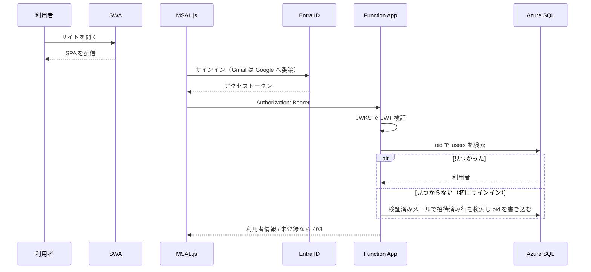
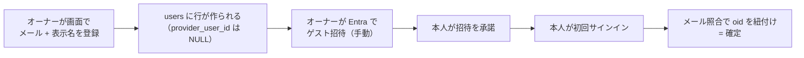
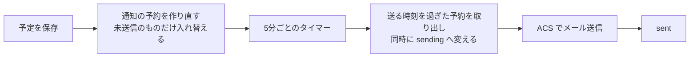
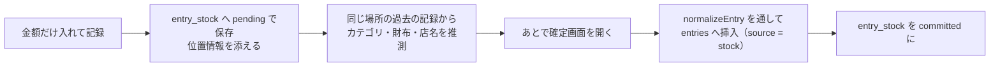
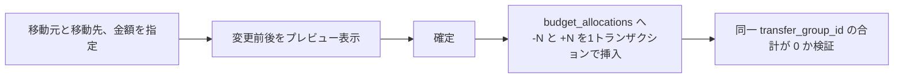

# 処理フロー（L1: 鳥瞰）

主要な処理の流れ。**関数の引数や内部ロジックは書かない**（L2 の担当）。

---

## サインイン

**メールアドレスは Entra が検証したクレームのみ使う。** リクエスト本文の値は決して使わない。

---

## メンバー追加

Entra への招待だけは人手が必要なため、追加直後に画面上で手順を案内する。

---

## 記帳（Phase 1 で実装）

**画面遷移で状態を失わせない。** 編集はモバイルではボトムシート、PC では右パネルで行い、
選択日・スクロール位置・フィルタを保持する。画面状態は URL に持たせる。

---

## 予定の通知

**遅れてもよいが、二重に送ってはいけない。** 取り出しと状態変更を1文で行い、
同じ予約を2つの実行が処理しないようにする。送信中に落ちたものは15分後に拾い直す。

送信予定から12時間以上過ぎたものは送らない。障害から復旧したときに古い通知が大量に飛ぶのを防ぐ。

**終日の予定は当日9:00を基準**に逆算する。前日通知が真夜中に飛ぶのを避けるため。

---

## クイック登録と確定

**確定するまで `entries` に入らない。** 残高にも予算にも影響しないため、
「とりあえず記録した額」が集計を汚さない。これがこの機能の前提。

推測は緯度経度が ±0.0015度（日本付近で概ね 140〜170m）にある過去の支出を集計して行う。
根拠は `suggestion_reason` に残し、画面に表示する。
**なぜその初期値なのか分からないまま埋まっている状態を作らない。**

確定時の項目整合は通常の登録と同じ `normalizeEntry` / `assertReferencesInHousehold` を通す。
経路が増えても検証の強さを変えない。

---

## 配分の設定

**既定値は設定ページ、その月の変動は予算ページ**という役割分担にする。

| どこで | 何を | いつ効くか |
|---|---|---|
| 設定 → 予算タブ | カテゴリごとの既定額（`budget_categories.default_amount`） | **次に開く新しい月から** |
| 予算ページ → 配分を設定 | その月の配分（`budget_allocations`） | その月だけ |

新しい月を初めて開いたとき、`ensurePeriod()` が `budget_periods` の行を作った回だけ
既定額を配分として投入する。期間の有無で判定するため、あとから既定額を変えても過去の月には遡らない。

配分の設定は**上書き**として扱う。入力された金額が、その月のそのカテゴリの配分合計になる。

台帳は追記専用のため、`指定額 −（組み換えや拠出を含む現在の配分合計）` を1行だけ追記して合わせる。
過去の行は書き換えないので、どういう経緯でその額になったかは履歴に残る。

> 「基本配分だけを差し替える」方式も採れるが、組み換え後に配分を直したとき、
> 画面に出ている数字と入力した数字が一致しなくなる。入れた額がそのまま結果になるほうを採った。

---

## 月次締めと繰り越し

必ず**プレビュー → 承認**の2段階にする。何がどう動くか見ないまま押せる操作にしない。
プレビューと実行は同じ計算関数（`computeLines`）を使い、表示と結果が食い違わないようにする。

| カテゴリの設定 | 締めたときの動き |
|---|---|
| 繰り越さない | 何もしない |
| 余りだけ繰り越す | 余りが正なら翌月へ `carry_over` で +N |
| 過不足とも繰り越す | 余りが正でも負でも翌月へ `carry_over` |
| 余りをプールへ | 当月に `carry_to_pool` で −N、プール台帳へ +N（対で記録） |

締めた月は `assertPeriodOpen` が配分の変更を拒否する。

### 順序の制約

- **前月が未締めなら締められない。** 古い月の繰越が後から降ってくると、締めた月の数字が動いてしまう
- **翌月が締め済みなら戻せない。** その繰越の上にさらに積み上がっているため、新しい月から順に戻す

### 締めを戻すときだけは行を削除する

台帳は原則として追記専用だが、締めの取り消しに限り、締めが作った行を**削除**する。

- 締めは「その時点の残額から機械的に導ける操作」であり、履歴として保つ価値が薄い
- ±の対を残すと、翌月の履歴が取り消しの記録だらけになって読めなくなる
- `ux_alloc_carryover`（カテゴリごとに繰越は1行まで）が、取り消し時に行が消えることを前提にした制約になっている

利用者が手で行ったプール拠出（`to_pool`）を巻き込まないよう、
**締めが作った行は `carry_to_pool` という専用の理由で区別する**。

---

## 予算の組み換え

予算額は UPDATE せず `SUM` で導出するため、**組み換えで総額が狂うことが構造的に起きない**。
取り消しは逆仕訳の追記で行い、履歴は消さない。

**移動元の残額が不足していても実行を止めない。** 赤字の月は予算がマイナスになるのが実態であり、
残額で縛ると組み換えが最も必要な月にこそ組み換えできなくなる。マイナスになることはプレビューで示す。

---

## プールの出し入れ

プールは「予算から拠出」と「何もないところから追加」の2系統を持つ。

| 操作 | 挿入されるレコード | ゼロサム検証 |
|---|---|---|
| 予算 → プール | `budget_allocations(-N)` + `pool_movements(+N)` | あり |
| プール → 予算 | `pool_movements(-N)` + `budget_allocations(+N)` | あり |
| 臨時の積み増し | `pool_movements(+N)` のみ | なし |

**ゼロサム検証は `transfer_group_id` が付いたレコードにのみ適用する。**
これにより臨時の積み増しが制約に抵触しない。

拠出元カテゴリの残額不足は許容するが、**プール残高を超える引き出しは拒否する**。
プールは積み立てた実額であり、無い金額を取り出す操作には意味がないため。

---

## デプロイ

| 対象 | 手段 | 契機 |
|---|---|---|
| FE | GitHub Actions（SWA） | `KakeiFlow_GH` の `main` へ push |
| BE | `npm run deploy`（Functions Core Tools） | 手動 |
| DB | `20_DATABASE/migrations/` を連番で適用 | 手動 |

マイグレーションは冪等に書き、`schema_migrations` テーブルに適用履歴を残す。
