# 処理フロー（L1: 鳥瞰）

主要な処理の流れ。**関数の引数や内部ロジックは書かない**（L2 の担当）。

---

## サインイン

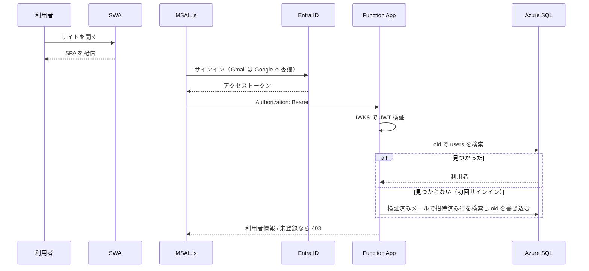

**メールアドレスは Entra が検証したクレームのみ使う。** リクエスト本文の値は決して使わない。

### 数字が揃うまで数字を出さない

Function App のコールドスタートと Azure SQL への初回接続で、開いてから数秒かかることがある。
その間 `0` を描くと、**¥0 が本物の数字に見えて「残高が消えた」と読める**。

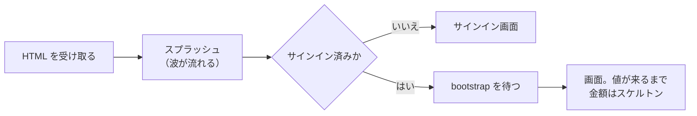

**スプラッシュは `index.html` に素で置く。** React コンポーネントにすると
JS バンドルの取得・評価が終わるまで出ず、いちばん白い時間に間に合わない。

**閉じ込めないことを最優先する。** 消す道は3つあり、どれか1つでも通れば消える。
未認証はサインイン画面の描画時、認証済みは `bootstrap` の**解決または失敗**時、
そのどちらも来なければ **8秒の安全弁**が消す。
ロゴが永久に回り続ける画面は真っ白より悪い。原因が一切読めなくなる。

金額は `data` が来るまでスケルトンに置き換える。**寸法は値のときと同じ要素・
同じクラスで包む**（`components/Skeleton.tsx`）。別の入れ物で包むと行の高さが変わり、
値が入った瞬間に画面が跳ねる。

待ち時間そのものは縮めていない。隠しているだけなので、
実測でまだ遅ければ always-ready インスタンス（課金増）を別途検討する。

---

## メンバー追加

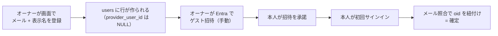

Entra への招待だけは人手が必要なため、追加直後に画面上で手順を案内する。

---

## 記帳（Phase 1 で実装）

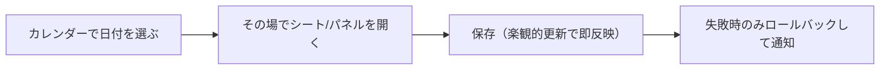

**画面遷移で状態を失わせない。** 編集はモバイルではボトムシート、PC では右パネルで行い、
選択日・スクロール位置・フィルタを保持する。画面状態は URL に持たせる。

### 直せる場所は3つ、実装はひとつ

記録を直したくなるのはカレンダーだけではない。**残高がおかしいと気付くのは口座画面**、
**使いすぎに気付くのは予算画面**、**何に使ったか辿るのは分析画面**なので、
そこから直せないと日付を思い出して戻る羽目になる。

| どこから | 何を出すか |
|---|---|
| カレンダー | 選んだ日の一覧 |
| 口座 | その口座の直近60件（`GET /api/entries?accountId=`） |
| 予算 | そのカテゴリのその月（`GET /api/entries?categoryId=&from=&to=`） |
| 分析 | カテゴリ／場所のその月（`?categoryId=` / `?placeId=` / `?merchant=`） |

一覧はどれも既存の検索を流用する。**場所で絞る道だけは無かった**ので、
`?placeId=` と `?merchant=` を足した（それ以外の BE 追加は無い）。

**編集シートは1つの実装を共有する。** 3か所に同じものを書くと必ず片方だけ直る。
口座と予算では一覧シートの上に重ねて出し、閉じれば元の一覧に戻る。

**一覧シートも共有する**（`features/entries/EntryListSheet.tsx`）。分析からも開くようになり
3か所目になったので、編集シートと同じ理由で1つにまとめた。
金額の符号・色・2行目の文言だけを画面ごとに渡す（口座は「その口座から見た増減」なので
振替の相手側で符号が反転し、予算のカテゴリ明細は全部が支出なので赤で塗らない）。

分析では、カテゴリの行は**行ごと押せる**が、場所の行は 📍地図リンクを抱えているため
行をボタンにできない（ボタンの中にリンクは置けない）。場所だけ「🧾 明細」を別に出す。

場所の明細は**2系統で絞る**。一覧が `COALESCE(表示名, merchant, place_name)` で
束ねているので、絞り込みも同じにしないと「一覧には出るのに明細が空」が起きる。
マスタに紐付いていれば `?placeId=`、紐付いていなければ `?merchant=`。

**新規作成は共有しない。** 現在地・自宅判定・連続入力は「記録するとき」だけの関心で、
口座や予算から新しく作る導線は無い。作成はカレンダーが持つ。
「この支出を返金」も新しい記録を作る操作なので、カレンダーからのみ出す。

プールから出した支出は `budget_category_id` を持たないため、予算の明細には出ない。
予算カテゴリを消費していないので、それが正しい。

### 口座間のお金の移動

**種別は `transfer` の1つだけ。** 入力の導線を3つに分け、呼び名は口座の種別から導く。

| 入力の導線 | 行き先 | 履歴での呼び名 |
|---|---|---|
| 口座移動 | 任意の口座 | 口座移動 |
| カード引落 | クレジット | カード引落 |
| **チャージ** | **電子マネー** | **チャージ** |

チャージ元はクレジットでも財布でもよい。クレジットから出せば支払予定が積み上がり、
財布から出せば残高が減る。どちらも `transfer` の性質そのままなので、特別扱いは要らない。

**チャージ元は口座の属性で固定する。** `accounts.is_charge_source` を立てた口座から
出したことにし、記録画面では**チャージ先だけを選ぶ**。実際には出どころが常に同じなので、
毎回選ばせる意味がない。固定表示のまま「変更」を押せばその場で選べる。

世帯にひとつという決まりは、フィルタ付き一意インデックス `ux_accounts_charge_source` が守る。
付け替えは「先に他を落としてから立てる」をアプリが行うが、落とし忘れれば索引が必ず弾く。
**画面の作りには依存させない。**

**何を選んだかは保存しない。** 行き先の口座種別から必ず導けるうえ、
この作りなら過去の記録も正しい呼び名で読める（`lib/format.ts` の `transferLabel`）。

> 種別に `charge` を足す案は採らなかった。残高ビュー・`ck_entries_shape`・
> カレンダー・分析・予算のすべてに手が要り、得られるのは呼び名の違いだけになる。

---

## リストからの一括登録

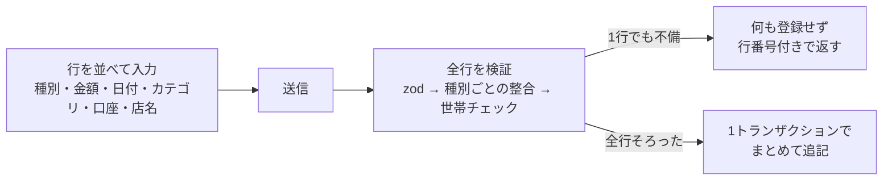

レシートの束やカード明細は、1件ずつシートを開き閉じするより、
**入力済みの行を見比べながら直せる**ほうが速い。

**全か無かにする。** 検証をすべて書き込みの前に終わらせるので、通常の不備では1行も入らない。
50行のうち1行が悪いと49行も入らない代わりに、「どこまで入ったか分からない」状態が起きない。
そのぶん**どの行のどこが悪いかを行番号付きで返す**ことがこの機能の要になっている。

| 決めたこと | 理由 |
|---|---|
| 種別は**支出・収入・返金のみ** | 振替は移動元・移動先の2口座が要り、同じ列が行によって意味を変える |
| カテゴリとプールは**ひとつの選択欄** | 排他の決まりを選択肢の作り方そのものにする。両方入った状態を画面で作れない |
| **位置情報を受け取らない** | まとめ打ちは店にいない。付ければ支出マップと店名候補が無関係な座標で汚れる |
| 上限は50行 | 多値 INSERT のパラメータ数と、1トランザクションの滞留時間 |

**行数が増えても往復は増やさない。** 参照先の世帯チェックは ID の集合に対して SELECT を並べて1往復、
INSERT も多値 VALUES の1文にまとめる。行ごとに問い合わせると 50 行で 150 往復になる。

**再送しても二重に入らない。** バッチ全体にひとつ受付番号（UUID）を持たせ、**先頭行にだけ**刻む。
`ux_entries_client_id` は世帯ごとの部分一意索引なので、全行に同じ値を入れると2行目で必ず違反する。
すり抜けた同時押しは、その索引が最終防衛線になる。

種別ごとの項目整合は通常の登録と同じ `normalizeEntry` を通す。
[クイック登録の確定](#クイック登録と確定)と同じで、**経路が増えても検証の強さを変えない。**

---

## 自宅での記録

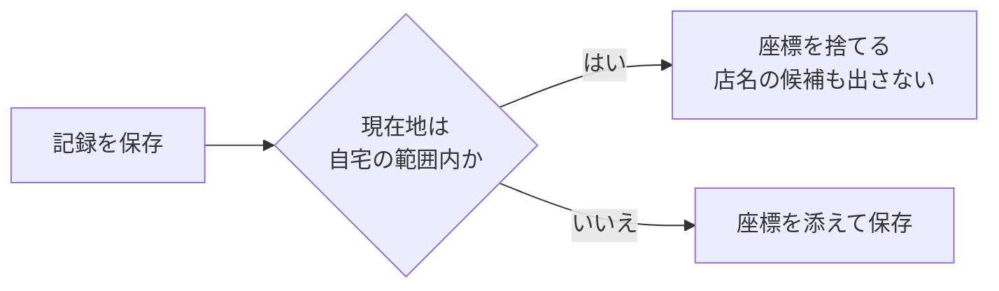

カードの明細は、店ではなく**自宅でまとめて付ける**ことが多い。
そこに位置を添えると、支出マップに自宅が並び、
店名の候補も「自宅の近所で過去に使った店」から出てしまう。

**座標を持たないことで解決する。** 保存した上で地図側で除外する形にすると、
除外条件が地図・分析・店名候補の3か所に散らばり、いずれ抜ける。
入口で落としてしまえば、下流は今のままで正しく動く。

**判定は BE で行う。** 画面側でも判定するが、それは表示のためだけ。
`normalizeEntry` が種別ごとの項目を必ず落とすのと同じで、
画面が座標を送ってきても BE が捨てる。通す場所は取引の登録とクイック登録の2か所。

### 当てにならない座標は入口で捨てる

PC のブラウザは Wi-Fi と IP アドレスから現在地を推定するため、**誤差が数km 出る**。
その座標を残すと、支出マップのピンが見知らぬ土地に立ち、店名の候補も無関係な店から引かれる。

止め方は自宅と同じで**入口の2段構え**にする。

| どこで | 何をするか |
|---|---|
| 画面 | マウスしか無い端末では、そもそも位置情報を取りに行かない |
| BE | 誤差が 500m を超える座標を捨てる（`dropIfImprecise` → `stripIfAtHome` の順） |

画面側だけでは足りない。タッチできるノートPC や、屋内で GPS を掴めないスマホがすり抜ける。
**画面の作りには依存させない。**

利用者が明示的に「位置情報を使う」と決めた場合はその設定が優先される。
端末で決めるのは既定値だけ。

**自宅の登録だけは精度で弾かない。** 弾くと登録そのものができなくなる。
代わりに画面で警告する。**ずれた自宅を登録すると、以後の自宅判定がすべて狂う**ため、
黙って通してはいけない。

既に保存されてしまった座標は、自宅ページから**誤差の大きいものだけまとめて消せる**。
消す前に件数を出す。座標は元に戻せないので、数が分からないまま押せるボタンにしない
（月次締めのプレビュー→承認と同じ）。消すのは座標だけで、金額・店名・カテゴリは残る。

自宅は**世帯で1つ**。`households` に位置と半径を持つ（既定50m）。
登録した時点で、範囲内にある過去の記録からも座標を外す。金額と店名は残す。

範囲の絞り込みは、まず緯度経度の矩形で候補を減らしてから距離で確定する。
矩形だけだと角が半径の約1.4倍まで入ってしまう。

---

## 予定の通知

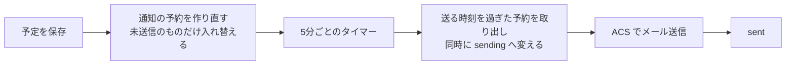

**遅れてもよいが、二重に送ってはいけない。** 取り出しと状態変更を1文で行い、
同じ予約を2つの実行が処理しないようにする。送信中に落ちたものは15分後に拾い直す。

送信予定から12時間以上過ぎたものは送らない。障害から復旧したときに古い通知が大量に飛ぶのを防ぐ。

**終日の予定は当日9:00を基準**に逆算する。前日通知が真夜中に飛ぶのを避けるため。

---

## 買い物メモ

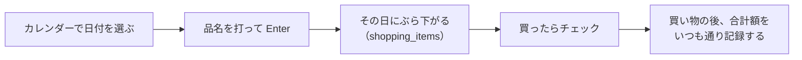

**リストはメモに徹する。** 品名とチェックだけを持ち、金額もカテゴリも持たない。
`entries` とは接続しないので、集計にも残高にも予算にも一切影響しない。

品目ごとに金額を付けて台帳へ入れる形にすると、未実装の「明細分割」を先取りすることになる。
レシート1枚は1件の記録のまま、買い物の後に合計額だけを入れる。

**予定と同じテーブルにしない。** 予定は時刻・通知の宛先を持ち、`schedule_reminders` から
FK で指されている。買い物メモにはどれも要らず、混ぜると「通知の無い予定」という第2の形が
`reminderSweep` と一覧の並び替えに入り込む。日付にぶら下がる点が同じなだけで性質が違う。

**論理削除にしない。** `schedules` が `is_deleted` を持つのは通知予約に指されているため。
買い物メモは何からも指されない使い捨てのメモなので、消すときは行ごと消す。

**並びは追加順で固定し、チェックしても動かさない。** 済んだものを下へ送ると、
押した項目が目の前で飛び、続けて押すときに1つ下を押してしまう。
打ち消し線と薄字でその場に残す。

**チェックだけは楽観的更新にする。** レジの前で続けて押す操作なので、
1件ずつ往復を待たせない。失敗したら元に戻す。

カレンダーのマス目に印は増やさない。青丸は予定、赤丸は祝日のまま。

> 未チェック分の繰り越し（「残りを今日へ移す」）と「この買い物を記帳」でクイック登録へ渡す橋は
> まだ作っていない（[機能候補 §6](10_計画/03_機能候補.md#6-買い物リスト--詳細)）。
> 自動で翌日へ湧かせないことだけは先に決めてある。予定と実績の区別が曖昧になるため。

---

## クイック登録と確定

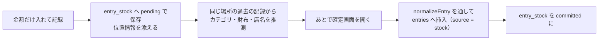

**確定するまで `entries` に入らない。** 残高にも予算にも影響しないため、
「とりあえず記録した額」が集計を汚さない。これがこの機能の前提。

推測は緯度経度が ±0.0015度（日本付近で概ね 140〜170m）にある過去の支出を集計して行う。
根拠は `suggestion_reason` に残し、画面に表示する。
**なぜその初期値なのか分からないまま埋まっている状態を作らない。**

確定時の項目整合は通常の登録と同じ `normalizeEntry` / `assertReferencesInHousehold` を通す。
経路が増えても検証の強さを変えない。

---

## 支出マップ

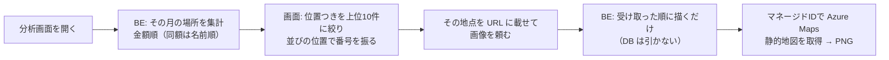

**地図はブラウザから直接取りに行かない。** そうするとサブスクリプションキーを
FE に埋めるか、利用者ひとりひとりに `Azure Maps Data Reader` を割り当てることになる。
前者は方針違反、後者はメンバーが増えるたびに Azure 側の作業が要る。
BE が中継すれば、認証は今までどおりアプリの Bearer トークンだけで済む。

**拡大率はこちらで計算する。** Azure Maps は `bbox` と `width`/`height` を
同時に受け付けないため、出力サイズを指定するなら中心と拡大率を渡すしかない。
静的地図は**1タイル512画素**で描かれる。256 で計算すると1段きつくなり、端の地点がはみ出す。

### 番号を数える場所はひとつだけ

**画像は順位を決めない。** 一覧が決めた並びを受け取って描くだけで、地図の関数は DB を引かない。

数える場所が2つあると必ずずれる。同じ SQL を2回実行する形にしても、
実行が2回ある限り食い違う余地は残る（同額のときの並び、キャッシュの寿命の違い）。
実際、一覧の①と画像の①が違う店を指していた。座標そのものは正しいので、
📍リンクでは合っているのに画像だけズレる、という分かりにくい壊れ方をする。

**番号は渡した並びの位置そのもの。** ラベルを別に送らないので、
「番号と座標がずれて渡る」という事故が起こせない。
Azure Maps のラベルは ASCII しか解釈できないが、番号を位置から作れば自動的に守られる。

座標を持たない記録は今後も増える（一括登録は位置を受け取らない、自宅では座標を落とす、
誤差の大きいものは捨てる）。**ずれられない作りにしておくこと自体が対策**になる。

### 束ねる単位は場所マスタ

同じ「イオン」でも離れた場所は**別の店**として数える。店名だけで束ねていた頃は、
2店舗の金額が合算され、ピンはどちらか一方（または中間）に立っていた。

**束ねる鍵は座標のかたまり。地名は表示のための飾り。**
町境の近くにある店は GPS のばらつきで訪問ごとに町名が変わりうるので、
「店名＋地名」を鍵にすると同じ店が2つに割れる。鍵にしない。

| 記録の状態 | どうするか |
|---|---|
| 座標がある | 同名のマスタのうち **200m 以内でいちばん近いもの**。無ければ新しく作る |
| 座標がある・同名のマスタが座標なし1件だけ | そのマスタに座標を書き込んで**育てる**（2つに割らない） |
| 座標が無い・同名のマスタが1件 | それを指す |
| 座標が無い・同名のマスタが複数 | **紐付けない。** 当てずっぽうに選ぶと金額が別の店に混ざる |
| 座標が無い・マスタも無い | **作らない。** 座標なしのマスタは店を区別できない |

紐付いていない記録は今までどおり店名で束ねる。代表座標はマスタが持つ固定値を使うので、
最後の1件が外れ値でも引きずられない。

### 地名は定時ジョブが後から埋める

地名は国土地理院の逆ジオコーディングから取る。**API キーが要らない**ので、
「接続文字列とAPIキーをどこにも保持しない」という方針を崩さずに済む。
Azure Maps の POI・逆ジオは日本ではローマ字しか返さず不採用にしたが、
こちらは行政地名そのものが本業なので日本語で正しく返る。

**記録の保存では呼ばない。** 15分ごとの `placeGeocodeSweep` が、地名がまだ無いマスタを
拾って埋める。保存を外部 API の応答待ちにすると、あちらが遅い日は記帳が遅くなり、
止まっている日は記帳できなくなる。地名は飾りなので、それと引き換えにしない。

**一度書いたら二度と引かない。** 国土地理院は地理院地図向けの提供で SLA が無い。
止まっても既存のマスタは動き続け、新しい店に地名が付かなくなるだけで済む。

記録に書く店名は**利用者の呼び方のまま**。地名は表示にだけ使う。
記録側に地名まで書き込むと、地名の付き方が変わったときに過去の記録だけ古い名前で残る。

### 画像のキャッシュは中身で決まる

地点を URL に載せる（`?p=緯度,経度;…`）。**ピンが変われば URL が変わる**ので、
古い画像が出てくる経路が無い。逆に中身が同じなら取り直さないので、
Azure Maps の呼び出しも増えない。

一覧の並びは `ORDER BY amount DESC, name`。同額のときの決め手を置かないと、
取り直すたびに一覧そのものが入れ替わり、番号も動いてしまう。

### 場所の代表座標は「直近の座標つき記録」

平均は使わない。外れ値1件で全体が引きずられ、**同名の別店舗は中間（どちらでもない場所）**
に立ってしまう。窓関数で「座標つきのうちいちばん新しい行」を選ぶ。
その店に座標つきが1件も無ければ代表座標は持たず、地図に出ない。

代表座標は**同じ月の中から**選ぶ。全期間に広げると「その月は座標なしで記録した店」にも
ピンが立ち、位置つきが1件も無い月は地図を出さないという約束が変わってしまう。

**自宅は地図に出ない。** 自宅で記録したものは座標を持たないため、
地図側で除外する処理は要らない（[自宅での記録](#自宅での記録)）。

位置つきの記録が1件も無い月は `204` を返し、画面は地図を出さない。
地図の取得に失敗しても `502` を返すだけで、場所ごとの一覧はそのまま使える。

課金は月5,000トランザクション（＝タイル75,000枚相当）まで無料。
この規模では1回の表示で1トランザクションなので、枠に届かない。

---

## 定期取引の予約と自動記帳

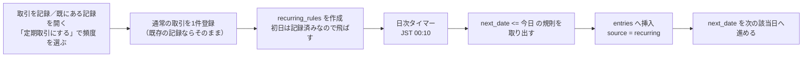

**入口は3つ。** 新しく記録するとき、**既に付けた記録を開いたとき**、設定の定期タブ。
「これ毎月だった」と後から気付くほうが多いので、記録の編集画面からも作れるようにしてある。
どの入口でも作られるものは同じ `recurring_rules` の1行で、雛形は取引と同じ形。

**元の記録は規則と紐付けない。** 記録から作った場合も、その記録は手で付けたもののまま残る。
紐付けると、手で付けた記録と自動記帳された分の区別がつかなくなる。
初回はその記録で消化済みなので、規則側は開始日を飛ばして次から数える。

**未来の取引行は作らない。** 先に `entries` へ入れると、まだ払っていないお金で
残高が減り、予算も消化済みに見えてしまう。その日が来たものだけを実体化する。
このため、まだ来ていない定期取引はカレンダーに現れない。次回予定は設定の定期タブで見る。

**二重記帳は DB で止める。** `entries` の `(recurring_rule_id, entry_date)` に
一意インデックスを張ってある。タイマーの重複起動と手動の「今すぐ記帳」が重なっても、
2件目は制約で落ちる。アプリ側のチェックには依存しない。

**古すぎる予約は記帳しない。** 62日より前の分は読み飛ばして次回予定日だけを進める。
長く止めていた規則を再開した瞬間に、過去の記録が大量に湧くのを防ぐ。
1回の実行で追いつくのは1規則あたり12件まで。

### 作った瞬間に過去へ遡らない

**規則を作る・直すときは、次回予定日を必ず今日以降にする。**
起点（`start_date`）は元の記録の日付のまま動かさず、**次回予定日だけを押し出す**。

過去の記録を定期にすると、素直に数えれば次回予定日が過去日になる。
そのままだとタイマーが62日以内の分を実体化し、**作った翌朝に覚えのない記録が湧く**。
口座残高と過去月の予算が後から動いてしまう。

起点まで今日へ動かさないのは、「毎月20日」という規則が元の記録から素直に導けなくなるうえ、
毎週の間隔（隔週など）は開始週を基準に数えるため、起点を動かすと周期そのものがずれるため。

これはタイマー側の追いつき（上の62日）とは別物で、**入口（作成・更新）で止める**。
追いつきのほうは、タイマーが止まっていた規則を後から拾い直すためのもので目的が違う。

画面の「次は◯月◯日に記帳されます」も同じ基準で出す。ここがずれると、
表示と実際の記帳日が食い違う。

**「今すぐ記帳」は今日の日付で1件作り、次回予定日は動かさない。**
前倒しではなく「今日その支払いがあった」を意味する操作にしてある。

繰り返しの日付計算は `domain/recurrence.ts` の純粋関数に隔離する。
月末は丸める（31日指定の2月は28日、閏年は29日）。判定の基準は常に指定日そのものなので、
一度丸めた後もその翌月は31日に戻る。

---

## 配分の設定

**既定値は設定ページ、その月の変動は予算ページ**という役割分担にする。

| どこで | 何を | いつ効くか |
|---|---|---|
| 設定 → 予算タブ | カテゴリごとの既定額（`budget_categories.default_amount`） | **翌月を締めで確定したとき** |
| 予算ページ → 残りを設定 | その月の残り（`budget_allocations` に調整を追記） | その月だけ |
| 予算ページ → 組み換え | カテゴリ間の移動 | その月だけ |

### 母数と調整を読み分ける

**予算ページはその月の残高をいじる場所であって、母数を決める場所ではない。**
そのため同じ台帳を2つの目で読む。

| 呼び名 | `reason` | 性質 |
|---|---|---|
| **予算（基準額・母数）** | `initial` / `carry_over` / `default` | その月の計画。残りを直しても動かない |
| 調整 | `adjust` / `transfer` / `to_pool` / `from_pool` | 月内の増減 |

```
残り = 基準額 + 調整 − 消化
```

「予算 20,000 / 残り 15,000」を「残り 10,000」に直すと、消化 5,000 に対して
`adjust` を **−5,000** で1行追記する。**予算は 20,000 のまま、残りが 10,000 になる。**

台帳は追記専用なので過去の行は書き換えない。どういう経緯でその額になったかは履歴に残る。

> 入れた額をそのまま配分合計にする方式も採れるが、それだと残りを直すたびに
> 母数まで動いてしまい、「今月はいくらの予定だったか」が分からなくなる。

### 合計に含めない印

口座と予算カテゴリに `exclude_from_totals` を持たせる。
「その他」のような受け皿や、性質の違う口座（証券など）が混ざると、
**財布の合計や予算の合計が実感と合わなくなる**ため。

**アーカイブとは別物として扱う。**

| | 意味 | 一覧 | 記録で選べるか | 合計 |
|---|---|---|---|---|
| アーカイブ | もう使わない | 消える | 選べない | 入らない |
| 合計に含めない | 使うけれど数えない | 出る | 選べる | 入らない |

混ぜると「使いたいのに隠れる」か「数えたくないのに数えられる」のどちらかになる。

外すのは**合計だけ**。分析タブの内訳には出す。何に使ったかは見たいため。
合計を出しているのは口座ページ（財布・クレジット）と `budgetsGet` の `total` の2か所。

### 翌月は開いただけでは決まらない

`ensurePeriod()` は `budget_periods` の行を作るだけで、**配分は入れない。**
翌月の予算は月次締めで確定する（次節）。

開いた時点で入れてしまうと、締める前から翌月が確定したように見え、
締めで繰越を足したときに二重になる。

---

## 月次締めと繰り越し

必ず**プレビュー → 承認**の2段階にする。何がどう動くか見ないまま押せる操作にしない。
プレビューと実行は同じ計算関数（`computeLines`）を使い、表示と結果が食い違わないようにする。

| カテゴリの設定 | 締めたときの動き |
|---|---|
| 繰り越さない | 何もしない |
| 余りだけ繰り越す | 余りが正なら翌月へ `carry_over` で +N |
| 過不足とも繰り越す | 余りが正でも負でも翌月へ `carry_over` |
| 余りをプールへ | 当月に `carry_to_pool` で −N、プール台帳へ +N（対で記録） |

締めた月は `assertPeriodOpen` が配分の変更を拒否する。

### 翌月の予算はここで決まる

繰越を書くのと同じ処理の中で、**設定の既定額を翌月へ `default` で入れる。**
すでに `default` の行があれば入れない。締め直しても増えない。

翌月の予算ページを開いただけでは何も入らない。締めるまでは
「まだ決まっていません」と案内し、先に決めたいときだけ手で入れられるようにしてある。

初めて使う月は締める前月が無いため、手で入れる道を必ず残す。

### 順序の制約

- **前月が未締めなら締められない。** 古い月の繰越が後から降ってくると、締めた月の数字が動いてしまう
- **翌月が締め済みなら戻せない。** その繰越の上にさらに積み上がっているため、新しい月から順に戻す

### 締めを戻すときだけは行を削除する

台帳は原則として追記専用だが、締めの取り消しに限り、締めが作った行を**削除**する。

- 締めは「その時点の残額から機械的に導ける操作」であり、履歴として保つ価値が薄い
- ±の対を残すと、翌月の履歴が取り消しの記録だらけになって読めなくなる
- `ux_alloc_carryover`（カテゴリごとに繰越は1行まで）が、取り消し時に行が消えることを前提にした制約になっている

利用者が手で行ったプール拠出（`to_pool`）や、手で入れた配分（`initial` / `adjust`）を
巻き込まないよう、**締めが作った行は専用の理由で区別する**。

| 締めが作る行 | 理由 | 戻すとき |
|---|---|---|
| 翌月への繰越 | `carry_over` | 消す |
| 翌月の既定額 | `default` | 消す |
| 余りのプール移送 | `carry_to_pool` | 対で消す |

手で入れた `initial` / `adjust` / `to_pool` は残る。

---

## 予算の組み換え

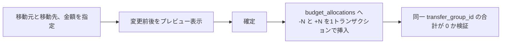

予算額は UPDATE せず `SUM` で導出するため、**組み換えで総額が狂うことが構造的に起きない**。
取り消しは逆仕訳の追記で行い、履歴は消さない。

**移動元の残額が不足していても実行を止めない。** 赤字の月は予算がマイナスになるのが実態であり、
残額で縛ると組み換えが最も必要な月にこそ組み換えできなくなる。マイナスになることはプレビューで示す。

---

## プールの出し入れ

プールは「予算から拠出」と「何もないところから追加」の2系統を持つ。

| 操作 | 挿入されるレコード | ゼロサム検証 |
|---|---|---|
| 予算 → プール | `budget_allocations(-N)` + `pool_movements(+N)` | あり |
| プール → 予算 | `pool_movements(-N)` + `budget_allocations(+N)` | あり |
| 臨時の積み増し | `pool_movements(+N)` のみ | なし |

**ゼロサム検証は `transfer_group_id` が付いたレコードにのみ適用する。**
これにより臨時の積み増しが制約に抵触しない。

拠出元カテゴリの残額不足は許容するが、**プール残高を超える引き出しは拒否する**。
プールは積み立てた実額であり、無い金額を取り出す操作には意味がないため。

---

## デプロイ

| 対象 | 手段 | 契機 |
|---|---|---|
| FE | GitHub Actions（SWA） | `KakeiFlow_GH` の `main` へ push |
| BE | `npm run deploy`（Functions Core Tools） | 手動 |
| DB | `20_DATABASE/migrations/` を連番で適用 | 手動 |

マイグレーションは冪等に書き、`schema_migrations` テーブルに適用履歴を残す。

BE は `npm test`（Vitest）で `src/domain/` の純粋ロジックを単体テストする。
テストは `test/` 直下にあり、ビルド（`dist/`）にもデプロイ物にも含まれない
（`.funcignore` が除外）。デプロイ前に `npm test` を通すこと。
