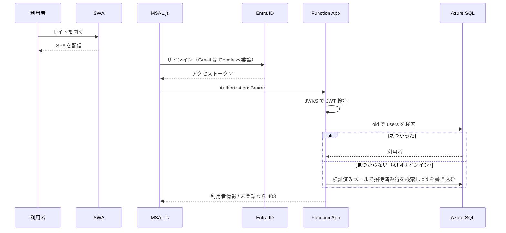
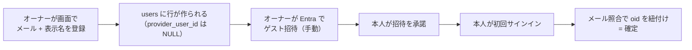
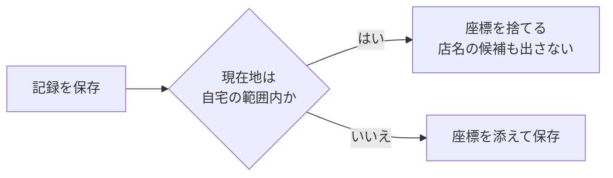
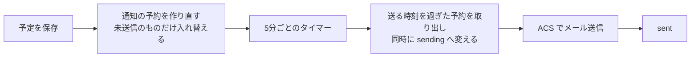
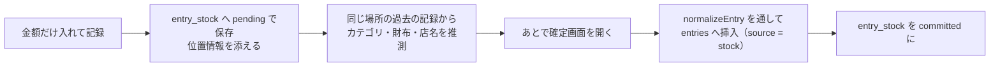
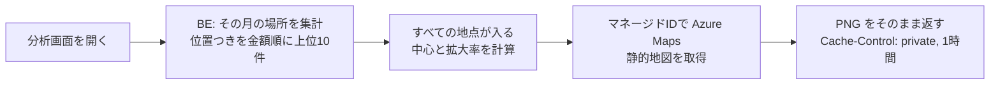
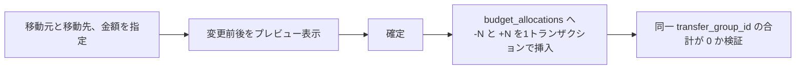

# 処理フロー（L1: 鳥瞰）

主要な処理の流れ。**関数の引数や内部ロジックは書かない**（L2 の担当）。

---

## サインイン



**メールアドレスは Entra が検証したクレームのみ使う。** リクエスト本文の値は決して使わない。

---

## メンバー追加



Entra への招待だけは人手が必要なため、追加直後に画面上で手順を案内する。

---

## 記帳（Phase 1 で実装）


**画面遷移で状態を失わせない。** 編集はモバイルではボトムシート、PC では右パネルで行い、
選択日・スクロール位置・フィルタを保持する。画面状態は URL に持たせる。

### 口座間のお金の移動

**種別は `transfer` の1つだけ。** 入力の導線を3つに分け、呼び名は口座の種別から導く。

| 入力の導線 | 行き先 | 履歴での呼び名 |
|---|---|---|
| 口座移動 | 任意の口座 | 口座移動 |
| カード引落 | クレジット | カード引落 |
| **チャージ** | **電子マネー** | **チャージ** |

チャージ元はクレジットでも財布でもよい。クレジットから出せば支払予定が積み上がり、
財布から出せば残高が減る。どちらも `transfer` の性質そのままなので、特別扱いは要らない。

**チャージ元は口座の属性で固定する。** `accounts.is_charge_source` を立てた口座から
出したことにし、記録画面では**チャージ先だけを選ぶ**。実際には出どころが常に同じなので、
毎回選ばせる意味がない。固定表示のまま「変更」を押せばその場で選べる。

世帯にひとつという決まりは、フィルタ付き一意インデックス `ux_accounts_charge_source` が守る。
付け替えは「先に他を落としてから立てる」をアプリが行うが、落とし忘れれば索引が必ず弾く。
**画面の作りには依存させない。**

**何を選んだかは保存しない。** 行き先の口座種別から必ず導けるうえ、
この作りなら過去の記録も正しい呼び名で読める（`lib/format.ts` の `transferLabel`）。

> 種別に `charge` を足す案は採らなかった。残高ビュー・`ck_entries_shape`・
> カレンダー・分析・予算のすべてに手が要り、得られるのは呼び名の違いだけになる。

---

## 自宅での記録



カードの明細は、店ではなく**自宅でまとめて付ける**ことが多い。
そこに位置を添えると、支出マップに自宅が並び、
店名の候補も「自宅の近所で過去に使った店」から出てしまう。

**座標を持たないことで解決する。** 保存した上で地図側で除外する形にすると、
除外条件が地図・分析・店名候補の3か所に散らばり、いずれ抜ける。
入口で落としてしまえば、下流は今のままで正しく動く。

**判定は BE で行う。** 画面側でも判定するが、それは表示のためだけ。
`normalizeEntry` が種別ごとの項目を必ず落とすのと同じで、
画面が座標を送ってきても BE が捨てる。通す場所は取引の登録とクイック登録の2か所。

自宅は**世帯で1つ**。`households` に位置と半径を持つ（既定50m）。
登録した時点で、範囲内にある過去の記録からも座標を外す。金額と店名は残す。

範囲の絞り込みは、まず緯度経度の矩形で候補を減らしてから距離で確定する。
矩形だけだと角が半径の約1.4倍まで入ってしまう。

---

## 予定の通知



**遅れてもよいが、二重に送ってはいけない。** 取り出しと状態変更を1文で行い、
同じ予約を2つの実行が処理しないようにする。送信中に落ちたものは15分後に拾い直す。

送信予定から12時間以上過ぎたものは送らない。障害から復旧したときに古い通知が大量に飛ぶのを防ぐ。

**終日の予定は当日9:00を基準**に逆算する。前日通知が真夜中に飛ぶのを避けるため。

---

## クイック登録と確定



**確定するまで `entries` に入らない。** 残高にも予算にも影響しないため、
「とりあえず記録した額」が集計を汚さない。これがこの機能の前提。

推測は緯度経度が ±0.0015度（日本付近で概ね 140〜170m）にある過去の支出を集計して行う。
根拠は `suggestion_reason` に残し、画面に表示する。
**なぜその初期値なのか分からないまま埋まっている状態を作らない。**

確定時の項目整合は通常の登録と同じ `normalizeEntry` / `assertReferencesInHousehold` を通す。
経路が増えても検証の強さを変えない。

---

## 支出マップ



**地図はブラウザから直接取りに行かない。** そうするとサブスクリプションキーを
FE に埋めるか、利用者ひとりひとりに `Azure Maps Data Reader` を割り当てることになる。
前者は方針違反、後者はメンバーが増えるたびに Azure 側の作業が要る。
BE が中継すれば、認証は今までどおりアプリの Bearer トークンだけで済む。

**拡大率はこちらで計算する。** Azure Maps は `bbox` と `width`/`height` を
同時に受け付けないため、出力サイズを指定するなら中心と拡大率を渡すしかない。
静的地図は**1タイル512画素**で描かれる。256 で計算すると1段きつくなり、端の地点がはみ出す。

**地図と一覧の番号は揃える。** どちらも「位置つきを金額の多い順に上位から」で数える。
ずれると、どの棒がどのピンか分からなくなる。

**自宅は地図に出ない。** 自宅で記録したものは座標を持たないため、
地図側で除外する処理は要らない（[自宅での記録](#自宅での記録)）。

位置つきの記録が1件も無い月は `204` を返し、画面は地図を出さない。
地図の取得に失敗しても `502` を返すだけで、場所ごとの一覧はそのまま使える。

課金は月5,000トランザクション（＝タイル75,000枚相当）まで無料。
この規模では1回の表示で1トランザクションなので、枠に届かない。

---

## 定期取引の予約と自動記帳


**未来の取引行は作らない。** 先に `entries` へ入れると、まだ払っていないお金で
残高が減り、予算も消化済みに見えてしまう。その日が来たものだけを実体化する。
このため、まだ来ていない定期取引はカレンダーに現れない。次回予定は設定の定期タブで見る。

**二重記帳は DB で止める。** `entries` の `(recurring_rule_id, entry_date)` に
一意インデックスを張ってある。タイマーの重複起動と手動の「今すぐ記帳」が重なっても、
2件目は制約で落ちる。アプリ側のチェックには依存しない。

**古すぎる予約は記帳しない。** 62日より前の分は読み飛ばして次回予定日だけを進める。
長く止めていた規則を再開した瞬間に、過去の記録が大量に湧くのを防ぐ。
1回の実行で追いつくのは1規則あたり12件まで。

**「今すぐ記帳」は今日の日付で1件作り、次回予定日は動かさない。**
前倒しではなく「今日その支払いがあった」を意味する操作にしてある。

繰り返しの日付計算は `domain/recurrence.ts` の純粋関数に隔離する。
月末は丸める（31日指定の2月は28日、閏年は29日）。判定の基準は常に指定日そのものなので、
一度丸めた後もその翌月は31日に戻る。

---

## 配分の設定

**既定値は設定ページ、その月の変動は予算ページ**という役割分担にする。

| どこで | 何を | いつ効くか |
|---|---|---|
| 設定 → 予算タブ | カテゴリごとの既定額（`budget_categories.default_amount`） | **翌月を締めで確定したとき** |
| 予算ページ → 残りを設定 | その月の残り（`budget_allocations` に調整を追記） | その月だけ |
| 予算ページ → 組み換え | カテゴリ間の移動 | その月だけ |

### 母数と調整を読み分ける

**予算ページはその月の残高をいじる場所であって、母数を決める場所ではない。**
そのため同じ台帳を2つの目で読む。

| 呼び名 | `reason` | 性質 |
|---|---|---|
| **予算（基準額・母数）** | `initial` / `carry_over` / `default` | その月の計画。残りを直しても動かない |
| 調整 | `adjust` / `transfer` / `to_pool` / `from_pool` | 月内の増減 |

```
残り = 基準額 + 調整 − 消化
```

「予算 20,000 / 残り 15,000」を「残り 10,000」に直すと、消化 5,000 に対して
`adjust` を **−5,000** で1行追記する。**予算は 20,000 のまま、残りが 10,000 になる。**

台帳は追記専用なので過去の行は書き換えない。どういう経緯でその額になったかは履歴に残る。

> 入れた額をそのまま配分合計にする方式も採れるが、それだと残りを直すたびに
> 母数まで動いてしまい、「今月はいくらの予定だったか」が分からなくなる。

### 合計に含めない印

口座と予算カテゴリに `exclude_from_totals` を持たせる。
「その他」のような受け皿や、性質の違う口座（証券など）が混ざると、
**財布の合計や予算の合計が実感と合わなくなる**ため。

**アーカイブとは別物として扱う。**

| | 意味 | 一覧 | 記録で選べるか | 合計 |
|---|---|---|---|---|
| アーカイブ | もう使わない | 消える | 選べない | 入らない |
| 合計に含めない | 使うけれど数えない | 出る | 選べる | 入らない |

混ぜると「使いたいのに隠れる」か「数えたくないのに数えられる」のどちらかになる。

外すのは**合計だけ**。分析タブの内訳には出す。何に使ったかは見たいため。
合計を出しているのは口座ページ（財布・クレジット）と `budgetsGet` の `total` の2か所。

### 翌月は開いただけでは決まらない

`ensurePeriod()` は `budget_periods` の行を作るだけで、**配分は入れない。**
翌月の予算は月次締めで確定する（次節）。

開いた時点で入れてしまうと、締める前から翌月が確定したように見え、
締めで繰越を足したときに二重になる。

---

## 月次締めと繰り越し

必ず**プレビュー → 承認**の2段階にする。何がどう動くか見ないまま押せる操作にしない。
プレビューと実行は同じ計算関数（`computeLines`）を使い、表示と結果が食い違わないようにする。

| カテゴリの設定 | 締めたときの動き |
|---|---|
| 繰り越さない | 何もしない |
| 余りだけ繰り越す | 余りが正なら翌月へ `carry_over` で +N |
| 過不足とも繰り越す | 余りが正でも負でも翌月へ `carry_over` |
| 余りをプールへ | 当月に `carry_to_pool` で −N、プール台帳へ +N（対で記録） |

締めた月は `assertPeriodOpen` が配分の変更を拒否する。

### 翌月の予算はここで決まる

繰越を書くのと同じ処理の中で、**設定の既定額を翌月へ `default` で入れる。**
すでに `default` の行があれば入れない。締め直しても増えない。

翌月の予算ページを開いただけでは何も入らない。締めるまでは
「まだ決まっていません」と案内し、先に決めたいときだけ手で入れられるようにしてある。

初めて使う月は締める前月が無いため、手で入れる道を必ず残す。

### 順序の制約

- **前月が未締めなら締められない。** 古い月の繰越が後から降ってくると、締めた月の数字が動いてしまう
- **翌月が締め済みなら戻せない。** その繰越の上にさらに積み上がっているため、新しい月から順に戻す

### 締めを戻すときだけは行を削除する

台帳は原則として追記専用だが、締めの取り消しに限り、締めが作った行を**削除**する。

- 締めは「その時点の残額から機械的に導ける操作」であり、履歴として保つ価値が薄い
- ±の対を残すと、翌月の履歴が取り消しの記録だらけになって読めなくなる
- `ux_alloc_carryover`（カテゴリごとに繰越は1行まで）が、取り消し時に行が消えることを前提にした制約になっている

利用者が手で行ったプール拠出（`to_pool`）や、手で入れた配分（`initial` / `adjust`）を
巻き込まないよう、**締めが作った行は専用の理由で区別する**。

| 締めが作る行 | 理由 | 戻すとき |
|---|---|---|
| 翌月への繰越 | `carry_over` | 消す |
| 翌月の既定額 | `default` | 消す |
| 余りのプール移送 | `carry_to_pool` | 対で消す |

手で入れた `initial` / `adjust` / `to_pool` は残る。

---

## 予算の組み換え



予算額は UPDATE せず `SUM` で導出するため、**組み換えで総額が狂うことが構造的に起きない**。
取り消しは逆仕訳の追記で行い、履歴は消さない。

**移動元の残額が不足していても実行を止めない。** 赤字の月は予算がマイナスになるのが実態であり、
残額で縛ると組み換えが最も必要な月にこそ組み換えできなくなる。マイナスになることはプレビューで示す。

---

## プールの出し入れ

プールは「予算から拠出」と「何もないところから追加」の2系統を持つ。

| 操作 | 挿入されるレコード | ゼロサム検証 |
|---|---|---|
| 予算 → プール | `budget_allocations(-N)` + `pool_movements(+N)` | あり |
| プール → 予算 | `pool_movements(-N)` + `budget_allocations(+N)` | あり |
| 臨時の積み増し | `pool_movements(+N)` のみ | なし |

**ゼロサム検証は `transfer_group_id` が付いたレコードにのみ適用する。**
これにより臨時の積み増しが制約に抵触しない。

拠出元カテゴリの残額不足は許容するが、**プール残高を超える引き出しは拒否する**。
プールは積み立てた実額であり、無い金額を取り出す操作には意味がないため。

---

## デプロイ

| 対象 | 手段 | 契機 |
|---|---|---|
| FE | GitHub Actions（SWA） | `KakeiFlow_GH` の `main` へ push |
| BE | `npm run deploy`（Functions Core Tools） | 手動 |
| DB | `20_DATABASE/migrations/` を連番で適用 | 手動 |

マイグレーションは冪等に書き、`schema_migrations` テーブルに適用履歴を残す。
