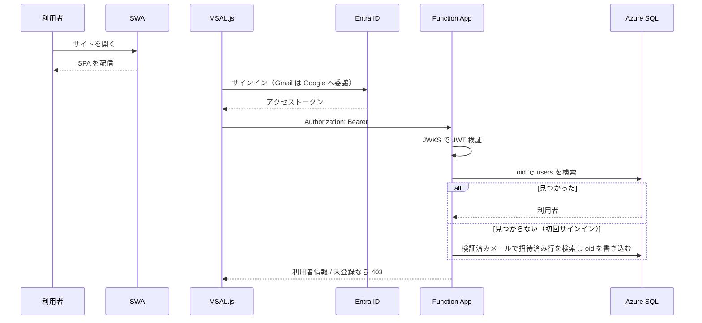
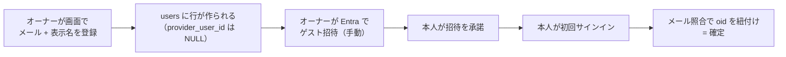
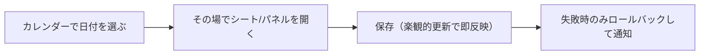
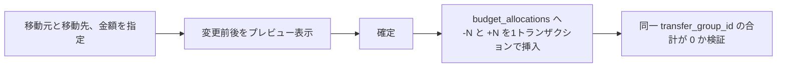

# 処理フロー（L1: 鳥瞰）

主要な処理の流れ。**関数の引数や内部ロジックは書かない**（L2 の担当）。

---

## サインイン

**メールアドレスは Entra が検証したクレームのみ使う。** リクエスト本文の値は決して使わない。

---

## メンバー追加

Entra への招待だけは人手が必要なため、追加直後に画面上で手順を案内する。

---

## 記帳（Phase 1 で実装）

**画面遷移で状態を失わせない。** 編集はモバイルではボトムシート、PC では右パネルで行い、
選択日・スクロール位置・フィルタを保持する。画面状態は URL に持たせる。

---

## 予算の組み換え

予算額は UPDATE せず `SUM` で導出するため、**組み換えで総額が狂うことが構造的に起きない**。
取り消しは逆仕訳の追記で行い、履歴は消さない。

**移動元の残額が不足していても実行を止めない。** 赤字の月は予算がマイナスになるのが実態であり、
残額で縛ると組み換えが最も必要な月にこそ組み換えできなくなる。マイナスになることはプレビューで示す。

---

## プールの出し入れ

プールは「予算から拠出」と「何もないところから追加」の2系統を持つ。

| 操作 | 挿入されるレコード | ゼロサム検証 |
|---|---|---|
| 予算 → プール | `budget_allocations(-N)` + `pool_movements(+N)` | あり |
| プール → 予算 | `pool_movements(-N)` + `budget_allocations(+N)` | あり |
| 臨時の積み増し | `pool_movements(+N)` のみ | なし |

**ゼロサム検証は `transfer_group_id` が付いたレコードにのみ適用する。**
これにより臨時の積み増しが制約に抵触しない。

拠出元カテゴリの残額不足は許容するが、**プール残高を超える引き出しは拒否する**。
プールは積み立てた実額であり、無い金額を取り出す操作には意味がないため。

---

## デプロイ

| 対象 | 手段 | 契機 |
|---|---|---|
| FE | GitHub Actions（SWA） | `KakeiFlow_GH` の `main` へ push |
| BE | `npm run deploy`（Functions Core Tools） | 手動 |
| DB | `20_DATABASE/migrations/` を連番で適用 | 手動 |

マイグレーションは冪等に書き、`schema_migrations` テーブルに適用履歴を残す。
