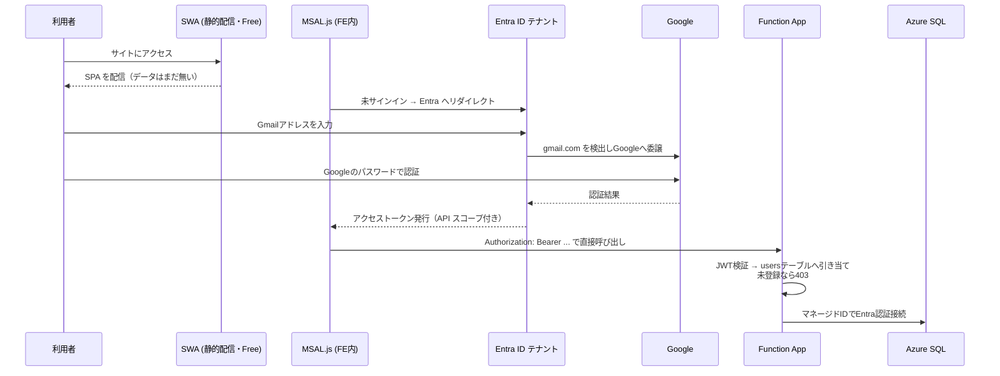
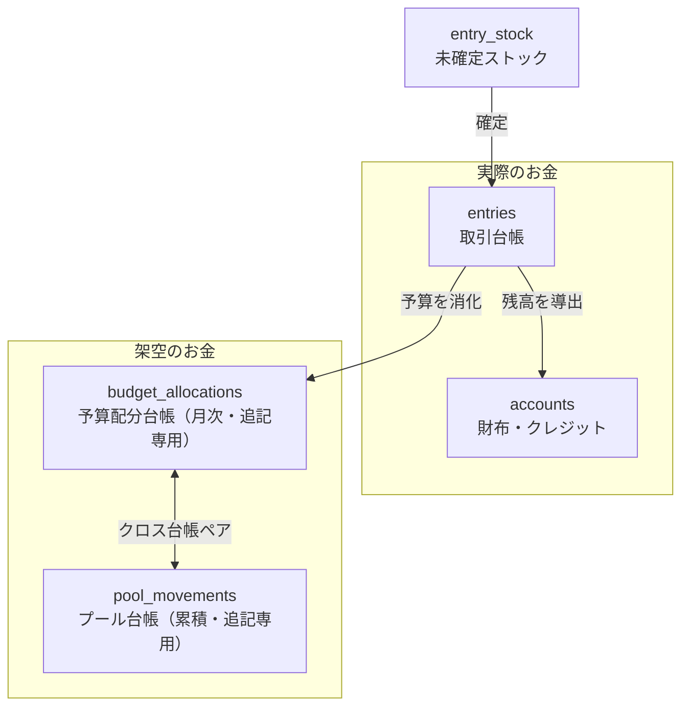
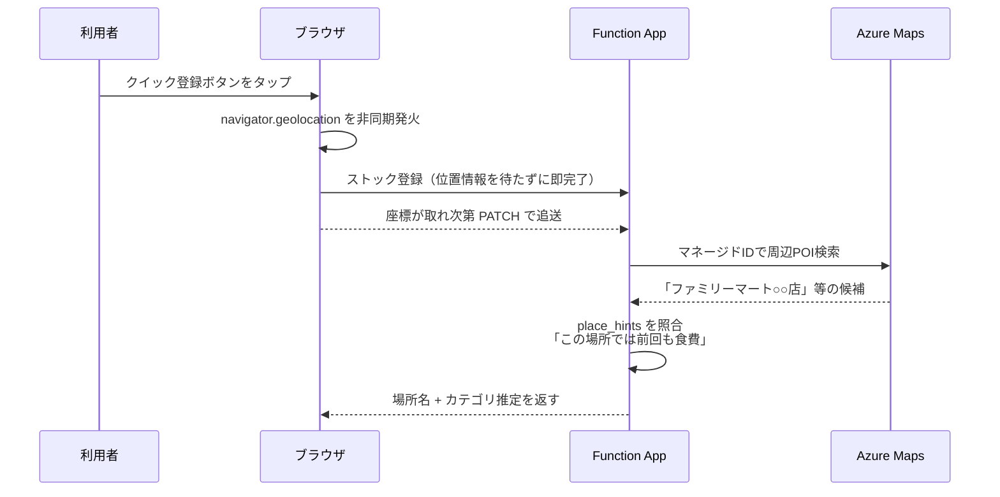
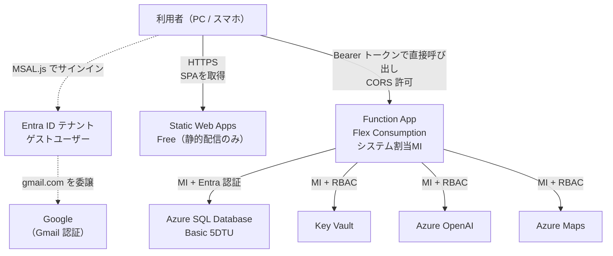

# 家計簿アプリ 全面再構築 計画書 v3

- **作成日**: 2026-08-10（v2: 方針反映 / v3: コスト最適化）
- **対象**: 家計簿アプリ（現行: Express + SQLite/PostgreSQL + Vanilla JS / Railway）
- **移行先**: Azure Static Web Apps（Free）+ Azure Functions（Flex Consumption）+ Azure SQL Database
  - **全リソース間連携を Entra ID + マネージドID で統一**（接続文字列・APIキーを持たない）
- **月額**: 約 ¥800〜1,000（Railway 現行とほぼ同額）
- **ステータス**: 計画（未承認）

---

## 0. エグゼクティブサマリ

現行アプリは「動くが使われない」状態にある。原因は機能不足ではなく、**データモデルの歪みがそのままUXの歪みとして表面化している**ことにある。

| 現行の症状 | 真の原因 |
|---|---|
| 修正のたび入力画面に飛ばされる | 画面遷移で状態を破棄する構造。編集がフォーム画面と一体化している |
| 予算組み換えにバグがある | 予算調整が「疑似取引を transactions に INSERT」するハック（[server.js:1110-1152](../../server.js#L1110-L1152)）。取引台帳と予算台帳が混線している |
| 種別変更でカテゴリが壊れる | 1テーブルに5種別を詰め込み、種別ごとに使うカラムが違う。手動クリア処理でしのいでいる |
| 集計が直感に反する | `支出 − 収入` の相殺集計（[server.js:1356-1373](../../server.js#L1356-L1373)）。返金と収入が区別されていない |
| 残高がズレる | `wallet_categories.balance` を UPDATE で持つ設計。取引削除時に整合しない |

本計画では **台帳を4つに分離**（取引 / 予算配分 / プール / 未確定ストック）し、その上に「画面遷移しないUI」を載せる。

---

## 1. v2 での方針確定事項

### 1.1 3つのお金の性質を明確に分離する

| 概念 | 性質 | 実体 | テーブル |
|---|---|---|---|
| **予算** | **架空の金額**（月ごとの使用計画） | 存在しない。計画上の枠 | `budget_allocations` |
| **財布** | **実際の金額**（今そこにある現金・預金） | 実在する残高 | `accounts` (kind≠credit) + `entries` から導出 |
| **クレジット** | **クレカ利用による積み立て**（未払債務） | 締め日まで積み上がり、引落で消える | `accounts` (kind=credit) から導出 |
| **プール金** | **架空の金額の貯金箱**（月をまたいで累積） | 予算世界の予備費 | `pools` + `pool_movements` |

**予算とプールは架空、財布とクレジットは実際。** この線引きを全画面・全APIで一貫させる。予算画面には実残高を出さず、口座画面には予算を出さない。混ぜると現行と同じ混乱が再発する。

### 1.2 確定した技術選定

| レイヤ | 採用 | 配置 |
|---|---|---|
| フロントエンド | React 19 + TypeScript + Vite | `10_SITE_DEPLOYMENT/` |
| バックエンド | Azure Functions（独立 Function App / Node 20 / TS v4） | `11_BE_DEPLOYMENT/` |
| データベース | Azure SQL Database（**Basic 5DTU / 2GB 常時稼働**） | `20_DATABASE/` |
| ホスティング | Azure Static Web Apps **Free**（静的配信のみ）+ **Function App 直接呼び出し** | — |
| 課金プラン | Function App は **Flex Consumption（従量）** | — |
| 認証（サイト） | Entra ID + **Google フェデレーション**（Gmail アカウントでサインイン / MSAL.js） | — |
| 認証（クラウド内連携） | **Entra ID + マネージドID のみ。接続文字列・APIキー不使用** | — |
| 機密保存 | Azure Key Vault（MI + RBAC） | — |
| AI | **Azure OpenAI**（MI 認証） | — |
| 位置情報 | **Azure Maps**（MI 認証）+ ブラウザ Geolocation API | — |
| 月区切り | **暦月固定**（1日〜末日） | — |
| レシート解析 | **凍結**（実装しない） | — |
| 既存データ | 完全新規スタート | — |

---

## 2. ⚠️ 方針に対する技術的な訂正2点

指示いただいた方針のうち、**そのままでは実現できない点が2つ**あります。いずれも代替手段で目的は完全に達成できます。

### 2.1 「OpenAI接続を MI で」→ **Azure OpenAI を使う必要がある**

OpenAI社（openai.com）のAPIは **APIキー認証のみ**を提供しており、Azure のマネージドIDには対応していません。MI で繋ぐには **Azure OpenAI Service（Azure AI Foundry）** を利用する必要があります。

- Function App のマネージドIDに `Cognitive Services OpenAI User` ロールを付与
- `DefaultAzureCredential` でトークン取得 → キーは一切保存しない
- モデルは `gpt-4o-mini` 相当をデプロイ（現行のあいまい登録と同等以上の精度）

これにより **方針どおり「APIキーを持たない」構成が実現できます。**

### 2.2 「SWA + Managed Functions」→ **SWA は静的配信のみ。Function App を直接呼ぶ**

Microsoft の公式ドキュメントで確認しました。

> Static Web Apps supports managed identity, but it's only used to retrieve authentication secrets from Key Vault. **If you need managed identity or Key Vault references in your API, use the bring your own Functions app feature** to use a separate Functions app that uses managed identity.
> — [Azure Static Web Apps FAQ](https://learn.microsoft.com/en-us/azure/static-web-apps/faq)

**SWA の Managed Functions ではマネージドIDが使えません。** したがって Function App は独立させる必要があります。その繋ぎ方に2案あり、**コストの観点から後者を採用**します。

| | 案A: Linked Backend | **案B: 直接呼び出し（採用）** |
|---|---|---|
| SWA プラン | **Standard 必須**（月 約¥1,400） | **Free**（¥0） |
| 呼び出し | SWA が `/api/*` をプロキシ | FE が Function App の URL を直接叩く |
| 認証の受け渡し | SWA が `x-ms-client-principal` を自動注入 | **MSAL.js でトークン取得 → Bearer で送る** |
| CORS | 不要（同一オリジン） | **必要**（Function App 側で SWA ドメインを許可） |
| APIタイムアウト | **45秒**（SWAプロキシの制限） | **230秒**（Functions 既定）— 制限が実質外れる |
| PRプレビュー環境 | **APIが動かない** | 動く |
| FE実装量 | 少ない | MSAL.js の組み込みが必要 |

**案B を採用する理由**: 月 ¥1,400 の差は Linked Backend の「プロキシしてくれる」という利便性のためだけの費用であり、MSAL.js の導入（定型実装・数十行）で代替できます。加えて 45秒制限とPRプレビュー制約という2つの副作用も同時に解消されます。

**Function App は Flex Consumption（従量課金）** とし、リクエスト数に応じた課金にします。家計簿の利用規模（月数千リクエスト）では実質的に無視できる金額に収まる見込みです。

**フォルダを `10_` / `11_` に分ける当初のご指示が、この構成に完全に適合しています。**

---

## 3. 認証設計

### 3.1 サイトへのアクセス（Gmail アカウントで Entra 認証）— **実現可能**

ご要望の「Gmailのアカウントを Entra へ登録し、Gmail 側の認証をもってサイトへアクセス」は、**Entra External ID の Google フェデレーション**で実現できます。

> By setting up federation with Google, you can allow invited users to sign in to your shared apps and resources with **their own Gmail accounts, without having to create Microsoft accounts**.
> — [Google identity provider - Microsoft Entra External ID](https://learn.microsoft.com/en-us/entra/external-id/google-federation)

**認証フロー**



**設定手順の要点**
1. Google Cloud Console で OAuth クライアントIDを作成
2. Entra 管理センター → 外部ID → すべてのIDプロバイダー → **Google** を追加
3. Gmail アドレスを **ゲストユーザーとして招待** → 招待メールを承諾
4. Entra に **アプリ登録を2つ**作成
   - **API 用**: アプリID URI とスコープ（例 `api://kakeibo-api/access_as_user`）を公開
   - **SPA 用**: リダイレクトURIに SWA のドメインを登録し、上記スコープへの同意を設定
5. FE に `@azure/msal-browser` + `@azure/msal-react` を組み込み、トークンを取得して付与
6. Function App の CORS 許可オリジンに SWA のドメインを登録
7. アプリの `users` テーブルにメールを事前登録（未登録なら 403）

> **サイト自体の保護について**: SPA のシェル（HTML/JS）は認証なしでも取得できますが、**機密は一切含まれず、データはすべてトークン必須の API 経由**です。実質的な保護レベルは変わりません。それでもサイト自体をゲートしたい場合は、SWA Free の組み込み Entra 認証を併用できます（同一テナントのためブラウザセッションが共有され、通常2回目のログイン入力は発生しません）。

**注意点（検証済み）**
- **Google Workspace の独自ドメインは対象外。** `@gmail.com` のみ対応。ご利用がGmailであれば問題ありません
- **Google は埋め込みWebViewでのサインインをブロックしています。** 通常のブラウザなら問題ありませんが、**iOS のホーム画面PWA（WKWebView）で初回サインインが弾かれる可能性**があります。Phase 0 で実機検証し、問題があれば「サインインのみ外部ブラウザで開く」導線に切り替えます（技術的には解決可能）
- Entra テナントは Azure サブスクリプションに付随するもので足ります（追加費用なし）
- Google 側の OAuth クライアントシークレットは **Entra が管理**します。これはクラウド内リソース連携ではなく外部IdP連携のため、「キーを使わない」方針の対象外です

> **フォールバック案**: 上記が煩雑な場合、Entra テナント内にメンバーユーザー（`name@yourtenant.onmicrosoft.com`）を作る方式もあります。確実ですがパスワードは Entra 管理となり、Gmail のパスワードではなくなります。

### 3.2 クラウド内連携（シークレットゼロ構成）

**Function App にシステム割り当てマネージドIDを付与し、すべての接続をそれで賄います。接続文字列もAPIキーも一切保存しません。**

| 接続先 | 認証方式 | 付与するロール |
|---|---|---|
| Azure SQL Database | Entra ID トークン（MI） | `CREATE USER [func-kakeibo] FROM EXTERNAL PROVIDER` + `db_datareader` / `db_datawriter` / 必要なEXECUTE |
| Azure Key Vault | MI + RBAC | `Key Vault Secrets User` |
| Azure OpenAI | MI + RBAC | `Cognitive Services OpenAI User` |
| Azure Maps | MI + RBAC | `Azure Maps Data Reader` |
| Blob Storage（将来） | MI + RBAC | `Storage Blob Data Contributor` |

```ts
// db/pool.ts — 接続文字列を持たず、MIでトークンを取得して接続する
import { DefaultAzureCredential } from '@azure/identity';
import sql from 'mssql';

const credential = new DefaultAzureCredential();

async function createPool() {
  const token = await credential.getToken('https://database.windows.net/.default');
  return new sql.ConnectionPool({
    server: process.env.SQL_SERVER!,       // FQDN のみ。機密ではない
    database: process.env.SQL_DATABASE!,
    authentication: { type: 'azure-active-directory-access-token',
                      options: { token: token!.token } },
    options: { encrypt: true, trustServerCertificate: false },
    pool: { max: 8, min: 1, idleTimeoutMillis: 60_000 },
  }).connect();
}
```

**Key Vault の位置づけ**: MI 統一により保存すべき機密はほぼ消えますが、方針どおり Key Vault は設置します。用途は将来的な外部連携シークレット、および SWA の認証プロバイダ設定値の格納です。**「Key Vault は用意するが、中身を空に保つのが理想」**という状態を目指します。

### 3.3 世帯データの分離

全テーブルに `household_id` を持たせ、BE の共通ラッパで必ず WHERE 句に強制付与します。加えて Azure SQL の **Row-Level Security** を `SESSION_CONTEXT('household_id')` ベースで設定し、アプリ層の実装漏れがあってもDB層で止める二重防御とします。

---

## 4. ドメインモデル

### 4.1 台帳の4分離



| 台帳 | 性質 | 役割 |
|---|---|---|
| `entries` | 事実の記録。編集・論理削除可 | 財布残高とクレジット債務、予算消化の source |
| `budget_allocations` | **月次・追記専用** | 予算額の source。UPDATE しない |
| `pool_movements` | **累積・追記専用** | プール残高の source。月をまたいで持ち越す |
| `entry_stock` | 一時領域 | 確定するまで残高・予算に一切影響しない |

**予算額を UPDATE ではなく `SUM(amount)` で導出することが、組み換えバグを構造的に消す。** 組み換えは `-N` と `+N` の2行挿入となり、合計は必ず保存されます。取り消しは逆仕訳の追記で済み、履歴が消えません。

### 4.2 金額の扱い

**全金額は `BIGINT` の円単位整数。** 現行の `DECIMAL(10,2)` は PostgreSQL 移行時に文字列で返り、`parseFloat(...) || 0` がコード中に15箇所以上散乱する原因になりました。日本円に小数は不要であり、整数化で丸め誤差とパース処理を同時に排除します。

### 4.3 テーブル定義

#### マスタ

```sql
households (
  id BIGINT IDENTITY PK,
  name NVARCHAR(100) NOT NULL,
  created_at DATETIME2 DEFAULT SYSUTCDATETIME()
)
-- 月区切りは暦月固定のため fiscal_start_day は持たない

users (
  id BIGINT IDENTITY PK,
  household_id BIGINT FK NOT NULL,
  email NVARCHAR(256) NOT NULL,            -- Gmailアドレス
  provider_user_id NVARCHAR(200) NOT NULL, -- x-ms-client-principal の userId
  display_name NVARCHAR(100) NOT NULL,     -- 「たけ」「ささ」
  color NVARCHAR(20),
  role NVARCHAR(20) NOT NULL DEFAULT 'member',
  is_active BIT DEFAULT 1,
  UNIQUE (provider_user_id), UNIQUE (household_id, email)
)

-- 口座＝実際のお金（財布・クレジットを統合し kind で区別）
accounts (
  id BIGINT IDENTITY PK,
  household_id BIGINT FK NOT NULL,
  name NVARCHAR(60) NOT NULL,
  kind NVARCHAR(20) NOT NULL,        -- 'bank'|'cash'|'emoney'|'investment'|'credit'
  owner_user_id BIGINT FK NULL,      -- 「現金たけ」→ 名前ではなく所有者で表現
  opening_balance BIGINT NOT NULL DEFAULT 0,
  opening_date DATE NOT NULL,
  -- kind='credit' のみ使用
  closing_day TINYINT NULL,          -- 締め日
  payment_day TINYINT NULL,          -- 引落日
  payment_account_id BIGINT FK NULL, -- 引落元口座
  icon NVARCHAR(40), color NVARCHAR(20),
  order_index INT NOT NULL DEFAULT 0,
  is_archived BIT DEFAULT 0,
  UNIQUE (household_id, name)
)

-- 予算カテゴリ＝架空のお金の分類
budget_categories (
  id BIGINT IDENTITY PK,
  household_id BIGINT FK NOT NULL,
  name NVARCHAR(60) NOT NULL,
  kind NVARCHAR(10) NOT NULL,        -- 'expense' | 'income'
  carry_over_policy NVARCHAR(20) NOT NULL DEFAULT 'none',
      -- 'none' | 'surplus' | 'full' | 'to_pool'
  carry_over_pool_id BIGINT FK NULL, -- 'to_pool' のときの集約先
  parent_id BIGINT FK NULL,
  icon NVARCHAR(40), color NVARCHAR(20),
  order_index INT NOT NULL DEFAULT 0,
  is_archived BIT DEFAULT 0,
  UNIQUE (household_id, name)
)
```

**クレジットの扱い（＝「クレカ利用による積み立て」）**

`kind='credit'` の口座は残高がマイナス方向に積み上がる＝未払債務。UI では正数の「利用額」として表示します。

```
今回請求額 = 前回締め日の翌日 〜 今回締め日 の当該カード利用額合計
引落      = transfer（引落元口座 → クレカ口座）として計上 → 債務がゼロに戻る
```

現行の `monthly_credit_summary` 特殊テーブルは不要になり、「チャージ」という例外種別も `transfer` に吸収されます。

#### 取引台帳

```sql
entries (
  id BIGINT IDENTITY PK,
  household_id BIGINT FK NOT NULL,
  client_id UNIQUEIDENTIFIER NULL UNIQUE,  -- オフライン登録の冪等キー
  entry_date DATE NOT NULL,
  kind NVARCHAR(10) NOT NULL,        -- 'expense'|'income'|'transfer'|'refund'
  amount BIGINT NOT NULL,            -- 常に正数
  budget_category_id BIGINT FK NULL, -- expense/income/refund で必須
  account_id BIGINT FK NULL,         -- 支出元 / 収入先 / 振替元
  counter_account_id BIGINT FK NULL, -- 振替先（transfer のみ）
  pool_id BIGINT FK NULL,            -- プールから直接支出する場合
  merchant NVARCHAR(120) NULL,
  memo NVARCHAR(500) NULL,
  -- 位置情報（§5.2）
  lat DECIMAL(9,6) NULL, lng DECIMAL(9,6) NULL,
  location_accuracy INT NULL,
  place_key NVARCHAR(100) NULL,      -- Azure Maps の POI ID または丸めた座標
  place_name NVARCHAR(120) NULL,     -- 「ファミリーマート○○店」
  place_category NVARCHAR(60) NULL,
  source NVARCHAR(20) DEFAULT 'manual',  -- 'manual'|'stock'|'ai'|'recurring'
  created_by BIGINT FK, created_at, updated_at,
  is_deleted BIT DEFAULT 0,          -- 論理削除（Undo対応）
  CONSTRAINT ck_entries_amount CHECK (amount > 0),
  CONSTRAINT ck_entries_shape CHECK (
    (kind IN ('expense','income','refund')
       AND budget_category_id IS NOT NULL AND account_id IS NOT NULL
       AND counter_account_id IS NULL)
    OR
    (kind = 'transfer'
       AND budget_category_id IS NULL AND pool_id IS NULL
       AND account_id IS NOT NULL AND counter_account_id IS NOT NULL
       AND account_id <> counter_account_id)
  )
)
```

**`ck_entries_shape` が「種別変更でカテゴリが壊れる」問題への構造的な答え。** 不整合レコードはDBが物理的に拒否するため、フロント側の手動クリア処理（現行の `toggleExpenseCategory()`）に依存しなくなります。

**`refund` 種別の導入**: 現行は返品・キャッシュバックを `income` として同一カテゴリに入れ、集計で `支出 − 収入` と相殺していたため「食費の収入」という不可解な行が生まれていました。新設計では `refund` は予算消化を戻すが収入には計上しません。

```
予算消化額 = Σexpense − Σrefund
収入       = Σincome （予算消化には一切影響しない）
```

#### 予算配分台帳

```sql
budget_periods (
  id, household_id, year_month CHAR(7),        -- '2026-08'
  status NVARCHAR(10) DEFAULT 'active',        -- 'active'|'closed'
  closed_at, closed_by,
  UNIQUE (household_id, year_month)
)

budget_allocations (                -- 追記専用。UPDATE/DELETE 禁止
  id BIGINT IDENTITY PK,
  household_id BIGINT FK NOT NULL,
  year_month CHAR(7) NOT NULL,
  category_id BIGINT FK NOT NULL,
  amount BIGINT NOT NULL,           -- 符号付き
  reason NVARCHAR(20) NOT NULL,
      -- 'initial'     : 月初の基本配分
      -- 'transfer'    : カテゴリ間組み換え（± 2行ペア）
      -- 'to_pool'     : プールへ拠出（予算側マイナス）
      -- 'from_pool'   : プールから補填（予算側プラス）
      -- 'carry_over'  : 前月からの繰越
      -- 'adjust' / 'reversal'
  transfer_group_id UNIQUEIDENTIFIER NULL,   -- ペア／クロス台帳ペアを束ねる
  reverses_id BIGINT FK NULL,
  note NVARCHAR(200), created_by, created_at
)

-- 繰越の二重実行を物理的に防ぐ（フィルタ付き一意インデックス）
CREATE UNIQUE INDEX ux_alloc_carryover
  ON budget_allocations (household_id, year_month, category_id)
  WHERE reason = 'carry_over';
```

**導出式**

```
配分額(cat, ym) = SUM(budget_allocations.amount)  -- 当該カテゴリ・当該月
消化額(cat, ym) = Σexpense − Σrefund              -- entries から
残額(cat, ym)   = 配分額 − 消化額
```

#### プール台帳（★専用テーブル）

ご指摘のとおり、プール金には **「予算から割り当てる」** と **「何もないところから追加する」** の2系統があり、さらに**月をまたいで累積する**ため、月次ゼロサムの `budget_allocations` では表現できません。専用台帳とします。

```sql
pools (
  id BIGINT IDENTITY PK,
  household_id BIGINT FK NOT NULL,
  name NVARCHAR(60) NOT NULL,        -- 「予備費」「冠婚葬祭」「家電更新」
  purpose NVARCHAR(200) NULL,
  target_amount BIGINT NULL,         -- 目標額（進捗リング表示用）
  icon NVARCHAR(40), color NVARCHAR(20),
  order_index INT NOT NULL DEFAULT 0,
  is_archived BIT DEFAULT 0,
  UNIQUE (household_id, name)
)

pool_movements (                     -- 追記専用。月次ではなく累積
  id BIGINT IDENTITY PK,
  household_id BIGINT FK NOT NULL,
  pool_id BIGINT FK NOT NULL,
  moved_on DATE NOT NULL,
  year_month CHAR(7) NOT NULL,       -- 集計用の派生値
  amount BIGINT NOT NULL,            -- 符号付き
  reason NVARCHAR(20) NOT NULL,
      -- 'from_budget'  : 予算から拠出（＋）※budget_allocations と対になる
      -- 'to_budget'    : 予算へ補填（−）※budget_allocations と対になる
      -- 'external_in'  : 何もないところから追加（＋）※対なし
      -- 'external_out' : プール外へ払い出し（−）※対なし
      -- 'direct_spend' : プールから直接支出（−）※entries と対になる
      -- 'adjust' / 'reversal'
  transfer_group_id UNIQUEIDENTIFIER NULL,  -- クロス台帳ペアを束ねる
  budget_allocation_id BIGINT FK NULL,
  entry_id BIGINT FK NULL,
  reverses_id BIGINT FK NULL,
  note NVARCHAR(200), created_by, created_at
)
```

**プール残高 = `SUM(pool_movements.amount)`（月をまたいで累積）**

| 操作 | 挿入されるレコード | ゼロサム検証 |
|---|---|---|
| 予算からプールへ ¥10,000 | `budget_allocations(-10000, 'to_pool')` + `pool_movements(+10000, 'from_budget')` | **あり**（同一 `transfer_group_id` の合計 = 0） |
| プールから医療費へ ¥8,000 | `pool_movements(-8000, 'to_budget')` + `budget_allocations(+8000, 'from_pool')` | **あり** |
| 何もないところから ¥50,000 追加 | `pool_movements(+50000, 'external_in')` のみ | **なし**（対を持たない正当な増加） |
| プールから直接支出 ¥12,000 | `entries(expense)` + `pool_movements(-12000, 'direct_spend')` | 金額一致を検証 |

**ゼロサム制約は `transfer_group_id` が付与されたレコードにのみ適用する。** これにより「何もないところからの追加」が制約に抵触せず、かつ台帳間の移動は必ず整合します。

**プールは架空のお金**です。プールに対応する実際の資金を分けて置きたい場合は、`accounts` に「予備費口座」を作って運用します（任意・強制しない）。

#### レコードストック

```sql
entry_stock (
  id BIGINT IDENTITY PK,
  household_id BIGINT FK NOT NULL,
  client_id UNIQUEIDENTIFIER NULL UNIQUE,
  raw_text NVARCHAR(500) NULL,              -- 「ファミマ 368」など生入力
  amount BIGINT NULL,
  entry_date DATE NULL,
  captured_at DATETIME2 NOT NULL,           -- 記録した瞬間の時刻
  suggested_kind NVARCHAR(10) NULL,
  suggested_category_id BIGINT FK NULL,
  suggested_account_id BIGINT FK NULL,
  suggested_pool_id BIGINT FK NULL,
  suggestion_reason NVARCHAR(200) NULL,     -- 「この場所では前回も食費」
  confidence DECIMAL(3,2) NULL,
  -- 位置情報
  lat DECIMAL(9,6) NULL, lng DECIMAL(9,6) NULL,
  location_accuracy INT NULL,
  place_key NVARCHAR(100) NULL, place_name NVARCHAR(120) NULL,
  place_category NVARCHAR(60) NULL,
  source NVARCHAR(20) NOT NULL,             -- 'quick'|'ai'|'voice'
  status NVARCHAR(12) NOT NULL DEFAULT 'pending',  -- 'pending'|'committed'|'discarded'
  committed_entry_id BIGINT FK NULL,
  created_by BIGINT FK, created_at
)

-- 場所ごとの学習テーブル（AIより速く確実な推定に使う）
place_hints (
  id BIGINT IDENTITY PK,
  household_id BIGINT FK NOT NULL,
  place_key NVARCHAR(100) NOT NULL,
  place_name NVARCHAR(120) NULL,
  budget_category_id BIGINT FK NULL,
  account_id BIGINT FK NULL,
  use_count INT NOT NULL DEFAULT 1,
  last_used_at DATETIME2,
  UNIQUE (household_id, place_key, budget_category_id, account_id)
)
```

### 4.4 残高の導出

**`accounts` に現在残高カラムを持ちません。** 現行の `wallet_categories.balance` を UPDATE する方式は、取引の編集・削除で必ず整合を失います。

```
残高(acc) = opening_balance
          + Σ(income   WHERE account_id = acc)
          − Σ(expense  WHERE account_id = acc)
          + Σ(refund   WHERE account_id = acc)
          − Σ(transfer WHERE account_id = acc)           -- 出金側
          + Σ(transfer WHERE counter_account_id = acc)   -- 入金側
```

`vw_account_balances` としてビュー定義。年間数千件規模のため都度集計で十分高速です。

---

## 5. 新機能の設計

### 5.1 プール金

**画面**
- 予算画面の最上部に **プールカード群**（残高＋目標額に対する進捗リング）
- カテゴリが超過しそうな行に **「プールから補填」** ボタンが自動出現 → スライダーで金額 → 1タップ確定
- プールカードから **「予算から積む」／「臨時で積む」** の2導線を明示的に分ける（＝2系統の入金経路をUIでも分離）
- プール詳細に入出金履歴（何月にどこから来て、どこへ出たか）

**運用イメージ**
1. 月初、予算の余裕分から予備費プールへ ¥10,000 拠出（`from_budget`）
2. ボーナスが入ったので予備費へ ¥100,000 を臨時追加（`external_in`）
3. 急な医療費が発生 → 医療費カテゴリに「プールから補填」で ¥30,000（`to_budget`）
4. 冠婚葬祭など予算カテゴリを経由しない出費は、プールから直接支出（`direct_spend`）

### 5.2 位置情報による記録（★新規・ご要望反映）

**「どこで記録したか」を自動で残し、後から思い出せるようにする。** クイック登録の弱点である「後から見て何の支出か分からない」を解決します。

**取得フロー**



**設計上の要点**
- **位置取得は登録をブロックしない。** 座標が取れなくても登録は必ず成功する（地下・機内モード・許可拒否でも壊れない）
- 座標取得後に非同期で追送する。ここが最重要 — 位置情報のために入力が1秒でも止まると、クイック登録の意味が消える
- Azure Maps の呼び出しは **必ずBE経由**（FEから直接呼ぶとキーが必要になり、MI方針に反する）
- **`place_hints` による学習**: 「同じ場所で前回選んだカテゴリ・財布」を記録し、次回の初期値にする。AI推論より速く、確実で、コストもゼロ
- **プライバシー**: 設定で位置記録をOFF可。位置は取引レコードに紐づくのみで、移動履歴としては保持しない。世帯内でのみ共有

**活用先**
| 画面 | 使い方 |
|---|---|
| ストック確定 | 「12:34 ファミリーマート△△店 ¥368」— 場所と時刻で記憶が蘇る |
| 取引一覧 | 場所アイコン → タップで地図ピン表示 |
| カテゴリ推定 | `place_hints` の最頻値を初期選択。AI推論の前段として優先適用 |
| 分析 | **「今月の支出マップ」** — どこでいくら使ったかをヒートマップ表示 |

> iOS Safari / Android Chrome ともに HTTPS かつユーザー操作起因であれば Geolocation が使えます（SWA は常時HTTPS）。初回のみ権限ダイアログが出るため、その場で目的を1行で説明するUIを挟みます。

### 5.3 レコードストック（クイック登録 → 後から本採用）

**思想: 記録の瞬間に判断を強制しない。** レジ前で「食費か日用品か、どの財布から出したか」を考えさせるから入力が止まります。金額とメモだけ2秒で放り込み、判断は後でまとめて行います。

**入力（2秒以内で完了）**
- ホーム最上部に常駐する1行入力: `[¥金額] [メモ]` → Enter でストックへ
- 自然文でも可: 「ファミマ 昼飯 368」→ Azure OpenAI が金額・店・カテゴリ・財布を推定
- 位置情報を自動添付（§5.2）
- **オフラインでも成功する**（IndexedDB キューに積み、復帰時に `client_id` で冪等同期）

**確定（まとめて処理）**
- ホームに `未確定 3件 ¥4,820` のカード
- **カードスタック方式**（モバイル）: 1件ずつ大きく表示。場所・時刻・推定カテゴリが入った状態で、チップのワンタップまたはスワイプで確定
- **一括編集テーブル**（PC）: 全件を表で表示し、カテゴリ列をまとめて設定 → 一括確定
- **「すべて推測どおりに確定」** ボタンで、確信度の高いものを一括処理
- 確定時にカテゴリ・財布に加え、**プールから支出**も選択可能

**未確定分の可視化**: サマリー・予算画面に「未確定 ¥4,820」を**破線のゴースト表示**で重ねます。予算残には含めないが存在は見えている状態にします。これがないと「入れたはずなのに反映されない」という不信感を生みます。

### 5.4 予算の繰り越し

| ポリシー | 挙動 | 想定用途 |
|---|---|---|
| `none` | 繰り越さない | 食費・日用品など月内完結 |
| `surplus` | 残 > 0 のときのみ翌月へ加算 | 娯楽費・被服費 |
| `full` | 赤字（残 < 0）も翌月へ持ち越す | 小遣い |
| `to_pool` | 余りを指定プールへ集約 | 公共料金など変動費 |

**月次締めは自動実行しません。** 月初にホームへ「7月の繰越を確定しますか？」カードを表示し、**プレビューで全カテゴリの繰越額を確認 → 承認**して初めて反映します。自動で数字が動くと納得感が失われ、現行と同じ「よく分からないうちにズレている」感覚を生むためです。

- API は `dry_run` パラメータでプレビューと実行を共通化
- 二重実行はフィルタ付き一意インデックスで物理的に阻止
- 締め後の月は `status='closed'` となり、以後の配分操作を拒否

### 5.5 予算組み換え

- 予算画面でカテゴリカードを**ドラッグして別カテゴリへドロップ**、または「A → B へ ¥N」フォーム
- **必ずプレビューを挟む**（変更前後の残額を並べて表示 → 確定）
- サーバ側で検証してから1トランザクションで挿入
  1. 移動元の残額 ≧ 移動額
  2. `transfer_group_id` によるペア整合（合計 = 0）
  3. 対象月が `closed` でないこと
- **履歴タブ**: 全配分イベントを時系列表示。各行に「取り消し」→ `reversal` を追記（元データは消さない）

---

## 6. UI/UX 設計

### 6.1 最重要原則 — 「画面遷移で状態を失わない」

| 施策 | 内容 |
|---|---|
| **編集はその場で** | モバイル: ボトムシート（40% / 90% の2スナップ、ドラッグで拡大）<br>PC: 右インスペクタパネル（3ペインレイアウト） |
| **楽観的更新** | 保存ボタン押下で即座にリストへ反映。失敗時のみトースト＋自動ロールバック |
| **URLに状態を持つ** | `/calendar/2026-08?d=12&e=4821` — リロード・ブラウザバック・共有リンクで完全復元 |
| **スクロール位置の保持** | 保存後もリスト位置・選択日・フィルタを維持 |
| **連続入力モード** | 保存後シートを閉じず、金額だけクリア。日付・財布は保持して次の1件へ |
| **Undo** | 削除は論理削除＋トーストに「元に戻す」（5秒） |

### 6.2 画面構成

**モバイル**（ボトムナビ5タブ + 中央FAB）

```
┌──────────────────────────┐
│  8月  ¥182,400 / ¥240,000 │ ← 予算消化リング（架空のお金）
│  ▓▓▓▓▓▓▓▓▓░░░ 76%        │
├──────────────────────────┤
│ ┌ 未確定 3件 ¥4,820 ─→ ┐  │ ← ストックカード
├──────────────────────────┤
│  日 月 火 水 木 金 土      │
│   …  … [12] …  …  …  …   │ ← 日別収支バー + カテゴリドット
├──────────────────────────┤
│  8/12 (火)                │
│  ● 食費 ファミマ  📍 ¥368 │ ← 位置アイコン付き
│  ● 娯楽 映画        ¥1,900│
└──────────────────────────┘
  ホーム カレンダー ⊕ 予算 分析
```

**PC**（左サイドレール + 3ペイン。編集で画面が切り替わらない構造）

```
┌────┬─────────────────┬──────────────┬───────────────┐
│ 🏠 │   2026年8月      │  8/12 (火)   │  取引を編集    │
│ 📅 │  ┌──┬──┬──┬──┐  │  ¥2,268      │  ┌──────────┐ │
│ ➕ │  │  │  │  │  │  │ ─────────────│  │ 金額 368  │ │
│ 📊 │  ├──┼──┼──┼──┤  │ ● 食費 ¥368  │  │ 食費   ▼  │ │
│ ⚙  │  │  │12│  │  │  │ ● 娯楽 ¥1900 │  │ 現金   ▼  │ │
│    │  └──┴──┴──┴──┘  │              │  │ 📍ファミマ│ │
└────┴─────────────────┴──────────────┴───────────────┘
```

**画面一覧**

| 画面 | 内容 |
|---|---|
| ホーム | 月サマリー / 未確定ストック / 予算消化ペース / クイック入力 |
| カレンダー | 月グリッド + 日別リスト + 編集シート |
| 予算 | プールカード群 / カテゴリ別リング / 組み換えD&D / 繰越バッジ / 配分履歴 |
| ストック確定 | カードスタック（モバイル）/ 一括編集テーブル（PC） |
| 口座 | 財布残高 / クレジット積立額と次回引落予定 / 残高推移 |
| 分析 | 月次推移 / カテゴリ内訳 / 前年同月比 / 消化ペースライン / **支出マップ** |
| 設定 | カテゴリ・口座・プール管理 / 繰越ポリシー / 位置情報ON-OFF / 世帯メンバー |

### 6.3 「令和らしいリッチな作り」

**デザイントークン**（CSS変数。ライト/ダーク自動 + 手動オーバーライド）
- ベース: ニュートラルグレー階調 + アクセント1色。支出=暖色、収入=寒色、振替=中立グレー、プール=第3色で明確に区別
- 角丸 16–20px、ソフトシャドウ多段。過剰なグラスモーフィズムは避け、**余白・階調・タイポグラフィで密度をコントロール**

**タイポグラフィ**
- 日本語 Noto Sans JP / 欧文 Inter
- **金額は必ず `font-variant-numeric: tabular-nums`**（桁が揃わない家計簿はそれだけで安っぽく見える）
- 金額表示は `<Money>` コンポーネントに統一

**モーション**（Framer Motion / `prefers-reduced-motion` 尊重）
- ボトムシート: スプリング（stiffness 300 / damping 30）
- shared layout animation（カレンダー日付 → 詳細が繋がって開く）
- 予算リング: 数値カウントアップ + 円弧のイージング
- 予算超過時: 赤グラデ + 微振動（1回のみ）

**インタラクション**
- 取引行を左スワイプで削除 / 右スワイプで複製
- 予算カードのD&Dで組み換え
- `navigator.vibrate` による軽微な触覚フィードバック
- キーボードショートカット（PC）: `N` 新規 / `←→` 日移動 / `Esc` 閉じる / `Cmd+Enter` 保存

**PWA**
- ホーム画面追加、スタンドアロン表示
- Service Worker で App Shell をキャッシュ → 起動が即座
- オフライン: 直近3ヶ月をIndexedDBに保持して閲覧可。クイック登録はキューイングして復帰時に同期

**アクセシビリティ**
- コントラスト比 WCAG AA 準拠、色だけに依存しない（支出/収入をアイコン形状でも区別）
- フォーカスリング、`aria-live` によるトースト読み上げ、44px以上のタップターゲット

---

## 7. Azure 構成

### 7.1 全体像



**すべてのリソース間接続がマネージドIDによる Entra 認証。接続文字列とAPIキーはどこにも存在しません。**

### 7.2 データベース SKU の選定

Function App 直接呼び出しにより **45秒制限は外れた**ため、Serverless のオートポーズ復帰（数十秒）を待つこと自体は技術的に可能になりました。しかし依然として2つの問題が残ります。

1. **体感の悪さ**: 朝いちばんの起動で数十秒待たされる。「使用率が悪い」という現状の課題を再生産する
2. **無料枠が実質足りない**: 10万 vCore秒/月 ≒ 27.8 vCore時間。最小オートポーズ遅延が60分のため、1日3回使えば月90時間相当となり枠を超える

| 選択肢 | 月額目安 | コールドスタート | 判定 |
|---|---|---|---|
| **Basic (5 DTU / 2GB) 常時稼働** | **約 ¥750** | **なし** | **★確定（2026-08-10 プロビジョニング済み）** |
| Serverless 無料枠 | ¥0（超過時は停止 or 課金） | 数十秒 | 不採用 |
| Serverless 従量 | 約 ¥3,500 | 数十秒 | 不採用 |

家計簿のデータ量は年間数千行であり **2GB で10年以上持ちます**。常時稼働で待ち時間ゼロ、コストも最安という三拍子が揃うため Basic を採用します。

**Basic 5 DTU の運用上の留意点**
- 同時ワーカー数の上限が 30。本アプリの利用規模（世帯2名）では余裕がありますが、**N+1 クエリを書かない**ことが平常時の余裕を保つ条件になります。`/api/bootstrap` での一括取得を徹底します
- 自動チューニング・読み取りレプリカは非対応。インデックスは `20_DATABASE/migrations/` で明示的に管理します
- バックアップは自動（PITR 7日間）。加えて月次で JSON エクスポートを取る運用を Phase 4 で追加します

### 7.3 デプロイ構成

FE と BE を**別々のワークフローでデプロイ**します。

```yaml
# .github/workflows/frontend.yml
- uses: Azure/static-web-apps-deploy@v1
  with:
    app_location: "10_SITE_DEPLOYMENT"
    api_location: ""            # ★Managed Functions は使わないので空文字
    output_location: "dist"
    app_build_command: "npm ci && npm run build -w 10_SITE_DEPLOYMENT"

# .github/workflows/backend.yml
- uses: Azure/functions-action@v1
  with:
    app-name: "func-kakeibo"
    package: "11_BE_DEPLOYMENT"
```

FE のビルド時に Function App のエンドポイントURL・Entra のテナントID・クライアントIDを環境変数として埋め込みます（いずれも公開情報であり機密ではありません）。

デプロイ認証も **OIDC フェデレーション資格情報**を使い、GitHub Secrets にサービスプリンシパルのシークレットを置きません（方針に準拠）。

**プレビュー環境**: SWA のPR環境も同じ Function App を参照します。PR環境のドメインは動的に変わるため、Function App の CORS 許可に `https://*.azurestaticapps.net` のワイルドカードを含めるか、PR環境ではAPI検証を行わない運用とします（Phase 0 で決定）。

### 7.4 コスト

| リソース | SKU | 月額目安 |
|---|---|---|
| Static Web Apps | **Free**（静的配信のみ） | **¥0** |
| Azure SQL Database | Basic 5 DTU / 2GB 常時稼働 | 約 ¥750 |
| Function App | Flex Consumption 従量（月数千リクエスト規模） | ¥0〜100 |
| Azure OpenAI | gpt-4o-mini 従量 | 約 ¥100 |
| Azure Maps | Gen2 従量（無料枠内の見込み） | ¥0〜100 |
| Key Vault | Standard | 約 ¥5 |
| **合計** | | **約 ¥800〜1,000 / 月** |

**Linked Backend を採用しないことで、当初見積の約 ¥2,300 から ¥1,400 削減しました。** 残るコストのほぼ全額（¥750）は常時稼働DBです。

**現行の Railway との比較**

| | Railway（現行） | 本構成 |
|---|---|---|
| 月額 | 約 ¥750（Hobby $5） | 約 ¥800〜1,000 |
| 認証 | なし（URLを知れば誰でも閲覧可） | Entra + Gmail サインイン |
| シークレット管理 | 環境変数に接続文字列・APIキー | **なし（MI統一）** |
| DB | PostgreSQL | Azure SQL |

**ほぼ同額**で、認証とシークレットレス化が上乗せされる形になります。さらに切り詰めるなら §7.2 の Serverless 無料枠を選ぶことで DB 費用も落とせますが、初回アクセスの待ち時間と引き換えです。

コスト予算アラートを月 ¥2,000 で設定します。

### 7.5 `staticwebapp.config.json`

SWA は静的配信に徹するため、ルーティングは SPA フォールバックとセキュリティヘッダのみです。

```jsonc
{
  "navigationFallback": { "rewrite": "/index.html", "exclude": ["/assets/*", "/icons/*"] },
  "globalHeaders": {
    "Content-Security-Policy": "default-src 'self'; img-src 'self' data: blob: https://*.azuremaps.com; connect-src 'self' https://func-kakeibo.azurewebsites.net https://login.microsoftonline.com",
    "X-Content-Type-Options": "nosniff",
    "Referrer-Policy": "strict-origin-when-cross-origin"
  }
}
```

`connect-src` に **Function App と Entra のログインエンドポイント**を明示的に許可する点が、Linked Backend 構成との違いです。

---

## 8. API 設計

### 8.1 共通仕様

認証は **Entra が発行した JWT を BE 側で検証**します。Azure の組み込み認証（EasyAuth）の有無に依存しないため、ホスティング構成を変えても壊れません。

```ts
// shared/auth.ts — Entra の公開鍵(JWKS)でトークンを検証する
import { createRemoteJWKSet, jwtVerify } from 'jose';

const JWKS = createRemoteJWKSet(
  new URL(`https://login.microsoftonline.com/${process.env.TENANT_ID}/discovery/v2.0/keys`)
);

export const withAuth = (handler: AuthedHandler) => async (req, ctx) => {
  const bearer = req.headers.get('authorization')?.replace(/^Bearer /i, '');
  if (!bearer) return json(401, { error: 'UNAUTHENTICATED' });

  let claims;
  try {
    ({ payload: claims } = await jwtVerify(bearer, JWKS, {
      issuer: `https://login.microsoftonline.com/${process.env.TENANT_ID}/v2.0`,
      audience: process.env.API_CLIENT_ID,      // API 用アプリ登録のクライアントID
    }));
  } catch { return json(401, { error: 'INVALID_TOKEN' }); }

  const user = await resolveUser(claims.oid as string);  // users テーブルへ引き当て
  if (!user) return json(403, { error: 'NOT_A_MEMBER' });
  return handler(req, ctx, { user, householdId: user.household_id });
};
```

- JWKS はライブラリ側でキャッシュされるため、リクエストごとの外部通信は発生しません
- リクエスト/レスポンスは `30_SHARED` の Zod スキーマで検証（FEと同一定義）
- レスポンス形式: `{ data: T }` または `{ error: { code, message, details? } }`
- 書き込み系は `Idempotency-Key`（= `client_id`）を受け付け、オフライン再送の二重登録を防止
- **CORS** は Function App 側で SWA のオリジンのみを許可し、`Authorization` ヘッダーを許可リストに含める

### 8.2 エンドポイント

| メソッド | パス | 用途 |
|---|---|---|
| GET | `/api/bootstrap` | 初回一括取得（世帯・ユーザー・口座・カテゴリ・プール・当月サマリ） |
| GET/POST/PATCH/DELETE | `/api/entries[/{id}]` | 取引CRUD（PATCHで種別変更時のカラム整合をサーバ担保） |
| POST | `/api/entries/{id}/restore` | Undo |
| GET | `/api/calendar/{ym}` | 日別集計 |
| GET | `/api/budgets/{ym}` | カテゴリ別 配分/消化/残/繰越 + ペース指標 |
| PUT | `/api/budgets/{ym}/initial` | 月初配分の一括設定 |
| POST | `/api/budgets/{ym}/transfer` | 組み換え（ゼロサム検証付き） |
| GET | `/api/budgets/{ym}/history` | 配分イベント履歴 |
| POST | `/api/budgets/{ym}/allocations/{id}/reverse` | 配分の取り消し |
| GET | `/api/pools` | プール一覧＋残高 |
| POST | `/api/pools/{id}/contribute` | 積む（`from_budget` / `external_in` を選択） |
| POST | `/api/pools/{id}/draw` | 引き出す（`to_budget` / カテゴリ指定） |
| GET | `/api/pools/{id}/movements` | プール入出金履歴 |
| POST | `/api/periods/{ym}/close?dry_run=` | 繰越プレビュー / 実行 |
| GET/POST | `/api/stock` | ストック一覧 / クイック登録 |
| PATCH | `/api/stock/{id}/location` | **位置情報の追送**（登録をブロックしない設計の要） |
| POST | `/api/stock/{id}/commit` | 1件確定 |
| POST | `/api/stock/commit-bulk` | 一括確定 |
| POST | `/api/places/resolve` | 座標 → 場所名 + カテゴリ推定（Azure Maps + place_hints） |
| GET | `/api/accounts/balances?asOf=` | 財布残高・クレジット積立額（導出値） |
| GET | `/api/accounts/credit-schedule` | 次回引落予定 |
| CRUD | `/api/accounts`, `/api/categories`, `/api/pools` | マスタ管理 |
| GET | `/api/analytics/monthly`, `/breakdown/{ym}`, `/map/{ym}` | 分析（支出マップ含む） |
| POST | `/api/ai/parse` | 自然文パース（Azure OpenAI / MI 認証） |

---

## 9. 実装フェーズ

| Phase | 内容 | 完了条件 |
|---|---|---|
| **0. 基盤** | Azureリソース一式 / Entra アプリ登録2つ / **Google フェデレーション疎通** / MSAL.js 組み込み / CORS 設定 / MI と RBAC 設定 / リポジトリ雛形 / 2系統CI / 現行資産を `99_ARCHIVE/` へ退避 | **Gmailでログインし、取得したトークンで `/api/health` を叩き、MI で SQL に接続できる** |
| **1. 中核** | DDL・シード / 認証 / 口座・カテゴリマスタ / 取引CRUD / カレンダー / 編集シート | 現行同等の記帳ができる（画面遷移なし） |
| **2. 予算・プール** | 配分台帳 / 初期配分 / 組み換え / **プール台帳** / 予算画面 / サマリー | 予算組み換えとプール運用が履歴付きで正しく動く |
| **3. ストック・位置情報・AI** | クイック登録 / **Geolocation + Azure Maps** / `place_hints` 学習 / 確定ワークフロー / Azure OpenAI あいまい入力 | 2秒で記録 → 場所つきで後から確定できる |
| **4. 繰越・分析** | 月次締め（プレビュー→承認）/ 繰越ポリシー / 分析ダッシュボード / 支出マップ / 定期取引 | 月をまたいだ予算運用が回る |
| **5. 仕上げ** | PWA / オフライン同期 / ダークモード / モーション / a11y / 明細分割 | 実運用で毎日使える品質 |

**Phase 0 は認証とMI疎通の検証が本体**です。ここで Google フェデレーション（特に iOS PWA での挙動）と MI 接続を確認してから先に進みます。ここを飛ばすと後戻りが大きくなります。

**Phase 1 完了時点で現行アプリから乗り換え可能**とし、以降は使いながら育てます。現行アプリは Phase 1 完了まで Railway 上に残します。

### テスト方針

- `11_BE_DEPLOYMENT/src/domain/` の純粋ロジック（予算計算・プール移動・繰越・残高導出）を **Vitest で単体テスト**
- **ゼロサム性・繰越の冪等性・`ck_entries_shape` 違反は必ずテストケース化**（現行のバグはすべてこの種類）
- FE は Playwright で主要導線（記帳→編集→組み換え→プール補填→確定）のE2Eを最小限

---

## 10. ユーザー手動作業

Phase 0 着手前に以下をお願いします。

**Azure**
1. Azure サブスクリプションの用意
2. リソースグループ作成
3. **Azure SQL Database**（Basic 5DTU / 2GB）作成 — Entra 管理者を自身のアカウントに設定、「Azureサービスへのアクセスを許可」をON
4. **Function App**（Flex Consumption / Node 20）作成 — **システム割り当てマネージドIDを有効化**
5. **Static Web Apps（Free）** 作成 → GitHub 連携 ※Link 操作は不要
6. Function App の **CORS 許可オリジン**に SWA のドメインを登録
7. **Azure Key Vault** 作成 → Function App の MI に `Key Vault Secrets User` を付与
8. **Azure OpenAI** リソース作成 → `gpt-4o-mini` をデプロイ → MI に `Cognitive Services OpenAI User` を付与
9. **Azure Maps** アカウント作成 → MI に `Azure Maps Data Reader` を付与
10. コスト予算アラート設定（月 ¥2,000）

**Entra ID / Google**
11. Google Cloud Console で OAuth クライアントID・シークレットを発行
12. Entra 管理センター → 外部ID → IDプロバイダー → **Google を追加**
13. ご自身と配偶者の **Gmail アドレスをゲストユーザーとして招待** → 招待メールを承諾
14. **アプリ登録を2つ作成**
    - API 用: スコープ `access_as_user` を公開
    - SPA 用: リダイレクトURIに SWA のドメインを登録、API スコープへの同意を付与
15. 招待済みメールアドレスをお知らせください（`users` テーブル初期登録用。現行の「たけ」「ささ」に対応）

**GitHub**
16. リポジトリの用意（既存 `household_inemoto` または新規）
17. Azure との **OIDC フェデレーション資格情報**を設定（シークレットレスなデプロイ認証）

いずれの資格情報もリポジトリにはコミットしません。

---

## 11. 現行機能の移行対応表

| 現行 | 新設計 |
|---|---|
| `expense_categories` | `budget_categories`（+ 繰越ポリシー・階層・アーカイブ） |
| `wallet_categories` + `credit_categories` | `accounts` に統合（`kind` で区別、UIでは分離表示） |
| `monthly_credit_summary` | **廃止**（クレジット積立額として自動導出） |
| `monthly_budgets` | **廃止** → `budget_allocations`（追記台帳） |
| `transactions`（5種別混在） | `entries`（4種別 + CHECK制約） |
| 種別「チャージ」 | `transfer` に統合 |
| 種別「予算振替」 | `budget_allocations` へ移動（取引台帳から分離） |
| `/api/budget-adjustments`（疑似取引INSERT） | `/api/budgets/{ym}/transfer`（ゼロサム保証） |
| `wallet_categories.balance`（UPDATE管理） | 取引からの導出（`vw_account_balances`） |
| `/api/parse-fuzzy`（OpenAI APIキー） | `/api/ai/parse`（Azure OpenAI + MI）+ ストック連携 |
| `/api/analyze-receipt`（レシート解析） | **凍結**（実装しない） |
| `DECIMAL` + `parseFloat` 散在 | `BIGINT` 円単位整数 |
| カテゴリ名の「たけ」「ささ」 | `accounts.owner_user_id` で表現 |
| — | **`pools` / `pool_movements`（プール金）** ★新規 |
| — | **位置情報 + `place_hints`（場所学習）** ★新規 |
| — | **`entry_stock`（レコードストック）** ★新規 |

---

## 12. リスクと対策

| リスク | 影響 | 対策 |
|---|---|---|
| **iOS ホーム画面PWA で Google サインインが弾かれる** | ログイン不能 | **Phase 0 で実機検証**。問題があればサインインのみ外部ブラウザで開く導線に切り替え（技術的に解決可能） |
| **CORS 設定の不備** | APIが全く呼べない | Phase 0 で疎通を最優先確認。プリフライト（OPTIONS）と `Authorization` ヘッダー許可を明示的にテスト |
| **MSAL のトークン更新失敗** | 一定時間後に操作不能 | `acquireTokenSilent` を既定とし、失敗時のみリダイレクト再認証にフォールバック。401 応答時の自動リトライを API クライアントに実装 |
| Function App のコールドスタート | 初回API応答が数秒遅い | PWAキャッシュで画面は即表示。必要なら Always Ready インスタンスを1に設定（追加費用と要相談） |
| 位置情報の許可を拒否された場合 | 場所が記録されない | **位置取得は登録をブロックしない設計**。取れなくても全機能が成立する |
| Azure Maps / OpenAI のコスト増 | 想定外の課金 | 予算アラート。`place_hints` を優先適用してAI呼び出し回数自体を減らす |
| npm workspaces が SWA ビルドで解決できない | CI失敗 | Phase 0 で検証。失敗時は共有型のビルド時コピー方式へフォールバック |
| 機能を盛りすぎて完成しない | 現行と同じ結末 | **Phase 1 完了時点で乗り換え可能**な単位に区切る。定期取引・明細分割は後段へ |
| 過去データを持ち越さない | 過去の集計が見られない | 現行アプリを Phase 1 完了まで稼働。`/api/backup/json` でエクスポートを保管し、将来ETLで取り込める形にスキーマ側は準備 |

---

## 13. 次のアクション

**確定済み**
- ✅ Azure SQL Database **Basic 5DTU / 2GB** をプロビジョニング（2026-08-10）

**残作業**
1. 本計画書（v3）の承認
2. 承認後、`91_UPDATE/11/20260810_update.md` に Phase 0 の実施予定を記載
3. §10 の残りのユーザー手動作業を実施（Function App / SWA / Key Vault / OpenAI / Maps / Entra アプリ登録2つ / Google フェデレーション）
4. Phase 0 着手（リポジトリ雛形 + Azure疎通 + Google フェデレーション検証 + MSAL/CORS 疎通）

**Azure SQL 側で追加確認が必要な設定**（MI 接続の前提条件）
- サーバーの **Microsoft Entra 管理者**が自身のアカウントに設定されているか
- ファイアウォールで **「Azure サービスおよびリソースにこのサーバーへのアクセスを許可する」が ON** か
- （後続）Function App 作成後に `CREATE USER [func-kakeibo] FROM EXTERNAL PROVIDER` を実行し、`db_datareader` / `db_datawriter` を付与

---

## 参考資料

- [Bring your own functions to Azure Static Web Apps](https://learn.microsoft.com/en-us/azure/static-web-apps/functions-bring-your-own)
- [Azure Static Web Apps FAQ（マネージドIDの制約）](https://learn.microsoft.com/en-us/azure/static-web-apps/faq)
- [Overview of API support in Azure Static Web Apps](https://learn.microsoft.com/en-us/azure/static-web-apps/apis-overview)
- [Google identity provider - Microsoft Entra External ID](https://learn.microsoft.com/en-us/entra/external-id/google-federation)
- [Authentication with Microsoft Azure Maps](https://learn.microsoft.com/en-us/azure/azure-maps/azure-maps-authentication)
